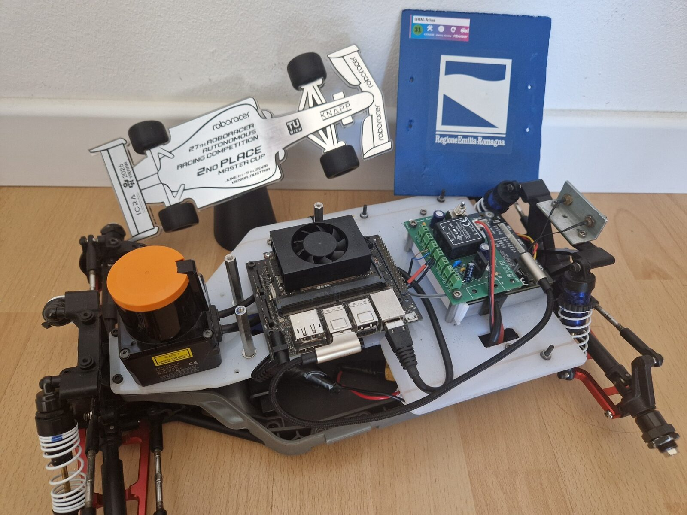
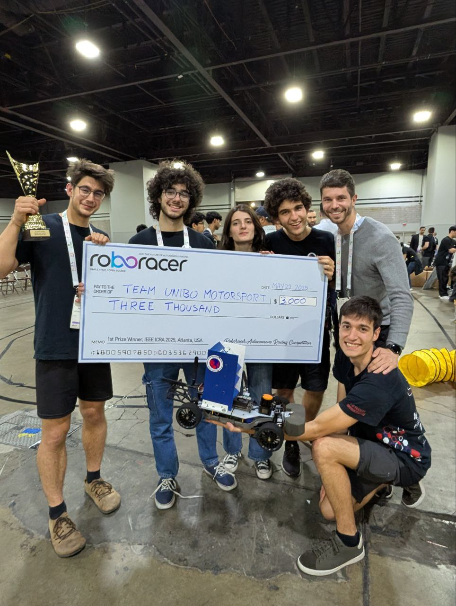
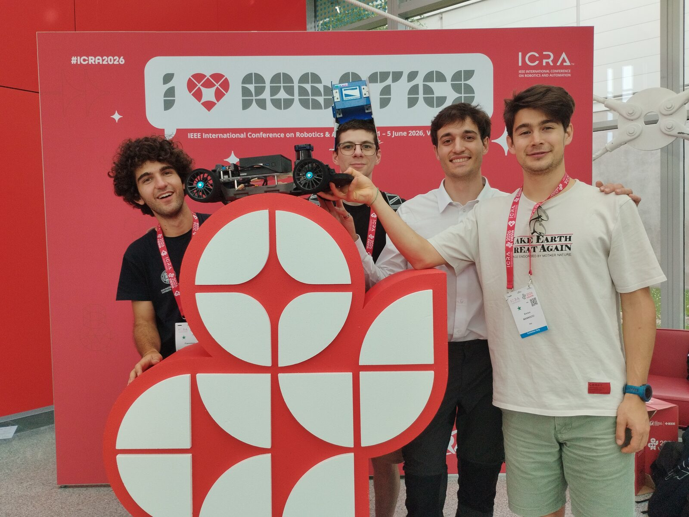

# AuRoRus

**Au**tonomous **Ro**boracer **Rus**t - an autonomous driving stack for
[RoboRacer](https://roboracer.ai/) (formerly F1TENTH) cars, written in Rust.

<p align="center">
  
  <br>
  <em><code>philly</code> and its trophy for second place in the Master Cup of the 27th RoboRacer Autonomous Racing Competition, ICRA 2026, Vienna</em>
</p>

It covers the whole pipeline in one crate (`aurorus`): a vehicle and LIDAR
simulator with a random track generator, SLAM mapping and localization,
race-line planning, opponent detection, a set of autonomous driving
algorithms, and the drivers for the real car (VESC, Hokuyo LIDAR, joystick).
Everything is driven from a browser GUI, and the same code runs in simulation
on a laptop and on the car.

## Installation

1. Install Rust with [rustup](https://rustup.rs/) (see the official
   [install page](https://www.rust-lang.org/tools/install) for other
   platforms and options):

   ```sh
   curl --proto '=https' --tlsv1.2 -sSf https://sh.rustup.rs | sh
   ```

   The crate uses the 2024 edition, so it needs Rust 1.85 or newer -
   `rustup update` brings an older install up to date. No other system
   library is required.

2. Build everything from the repository root:

   ```sh
   cargo build --release
   ```

   The executables are placed in `target/release/`. The release profile
   trades compile time for speed (LTO, a single codegen unit), so the first
   build takes a few minutes.

3. Run the main application and open <http://localhost:1999>:

   ```sh
   ./target/release/web_gui
   ```

   On a machine that isn't set up as a car this runs the simulation. Run the
   executables from the repository root: they look for `config/`, `maps/` and
   the other folders below relative to the current directory.

## Executables

`cargo build --release` builds every binary below into `target/release/`.
Each one prints its full list of options with `--help`.

| Executable | What it does | Web page |
|---|---|---|
| [`web_gui`](#web_gui) | The main application: drive the simulation or the real car | <http://localhost:1999> |
| [`replay_web_gui`](#replay_web_gui) | Play back a recorded debug session | <http://localhost:1998> |
| [`benchmark_viewer`](#benchmark_viewer) | Compare and replay recorded benchmark runs | <http://localhost:1997> |
| [`car_calibration`](#car_calibration) | Guided calibration of a car's hardware | <http://localhost:1996> |
| [`probe`](#probe) | Test one piece of the car's hardware on its own | - |
| [`benchmark_communication_time`](#benchmark_communication_time-and-benchmark_data_freshness) | Measure topic read/write latency | - |
| [`benchmark_data_freshness`](#benchmark_communication_time-and-benchmark_data_freshness) | Measure how stale the data readers see is | - |

The web pages are served on every network interface, so they can also be
opened from another device, e.g. a phone or laptop next to the car, at
`http://<address of the machine>:<port>`.

### `web_gui`

The main application. It starts every part of the stack - sensors,
localization, planning, perception, the driving algorithms - and serves the
GUI to control them: pick or generate a map, plan a race line, map a track
with SLAM, select and tune a driving algorithm live, race against simulated
opponents, run benchmarks and record debug sessions.

It simulates the car unless the machine is set up as one: with a `CAR_NAME`
file naming a calibrated car (see [Car calibration](documentation/car_calibration.md))
it drives the real hardware instead.

```sh
./target/release/web_gui                # simulation, or the car CAR_NAME names
./target/release/web_gui --sim          # simulate, even on a car
./target/release/web_gui --car tom      # run as the car "tom"
./target/release/web_gui --debug        # record a debug session from the start
```

See [Web GUI](documentation/web_gui.md) for every part of the page.

### `replay_web_gui`

Read-only playback of a `.debug` session file recorded by `web_gui` (from its
Debug panel, or with `--debug`): the same map view, drawing whatever the
recorded executors drew, with a timeline to scrub through. It only needs the
file itself. See [Replay web GUI](documentation/replay_web_gui.md).

```sh
./target/release/replay_web_gui --file debugs/<session>.debug
```

### `benchmark_viewer`

Read-only web UI over the benchmark runs recorded from `web_gui`'s Benchmark
panel: filter them, compare their lap times, parameters and telemetry, and
replay several of them together on the map. See
[Benchmark viewer](documentation/benchmark_viewer.md).

```sh
./target/release/benchmark_viewer
```

### `car_calibration`

A guided calibration of a real car, served as a web page: its size and
weight, how its IMU and LIDAR are mounted, its steering range and its motor's
speed gain. Saving writes `config/calibration/<car>.toml`, which every other
executable then uses. It needs the car's VESC and can't run at the same time
as `web_gui`. See [Car calibration](documentation/car_calibration.md).

```sh
./target/release/car_calibration --car tom
```

### `benchmark_communication_time` and `benchmark_data_freshness`

Two terminal benchmarks of the executor/topic framework everything is built
on, with one writer and several readers at different rates. The first
measures how long the read and write calls take, the second how old the data
is when a reader sees it. Both are explained in
[Core framework](documentation/core_framework.md).

```sh
./target/release/benchmark_communication_time --duration 30
```

### `probe`

Small bring-up tools for the real car, each testing one piece of hardware on
its own, without the rest of the stack: useful when `web_gui` or
`car_calibration` misbehave and it isn't clear which part is at fault. Like
`car_calibration`, the VESC probes can't run at the same time as `web_gui`.
`probe` alone lists them.

| Subcommand | What it does |
|---|---|
| `probe vesc [SECONDS] [PORT]` | Read-only: prints the VESC's firmware, then its state and IMU ten times a second |
| `probe hokuyo [SECONDS]` | Prints the LIDAR's scan rate and what it sees ahead, left, right and closest, e.g. to check the mounting |
| `probe servo POSITION\|center [PORT]` | Moves the steering servo to one position (`0.15..=0.85`) and exits. Never spins the motor |
| `probe motor ERPM SECONDS [PORT]` | Wheels off the ground: spins the motor at a low ERPM (at most 3000, for at most 15 s), then brakes. Never moves the servo. Ctrl+C brakes early |

```sh
./target/release/probe vesc
./target/release/probe servo center
```

## Maps

Maps live in `maps/`, one folder per map. The repository ships the tracks
of the RoboRacer races the UniBo team took part in (see [Credits](#credits)):

| Map | Track |
|---|---|
| `Atlanta_2025` | ICRA 2025, Atlanta |
| `Vienna_2026_Quali` | ICRA 2026, Vienna: the qualifying track |
| `Vienna_2026_Final_Ground` | ICRA 2026, Vienna: the final track, at ground level |
| `Vienna_2026_Final_Bridge` | ICRA 2026, Vienna: the same final track, on the bridge level |

The Vienna final track crossed over itself on a bridge, so it comes as two
maps of the same area, one per level.

Only each map's image and `info.json` are tracked. Race lines are not: plan
one from `web_gui`'s Planning panel (see [Planning](documentation/planning.md)).
Any other map you create from `web_gui` - generate a random track, import an
image, or map a real track with SLAM - stays local.

## Files not in the repository

These files and folders are listed in `.gitignore`: they are created locally
as the executables run and are specific to one machine.

| Path | What it holds |
|---|---|
| `target/` | Cargo's build output, including the executables in `target/release/` |
| `maps/` | Every map but the race tracks above, and every map's race lines (see [Maps](#maps)) |
| `debugs/` | `.debug` session files recorded by `web_gui`, played back by `replay_web_gui` |
| `benchmarks/` | Benchmark runs recorded by `web_gui`, read by `benchmark_viewer` |
| `CAR_NAME` | One line naming the car this machine drives; without it, `web_gui` simulates |
| `config/calibration/history/` | Each car's older calibrations, kept when `car_calibration` saves a new one |
| `other_repos/` | Local clones of third-party projects kept for reference |

Everything else under `config/` is tracked: one TOML file per component,
loaded at startup.

## Documentation

| Document | What it covers |
|---|---|
| [Core framework](documentation/core_framework.md) | The executor/topic framework, its design decisions, and the two communication benchmarks |
| [Web GUI](documentation/web_gui.md) | Every part of `web_gui`'s page, with screenshots, and how it works underneath |
| [Replay web GUI](documentation/replay_web_gui.md) | Playing back a recorded debug session: the map, the timeline, and how it works |
| [Benchmark viewer](documentation/benchmark_viewer.md) | Filtering, comparing and replaying benchmark runs |
| [Autonomous algorithms](documentation/autonomous_algorithms.md) | How driving algorithms are structured, selected and tuned live, and how to add one |
| [Tutorials](tutorial/README.md) | Writing an autonomous algorithm from an empty file, step by step: a gap follower and a pure pursuit |
| [Planning](documentation/planning.md) | How the race line is planned for a map |
| [SLAM](documentation/slam.md) | Mapping a track and localizing on a known map |
| [Detector](documentation/detector.md) | Finding and tracking an opponent by comparing the LIDAR scan with the map |
| [Vehicle models](src/simulation/vehicle_models/README.md) | The simulator's vehicle dynamics models |
| [Car calibration](documentation/car_calibration.md) | Calibrating a real car and the car file it produces |
| [Joystick](documentation/joystick.md) | Driving the car with a gamepad |

The API documentation is generated from the code:

```sh
cargo doc --no-deps --open
```

## Credits
The whole project was vibe coded by me ([@Noce99](https://github.com/Noce99)), using as a reference the (non-public) ROS2 repository of the University of Bologna's 1:10 scale autonomous driving team. I have led the team since 2024: at the RoboRacer Autonomous Racing Competition at IEEE ICRA 2025 in Atlanta it took first place with one car, `philly`, running the Frenet overtaking ([watch the final](https://youtube.com/shorts/cEtLJ8aXSXk)), and at ICRA 2026 in Vienna it took second and third place with two cars: `philly` with the Frenet overtaking and `tom` with the MPC.

<table>
  <tr>
    <td align="center"></td>
    <td align="center"></td>
  </tr>
  <tr>
    <td align="center"><em>Atlanta, ICRA 2025: first place in the RoboRacer competition</em></td>
    <td align="center"><em>Vienna, ICRA 2026: second and third place</em></td>
  </tr>
</table>

I would like to thank [@SamueleCrimi](https://github.com/SamueleCrimi) and [@Scheggetta](https://github.com/Scheggetta) for their amazing work in the UniBo autonomous driving team, especially for the first implementations of the [Frenet overtaking](documentation/autonomous_algorithms.md#frenet-overtaking) and the [Path Follower](documentation/autonomous_algorithms.md#path-follower). Both algorithms have been ported to this repository.

Special thanks also to [@AlbYoda](https://github.com/AlbYoda), who implemented the [detector](documentation/detector.md) (ported to this repository) and is now working on a faster, Acados-based MPC (not yet ported), and to [@FelixFrog](https://github.com/FelixFrog), who implemented the map switch that let us use the bridge at Vienna 2026 (not yet ported) and is now working on a new MPPI implementation.

Many thanks to everyone else who has been part of the UniBo driverless team, especially [@TorioCrema](https://github.com/TorioCrema), [@FedericoCalzoni](https://github.com/FedericoCalzoni), [@beatricebottari](https://github.com/beatricebottari), [@LucaTedeschini](https://github.com/LucaTedeschini), [@ncridlig](https://github.com/ncridlig) and [@StefanoColamonaco](https://github.com/StefanoColamonaco).

A final special thanks goes to [@gerkone](https://github.com/gerkone). In the second half of 2020, we worked together with [@EnricoTrombetti](https://github.com/EnricoTrombetti) and [@AldoCanfora](https://github.com/AldoCanfora) on a project for a Complex Systems course shared between physicists and computer scientists (all of us were physicists except @gerkone). Shortly afterwards, @gerkone founded the UniBo autonomous driving team, which I have enjoyed being part of ever since.

## License

Licensed under either of

- Apache License, Version 2.0 ([LICENSE-APACHE](LICENSE-APACHE) or <https://www.apache.org/licenses/LICENSE-2.0>)
- MIT license ([LICENSE-MIT](LICENSE-MIT) or <https://opensource.org/licenses/MIT>)

at your option.

Unless you explicitly state otherwise, any contribution intentionally submitted
for inclusion in this crate by you, as defined in the Apache-2.0 license, shall
be dual licensed as above, without any additional terms or conditions.
