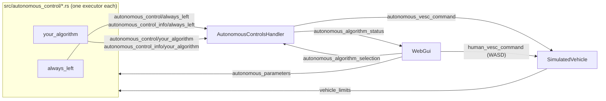
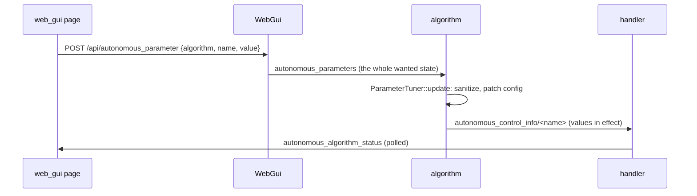

# Autonomous algorithms

How autonomous driving algorithms are structured, how one is selected and
tuned live from `web_gui`, and how to add a new one.

The goal: **adding an algorithm means adding one file** to
`src/autonomous_control/` and recompiling. `web_gui`, `main.rs`, and the
other executors never have to change.

## Architecture



- **Every algorithm is its own executor.** It runs on its own thread at its
  own rate and publishes the `VescCommand` it would like the vehicle to follow
  on its own topic, `autonomous_control/<name>`. It also publishes a label,
  a description, and its tunable parameters with their current values on
  `autonomous_control_info/<name>`.
- **All algorithms run all the time,** whether selected or not. A switch is
  therefore instant, and stateful algorithms (filters, integrators) stay warm.
  A `--debug` recording also captures what *every* algorithm wanted, not only
  the one driving, which is useful for comparing them in `replay_web_gui`.
- **`AutonomousControlsHandler`** (`src/autonomous_control.rs`) is the only
  writer of `autonomous_vesc_command`. It ticks at 100 Hz. Every tick it:
  1. finds every algorithm by its `autonomous_control_info/` topic;
  2. reads which one `autonomous_algorithm_selection` names, and whether
     it's running or paused;
  3. forwards that algorithm's latest command, or `(0, 0)` (stationary,
     centered) if nothing is selected, it's paused, or the command is
     missing or stale;
  4. reports what it did on `autonomous_algorithm_status`.
- **`WebGui`** only knows the generic selection and status topics. Its
  "Autonomous Algos" panel builds the dropdown from
  `autonomous_algorithm_status`, so a new algorithm appears there
  automatically. The same goes for the sliders of the selected algorithm's
  parameters (see [Live parameter tuning](#live-parameter-tuning)). The
  dropdown only picks the algorithm: **Start** hands control to it and
  **Pause** takes control back. Switching algorithms while running hands
  control straight to the new one, and switching while paused keeps it
  paused.
- **Drawings follow the selection.** Every algorithm publishes its drawing
  (`draw/<name>`) with all elements `visible_by_default = false`, so a page
  that knows nothing about algorithms shows none of them. `web_gui` shows
  the selected algorithm's drawing (every element) and hides every other
  algorithm's, each time the selection changes (see `focus` in
  `src/web/draw_layers.js`). Between changes, the Layers list is yours to
  tick and untick. The next selection change resets it.
- **`build.rs`** scans `src/autonomous_control/*.rs` at compile time. It
  generates one `mod` per file plus `autonomous_control::all()`, which returns
  one executor per file. `web_gui`'s `main.rs` adds everything `all()`
  returns.

### Safety rules

| Situation | What the vehicle does |
|---|---|
| Paused, or no algorithm selected | Autonomous command is `(0, 0)`: only a human drives |
| Selected algorithm never wrote a command | `(0, 0)` |
| Selected algorithm's command older than **1 s** (`VESC_COMMAND_TIMEOUT`) | `(0, 0)`; the UI shows a warning |
| A WASD key is held (human command fresh and non-zero) | **The human always overrides** the autonomous command |
| All keys released | Control returns to the selected algorithm |

The human override is decided in `SimulatedVehicle` (`select_command`). The
page re-sends `(0, 0)` every 250 ms even when no key is held, so "the human is
driving" means that a fresh, non-zero command is coming in. To stop the car
for good, press **Pause**.

## Topics

| Topic | Type | Writer | Meaning |
|---|---|---|---|
| `autonomous_control/<name>` | `VescCommand` | the algorithm | What the algorithm wants |
| `autonomous_control_info/<name>` | `AutonomousAlgorithmInfo` | the algorithm | Label, description, and tunable parameters with their current values |
| `autonomous_parameters` | `AutonomousParameters` | `WebGui` | Wanted parameter values, per algorithm |
| `autonomous_algorithm_selection` | `AutonomousAlgorithmSelection` | `WebGui` | Which algorithm is picked (`null` for none), and whether it's running or paused |
| `autonomous_algorithm_status` | `AutonomousAlgorithmStatus` | handler | Available algorithms, the selected one, the active one (selected and running), whether its command is fresh |
| `autonomous_vesc_command` | `VescCommand` | handler | The autonomous command the vehicle follows |
| `vehicle_limits` | `ActuatorLimits` | `SimulatedVehicle` | Max steering angle and rate, max speed, accel and decel |

The types live in `src/topics/autonomous_control.rs`,
`src/topics/vesc_command.rs`, and `src/topics/vehicle_limits.rs`.

## Adding an algorithm

### 1. Create the file

Create `src/autonomous_control/<name>.rs`. The file name:

- must be a snake_case Rust identifier (e.g. `pure_pursuit.rs`), or
  `build.rs` stops the build with an error;
- becomes the algorithm's **name**. That name is used for its executor, its
  topics (`autonomous_control/pure_pursuit`, ...), and its selection value.

### 2. Implement it

The only hard requirement is a function with this exact signature, because
`build.rs` calls it:

```rust
pub fn new(name: &str) -> Box<dyn Executor>
```

It must return an executor whose `name()` is `name`. The rest follows the
template below, which is `always_left.rs` with the parts to change marked:

```rust
//! What this algorithm does.

use crate::topics::{ActuatorLimits, AutonomousAlgorithmInfo, VEHICLE_LIMITS_TOPIC_NAME, VescCommand};
use crate::{Captain, Executor, Ticker};
use std::any::Any;

/// How often a command is published, in Hz.
const RATE_HZ: f64 = 50.0;

/// Entry point build.rs calls - required, with exactly this signature.
pub fn new(name: &str) -> Box<dyn Executor> {
    Box::new(PurePursuit { id: 0, name: name.to_string() })
}

struct PurePursuit {
    id: u8,
    name: String,
    // any state the algorithm keeps between ticks
}

impl Executor for PurePursuit {
    fn init(&mut self, id: u8) {
        self.id = id;
    }

    fn claim_writing_topics(&mut self, captain: &Captain) {
        // Claims autonomous_control/<name> and writes autonomous_control_info/<name>.
        captain.claim_autonomous_control(
            self.id,
            AutonomousAlgorithmInfo::new("Pure pursuit", "Follows the race line with pure pursuit."),
        );
        // Optional: shapes to show on the map (e.g. the planned path) - see topics/drawing.rs.
        // Publish its elements with `visible_by_default = false`: web_gui shows them while it's selected.
        // captain.claim_drawing(self.id);
    }

    fn run(&mut self, captain: &Captain) {
        let command_topic = captain.autonomous_control(self.id);
        let limits_topic = captain.topic::<ActuatorLimits>(VEHICLE_LIMITS_TOPIC_NAME);
        // Read anything else needed: lidar_scan, vehicle_status, map, ...
        let mut ticker = Ticker::new(RATE_HZ);

        while captain.is_running(self.id) {
            // Optional, only for computationally heavy algorithms:
            // if !captain.is_selected_algorithm(&self.name) { ticker.wait(); continue; }

            let limits = limits_topic.read();
            let command = VescCommand::new(0.0 /* steering, rad */, 0.0 /* speed, m/s */);
            command_topic
                .write(self.id, command)
                .expect("lost writer authorization for this algorithm's command topic");
            ticker.wait();
        }
    }

    fn name(&self) -> String {
        self.name.clone()
    }

    fn as_any(&self) -> &dyn Any {
        self
    }

    fn fresh(&self) -> Box<dyn Executor> {
        new(&self.name)
    }
}
```

### Optional: report a message to the driver

`autonomous_control::report_message(captain, id, Some(text))` sets the
algorithm's `AutonomousAlgorithmInfo::message`, for example to say why the
vehicle is held stopped. `web_gui` shows it in yellow under the status line in
the Autonomous Algos panel. Pass `None` to clear it. The info is only rewritten
when the message changes, so it's fine to call this every tick.

### 3. Optional: make parameters tunable live

See [Live parameter tuning](#live-parameter-tuning).

### 4. Build and run

```sh
cargo build
cargo run --bin web_gui
```

Open the UI, go to **Autonomous Algos**, and pick the new algorithm.

## Live parameter tuning

An algorithm can let `web_gui` tune its parameters while it runs. When it's
the selected algorithm (running or paused), the "Autonomous Algos" panel
shows one slider per parameter, plus a **Save parameters** button.



- **Parameters are declared once,** next to the info, each named after the
  config field it sets. Its current value is read from the config, so the
  TOML file stays the source of the defaults:

  ```rust
  captain.claim_autonomous_control(
      self.id,
      AutonomousAlgorithmInfo::new("Gap follower", "...").with_parameters(
          &self.config,
          [
              AlgorithmParameter::float("t_m", 0.5, 12.0, 0.1)
                  .unit("m")
                  .description("Threshold for identifying a far away lidar point."),
              AlgorithmParameter::int("b_radius", 0, 180, 1).unit("points"),
          ],
      ),
  );
  ```

  The config must derive `Serialize` and `Deserialize`. A value is applied
  by patching the config's JSON form, so no per-parameter code is needed.
  Use `int` for integer fields (`usize`, `u32`, ...) and `float` for `f32`
  or `f64` fields. A name that matches no numeric field panics at startup.
- **Changes are applied in the loop:** create a `ParameterTuner` at the top
  of `run()`, and call `tuner.update(captain, &mut self.config)` once per
  tick. It returns `true` when the config changed.
- **Rebuild derived state when `update` returns `true`.** Anything computed
  from the config before the loop (a `Ticker` from a rate, a lookup table,
  ...) is otherwise stale. `gap_follower.rs` rebuilds its `Ticker` this way,
  which makes `rate_hz` tunable too.
- **The algorithm validates, not the UI.** Values are clamped to
  `min..=max` (and rounded, for `int`). Non-finite values are ignored. Pick
  bounds that are always safe to run with: for example, a rate must stay
  well above 1 Hz, or every command is stale (`VESC_COMMAND_TIMEOUT`).
- **The UI shows what's in effect.** Sliders follow the values the
  algorithm reports, not what was sent, so a clamped value snaps back.
- **Only the selected algorithm can be tuned,** whether it's running or
  paused. Pausing it makes tuning safe: the car stays stopped while you
  change values. `WebGui` rejects any other algorithm.
- **`autonomous_parameters` holds the whole wanted state,** not single
  changes. Topics keep only their latest value, so two slider moves between
  two algorithm ticks would otherwise overwrite each other.
- **Save parameters writes the values in effect into the TOML file**
  (`config/autonomous_control/<name>.toml`, relative to the working
  directory, see `autonomous_control::save_parameters`). Only the tuned
  keys' values change: comments, other keys, and layout stay as they were.
  Load the config with `autonomous_control::load_config(name)` in `new()`,
  as `gap_follower.rs` does. The file is then read at runtime, so a saved
  value applies from the next restart (R). If the file can't be read, the
  compiled-in `Default` is used.
- **A restart (R) resets every unsaved parameter** to its TOML value. A
  `--debug` recording captures every change, since both topics are
  recorded.

## Pure pursuit

`pure_pursuit.rs` follows the selected map's `race_line`. That is the line
picked in the Race Lines panel. By default it is the map's newest planned
line, or its centerline if it has none (see `planning.md`). Its parameters live in
`config/autonomous_control/pure_pursuit.toml`.

Each tick it does the following:

1. **Pose.** It gets the pose, then moves it back by `lr_m` to the rear axle.
   The steering law assumes the car turns about the rear axle.
2. **Nearest point.** It finds the nearest point on the line.
   - The first search covers the whole line.
   - After that it searches only a window starting just behind the last match
     and running `1.5 · lookahead_max_m + 1` metres ahead of it.
   - The window keeps the car from snapping to another stretch of track that
     happens to run close by, such as a hairpin or parallel straights.
3. **Lookahead distance:**
   `Ld = clamp(lookahead_base_m + lookahead_gain_s · v_ref, lookahead_min_m, lookahead_max_m)`.
   `v_ref` is the line's speed at the nearest point.
4. **Target.** The target is the point `Ld` metres ahead along the line,
   wrapping around the lap.
5. **Steering:** `δ = atan(2 · wheelbase_m · sin α / ld)`.
   - `α` is the bearing of the target relative to the heading.
   - `ld` is the straight-line distance to the target.
   - The result is clamped to `max_steering_angle_rad`.
   - No sign flip is needed: `α` is measured the same way as the heading, so
     it follows the same convention as `servo_position_rad`.
6. **Speed.**
   - Normally: `speed_scale ·` the line's speed `v_ref · speed_preview_s`
     metres further ahead. Reading ahead covers actuator lag.
   - If `constant_speed > 0`, that speed is used instead. Use this for lines
     without a meaningful speed profile, or to tune steering on its own.
   - The result is clamped to `max_speed_mps`.

**Pose source** (`pose_source`):

- **0, localization (default):** odometry composed onto `slam_status.map_to_odom`,
  which gives the pose on the map at odometry's rate. It is only used when all
  of these hold:
  - SLAM is in the `Localizing` state. Paused doesn't count: the pose would
    only be dead-reckoned.
  - Odometry is at most 300 ms old.
  - Odometry's `reset_count` matches the one SLAM reports.
- **1, ground truth:** `vehicle_status`. This only exists in simulation and is
  for debugging.

**The vehicle is held stopped** in any of these cases:
- there is no race line;
- there is no trustworthy pose;
- the car is farther than `max_cross_track_m` from the line (the next tick
  searches the whole line again).

The reason is shown in yellow in the Autonomous Algos panel, for example
"Localization isn't running".

The drawing shows:
- the nearest point, in blue;
- the target, in purple;
- the chord from the rear axle to the target;
- the arc being steered along.

**Tuning tips:**
- Start with `speed_scale` around 0.6. Pure pursuit cuts corners, so the
  profile's full speed leaves no margin.
- If the car oscillates on straights, raise the lookahead with
  `lookahead_gain_s` or `lookahead_min_m`.
- If it cuts corners, shorten the lookahead.

## Reactive algorithms

`ubm_disparity_extender.rs`, `ubm_potential_field.rs` and `ubm_potential_pursuit.rs` are
ported from ubm's `simple_control_algos`, hence the `ubm_` prefix on their
names (topics `autonomous_control/ubm_…`, configs
`config/autonomous_control/ubm_….toml`) and "UBM" in their labels in
`web_gui`. The first two need only the LIDAR
scan (`lidar_scan`), with no map and no pose. Their building blocks (FOV
window, speed laws, potential field, drawing helpers) live in
`src/autonomous_control/shared/reactive.rs`.

All three share these conventions:

- **Angles** are in the sensor frame: 0 is straight ahead, and positive is
  toward increasing heading (right, on screen). That is the same convention
  as `servo_position_rad`, so a direction in the scan is steered to as is.
  ubm ran on ROS, where angles grow to the left, so "left" in ubm's
  parameters means negative angles here.
- **`desired_fov_deg`** is clamped to the LIDAR's field of view (ubm
  refused a FOV at least as wide as the sensor's).
- **Speed** falls linearly from `max_speed` when driving straight to
  `min_speed` at full lock (`vehicle_limits.max_steering_angle_rad`). The
  result is clamped to the vehicle's `max_speed_mps`.
- **Flags** are `int` parameters: 0 means off and 1 means on.
- **The drawing** is placed with the simulator's `vehicle_status`, which the
  simulated LIDAR casts from. Without it, nothing is drawn, but the
  algorithm still drives.

### UBM Disparity extender

Based on [Nathan Otterness' write-up](https://www.nathanotterness.com/2019/04/the-disparity-extender-algorithm-and.html).
Each tick:

1. Readings are clipped to `max_range_m`.
2. **Disparities.** Two neighbouring readings in the FOV further apart than
   `disparity_threshold_m` are a disparity. Take the nearer one, at distance
   `d`. It overwrites (where it's nearer) `round(atan(car_width_m/2 / d) / Δθ) · r_multiplier`
   readings on the farther side, starting from the farther reading. Those
   are the readings the car would clip if it aimed there.
3. **Target.**
   - With `ray_eq_thr_m = 0`, it is the farthest reading. Ties go to
     `angle_priority` (0 = negative/left, 1 = right).
   - Otherwise, every reading within `ray_eq_thr_m` of the farthest is
     equally good, and the one nearest to straight ahead wins. Readings
     within `angle_eq_thr_rad` of that one tie, and `angle_priority` picks
     among them.
4. Steering is the target's angle.

The drawing shows the extended ranges in green and the chosen direction in
purple.

### UBM Potential field

Based on "A Real-Time Obstacle Avoidance Method for Autonomous Vehicles
Using an Obstacle-Dependent Gaussian Potential Field"
([doi:10.1155/2018/5041401](https://doi.org/10.1155/2018/5041401)). Each tick:

1. **Obstacles.** An obstacle is a run of readings nearer than
   `obstacle_threshold_gain` × the mean reading in the FOV. A run is entered
   below the threshold − `hysteresis_m` and left above it + `hysteresis_m`.
   Single readings are dropped as noise.
2. **Repulsion.** Each obstacle adds a Gaussian centred on it:
   - its spread is `σ = atan2(d·tan(φ/2) + car_width_m/2, d)`, where `φ` is
     the obstacle's angular width and `d` its mean distance;
   - its height is `(farthest reading − d)·√e`.
   The sum is sampled every `field_resolution_deg` and normalized to a peak
   of 1.
3. **Attraction.** `attractive_power · |cell − attractive cell| / cells` is
   added. The attractive cell is the direction of the longest reading.
4. **Choice.** The chosen cell is a strict local minimum of the field
   (plus the global minimum if `include_global_minima`). It is the lowest
   one, or the one nearest the attractive cell if
   `use_minima_near_attractive`. If there is no minimum, the attractive
   cell is used.
5. **Steering** is `steering_gain ×` the chosen direction.
6. **Speed.** With `use_speed_distance_gains`, the speed also gains
   `speed_distance_gain × mean(front)` and loses `brake_gain / mean(front)`,
   where `front` is the readings within `front_fov_deg` straight ahead.

The drawing shows:
- the obstacles as red sectors, each as wide as its `±σ`;
- the field as an amber polar curve, farther out where the potential is
  higher;
- the chosen direction in purple.

The obstacle threshold is relative to the mean reading. A scan where every
reading is nearly equal (e.g. a round room) therefore holds no obstacles.
On a track, the walls beside the car are the obstacles.

### UBM Potential pursuit

This is the potential field, attracted toward
`(1 − max_distance_weight) ·` the pursuit direction `+ max_distance_weight ·`
the longest reading's direction.

- The pursuit point is on the selected map's race line, the same one
  `pure_pursuit` follows. It is `max(min_look_ahead_m, look_ahead_gain_s · v_ref)`
  metres ahead of the nearest point.
- The nearest-point search is windowed after the first tick, as in
  `pure_pursuit`.
- The pose comes from `pose_source` (0 = localization, 1 = ground truth).
  The code for this is shared with `pure_pursuit` in
  `src/autonomous_control/shared/race_line.rs`.

**The vehicle is held stopped**, with the reason in the panel, in any of
these cases:
- there is no race line;
- there is no trustworthy pose;
- there is no LIDAR scan;
- the car is farther than `max_cross_track_m` from the line.

The drawing is the potential field's, plus the nearest point (blue) and the
pursuit point (green).

## UBM Path Follower

`ubm_path_follower.rs` is a port of ubm's `path_follower_node.cpp` and
`steering_controller.cpp`. It follows the selected map's race line, like
`pure_pursuit`, and uses the same pose sources (`pose_source`), which also
supply the speed `v` (odometry's, or `vehicle_status`'s). Its parameters live
in `config/autonomous_control/ubm_path_follower.toml`.

Each tick it does the following:

1. **Nearest point.** It finds the nearest point on the line, with the
   same windowed search as `pure_pursuit`.
2. **Steering law**, chosen by `controller`:
   - **0, PD (default).** The lookahead point is
     `look_ahead_gain_s · v + min_look_ahead_m` metres ahead of the nearest
     point. The heading error is measured from the pose moved back by
     `wheelbase_m`, as ubm does. Steering is
     `kk_s · err + clamp(kd_s · d(err)/dt, ±0.2)`, with no derivative on the
     first tick.
   - **1, P-enhanced.** Steering starts as `kk_s · err`. Above `min_speed`,
     it's multiplied by `(min_speed / v)^decay_v`. For errors up to
     `max_error`, it's also multiplied by
     `|err / max_error|^((v − min_speed) · decay_e)`. At speed, small errors
     barely steer.
   - **2, Stanley.** It uses the race-line point `tdp` points past the
     nearest one. Steering is
     `wrap(h − heading) − atan(k_stanley · d / max(v, 0.5))`, where `h` is
     the line's direction there and `d` the signed distance from it
     (positive toward increasing heading).
3. **Feedforward** (`feedforward`), added on top:
   - **1, from the curvature:** `beta_ff_gain · atan(κ · wheelbase_m)`,
     with `κ` the line's curvature `delay_ff_action` metres ahead.
   - **2, learned:** a value per race-line point, updated with the steering
     `delay_ff_action` points behind. `averaging_ff_gain = 1` never updates
     it. The table resets when the line changes.
   - The sum never exceeds the steering limit.
4. **Speed** is `scale_speed ·` the line's speed at the nearest point, or
   `constant_speed` if that's > 0.

The vehicle is held stopped in the same cases as `pure_pursuit`: no race
line, no trustworthy pose, or farther than `max_cross_track_m` from the
line. ubm had no such guard. Lap statistics and lap progress aren't ported.

The drawing shows the nearest point (blue), the target (the lookahead or
Stanley point, purple), and the chord to it.

## UBM Frenet overtaking

`ubm_frenet_overtaking.rs` is a port of ubm's `frenet_map_based_node.cpp`
and the `plan_map_based` part of `frenet_overtaking.cpp`. It follows the
race line like the UBM Path Follower's PD or P-enhanced law (`controller`
0 or 1). When the LIDAR sees something on the track that the map doesn't
contain, such as an opponent, it steers along a Frenet path around it
instead. Its parameters live in
`config/autonomous_control/ubm_frenet_overtaking.toml`. The planner is in
`shared/frenet.rs`, and the steering laws are in `shared/steering.rs`,
which it shares with `ubm_path_follower`.

It needs the vehicle's pose (`pose_source`), a race line, its LIDAR scan,
and the selected map.

### Each tick

1. **Free space.** The map's white pixels, shrunk away from every wall by
   `wall_clearance_m`, form the free space. This replaces ubm's 9 px
   `cv::erode`, and is rebuilt only when the map or the clearance changes.
2. **Obstacles.** A LIDAR reading is an obstacle when its world point
   lands on the free space. Only every `lidar_downsample`-th reading
   within `desired_fov_deg` straight ahead and closer than
   `max_path_length_m` is looked at. A hit on a wall lands off the free
   space, so it doesn't count.
3. **Switching.** Obstacles seen for `switch_on_s` switch to the planner.
   No obstacles for `hysteresis_s` switch back to following the line.
   Without a map, it only follows the line, and the autonomous algorithms
   panel says so.
4. **Frenet planning**, while avoiding:
   - **Sampling.** Paths are sampled along the line. Their end offsets
     range from `−max_road_width_m` to `+max_road_width_m` in steps of
     `delta_road_width_m`, and their lengths from `min_path_length_m` to
     `max_path_length_m` in steps of `delta_path_length_m`. Each path gets
     a point every `path_point_distance_m`.
   - **Shape.** Each path is a cubic that starts at the vehicle's offset
     and slope relative to the line, and ends flat.
   - **Field of view.** Paths whose end is more than `path_fov_deg` off
     straight ahead are skipped.
   - **Cost:** `k_jerk · jerk + k_length / length + k_distance · (end − d_weight)²`.
     `d_weight` is a decaying average of the chosen end offsets (weights
     `decay_last_d_factor` and `weight_last_d`). It keeps the vehicle on
     the side it picked.
   - **Choice.** The cheapest path is chosen among those that stay on the
     free space and keep `robot_radius_m` from every obstacle. If none
     does, it falls back to the cheapest path that keeps clear of the
     obstacles and only passes too close to a wall. If there's no such
     path either, it takes the one that gets farthest before its first
     obstacle. The speed decays by `speed_decay_factor` for every tick
     without a free path.
   - **Steering.** The steering law aims at the chosen path's first point
     at least the lookahead distance along it.
5. **Speed** is `scale_speed ·` the line's profile speed. While avoiding,
   it's also scaled:
   - by the decay above;
   - by `(line curvature / path curvature)^speed_curvature_exponent`,
     since swerving is slower than following the line;
   - never below `min_speed_reduction_gain` in total.

   If no full-length path is clear of the obstacles, the speed is also
   capped at `√(2 · max_decel · (reach − braking_margin_m))`. The reach is
   the farthest any path gets before its first obstacle, so the vehicle
   can always stop before it.

The vehicle is held stopped in the same cases as the UBM Path Follower: no
race line, no trustworthy pose, or farther than `max_cross_track_m` from the
line. `max_cross_track_m` defaults wider here (1.5 m), since overtaking
leaves the line.

### Differences from ubm

**Bug fixes:**

- The LIDAR field of view is honoured. ubm's filter compared with `||`,
  so it let every reading through.
- `lidar_downsample` is at least 1. At 0, ubm's scan loop never ended.
- `path_fov_deg` limits both sides. ubm's check had no absolute value, so
  it only rejected paths swerving toward negative offsets.

**Improvements:**

- **Slope matching.** A path starts along the vehicle's current slope, so
  replanning doesn't kink the path the vehicle is on. ubm's paths started
  flat and ended with zero curvature.
- **Braking.** The reach-based speed cap is new. ubm only slowed to a
  fixed fraction, and only once even its shortest path was blocked.
- **Fallback path.** ubm fell back to the cheapest path overall, even
  one running straight into the obstacle.
- **Target point.** The target is the first point at least the lookahead
  distance along the path; ubm's was one point short.
- **Speed.** The curvature slowdown doesn't compound from tick to tick.

**Not ported:** the external detector switch, map B, the basic
(all-LIDAR-points) planner, and lap statistics.

### Drawing

The drawing shows:

- **Obstacle points** (red).
- **Chosen path:** green if it's free, amber if it's merely the cheapest.
- **Candidate paths:** faint, hidden by default.
- **Nearest point, target and chord,** as for the UBM Path Follower.

While avoiding, the panel message says how many obstacle points it's
avoiding.

## Conventions and pitfalls

- **Publish at least once per second.** The handler treats anything older than
  `VESC_COMMAND_TIMEOUT` (1 s) as stale and stops the vehicle. Publishing at
  tens of Hz is typical.
- **Steering sign:** a *negative* `servo_position_rad` steers **left**, a
  positive one steers **right**. The world frame has y pointing down, so a
  positive heading change is clockwise on screen. See the doc comment on
  `VescCommand::servo_position_rad`.
- **Limits:** read `vehicle_limits` instead of hardcoding numbers. The vehicle
  clamps anything beyond them anyway, but `max_steering_angle_rad` and
  `max_speed_mps` are what "full lock" and "top speed" mean.
- **Idling when not selected** (`captain.is_selected_algorithm`) saves CPU,
  but the algorithm's state may be out of date when it's switched to. Use it
  only when the algorithm is actually expensive.
- **Names are unique by construction,** because they come from file names.
  Two algorithms can never claim the same topic.
- **Removing an algorithm** means deleting its file and rebuilding.
- **Execution latency:** the handler adds one hop of at most 10 ms (its
  100 Hz period) between an algorithm's write and the vehicle seeing it.

## Where things are

| File | Role |
|---|---|
| `build.rs` | Generates the module list and `autonomous_control::all()` |
| `src/autonomous_control.rs` | `AutonomousControlsHandler`, module docs |
| `src/autonomous_control/*.rs` | One algorithm per file |
| `src/autonomous_control/shared/` | Code several algorithms share: pose sources and race line geometry (`race_line.rs`), reactive building blocks (`reactive.rs`), ubm's PD and P-enhanced steering laws (`steering.rs`), the Frenet overtaking planner (`frenet.rs`). A directory, because every `.rs` file directly in `src/autonomous_control/` becomes an algorithm |
| `src/core/captain.rs` | `claim_autonomous_control`, `autonomous_control`, `is_selected_algorithm` |
| `src/actuators/simulated_vehicle.rs` | Human vs. autonomous `select_command`, publishes `vehicle_limits` |
| `src/autonomous_control.rs` | `ParameterTuner`, which applies live parameter changes; `load_config`/`save_parameters` |
| `src/sensors/web_gui/live_api.rs` | `GET /api/autonomous_algorithms`, `POST /api/autonomous_algorithm_selection`, `POST /api/autonomous_parameter`, `POST /api/autonomous_parameters_save` |
| `src/bin/web_gui/main.rs` | Adds the handler and every algorithm from `all()` |
