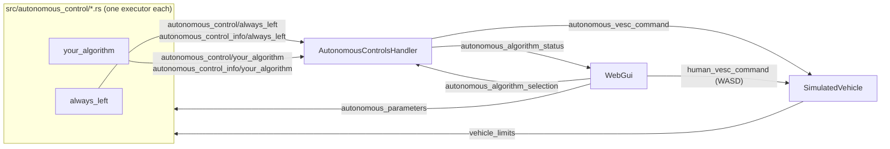
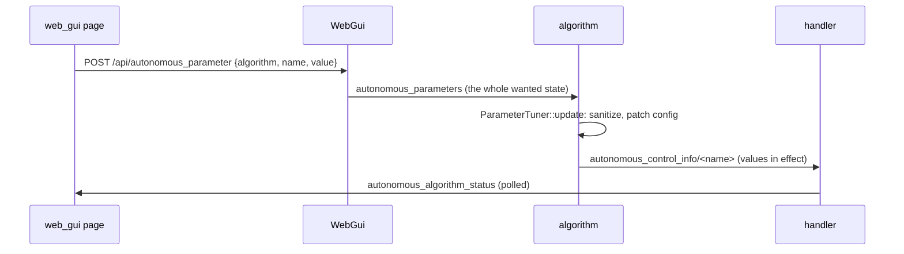

# Autonomous algorithms

How autonomous driving algorithms are structured, how one is selected and
tuned live from `web_gui`, and how to add a new one.

The goal: **adding an algorithm means adding one file** to
`src/autonomous_control/` and recompiling. `web_gui`, `main.rs`, and the
other executors never have to change.

## Architecture



- **Every algorithm is its own executor.** It runs on its own thread at its
  own rate and publishes the `VescCommand` it would like the vehicle to follow
  on its own topic, `autonomous_control/<name>`. It also publishes a label,
  a description, and its tunable parameters with their current values on
  `autonomous_control_info/<name>`.
- **All algorithms run all the time,** whether selected or not. A switch is
  therefore instant, and stateful algorithms (filters, integrators) stay warm.
  A `--debug` recording also captures what *every* algorithm wanted, not only
  the one driving, which is useful for comparing them in `replay_web_gui`.
- **`AutonomousControlsHandler`** (`src/autonomous_control.rs`) is the only
  writer of `autonomous_vesc_command`. It ticks at 100 Hz. Every tick it:
  1. finds every algorithm by its `autonomous_control_info/` topic;
  2. reads which one `autonomous_algorithm_selection` names;
  3. forwards that algorithm's latest command, or `(0, 0)` (stationary,
     centered) if nothing is selected or the command is missing or stale;
  4. reports what it did on `autonomous_algorithm_status`.
- **`WebGui`** only knows the generic selection and status topics. Its
  "Autonomous Algos" panel builds the dropdown from
  `autonomous_algorithm_status`, so a new algorithm appears there
  automatically. The same goes for the sliders of the algorithm in
  control's parameters (see [Live parameter tuning](#live-parameter-tuning)).
- **`build.rs`** scans `src/autonomous_control/*.rs` at compile time. It
  generates one `mod` per file plus `autonomous_control::all()`, which returns
  one executor per file. `web_gui`'s `main.rs` adds everything `all()`
  returns.

### Safety rules

| Situation | What the vehicle does |
|---|---|
| No algorithm selected ("None (manual)") | Autonomous command is `(0, 0)`: only a human drives |
| Selected algorithm never wrote a command | `(0, 0)` |
| Selected algorithm's command older than **1 s** (`VESC_COMMAND_TIMEOUT`) | `(0, 0)`; the UI shows a warning |
| A WASD key is held (human command fresh and non-zero) | **The human always overrides** the autonomous command |
| All keys released | Control returns to the selected algorithm |

The human override is decided in `SimulatedVehicle` (`select_command`). The
page re-sends `(0, 0)` every 250 ms even when no key is held, so "the human is
driving" means that a fresh, non-zero command is coming in. To stop the car
for good, select "None (manual)".

## Topics

| Topic | Type | Writer | Meaning |
|---|---|---|---|
| `autonomous_control/<name>` | `VescCommand` | the algorithm | What the algorithm wants |
| `autonomous_control_info/<name>` | `AutonomousAlgorithmInfo` | the algorithm | Label, description, and tunable parameters with their current values |
| `autonomous_parameters` | `AutonomousParameters` | `WebGui` | Wanted parameter values, per algorithm |
| `autonomous_algorithm_selection` | `AutonomousAlgorithmSelection` | `WebGui` | Which algorithm should drive (`null` for none) |
| `autonomous_algorithm_status` | `AutonomousAlgorithmStatus` | handler | Available algorithms, the active one, whether its command is fresh |
| `autonomous_vesc_command` | `VescCommand` | handler | The autonomous command the vehicle follows |
| `vehicle_limits` | `ActuatorLimits` | `SimulatedVehicle` | Max steering angle and rate, max speed, accel and decel |

The types live in `src/topics/autonomous_control.rs`,
`src/topics/vesc_command.rs`, and `src/topics/vehicle_limits.rs`.

## Adding an algorithm

### 1. Create the file

Create `src/autonomous_control/<name>.rs`. The file name:

- must be a snake_case Rust identifier (e.g. `pure_pursuit.rs`), or
  `build.rs` stops the build with an error;
- becomes the algorithm's **name**. That name is used for its executor, its
  topics (`autonomous_control/pure_pursuit`, ...), and its selection value.

### 2. Implement it

The only hard requirement is a function with this exact signature, because
`build.rs` calls it:

```rust
pub fn new(name: &str) -> Box<dyn Executor>
```

It must return an executor whose `name()` is `name`. The rest follows the
template below, which is `always_left.rs` with the parts to change marked:

```rust
//! What this algorithm does.

use crate::topics::{ActuatorLimits, AutonomousAlgorithmInfo, VEHICLE_LIMITS_TOPIC_NAME, VescCommand};
use crate::{Captain, Executor, Ticker};
use std::any::Any;

/// How often a command is published, in Hz.
const RATE_HZ: f64 = 50.0;

/// Entry point build.rs calls - required, with exactly this signature.
pub fn new(name: &str) -> Box<dyn Executor> {
    Box::new(PurePursuit { id: 0, name: name.to_string() })
}

struct PurePursuit {
    id: u8,
    name: String,
    // any state the algorithm keeps between ticks
}

impl Executor for PurePursuit {
    fn init(&mut self, id: u8) {
        self.id = id;
    }

    fn claim_writing_topics(&mut self, captain: &Captain) {
        // Claims autonomous_control/<name> and writes autonomous_control_info/<name>.
        captain.claim_autonomous_control(
            self.id,
            AutonomousAlgorithmInfo::new("Pure pursuit", "Follows the race line with pure pursuit."),
        );
        // Optional: shapes to show on the map (e.g. the planned path) - see topics/drawing.rs.
        // captain.claim_drawing(self.id);
    }

    fn run(&mut self, captain: &Captain) {
        let command_topic = captain.autonomous_control(self.id);
        let limits_topic = captain.topic::<ActuatorLimits>(VEHICLE_LIMITS_TOPIC_NAME);
        // Read anything else needed: lidar_scan, vehicle_status, map, ...
        let mut ticker = Ticker::new(RATE_HZ);

        while captain.is_running(self.id) {
            // Optional, only for computationally heavy algorithms:
            // if !captain.is_selected_algorithm(&self.name) { ticker.wait(); continue; }

            let limits = limits_topic.read();
            let command = VescCommand::new(0.0 /* steering, rad */, 0.0 /* speed, m/s */);
            command_topic
                .write(self.id, command)
                .expect("lost writer authorization for this algorithm's command topic");
            ticker.wait();
        }
    }

    fn name(&self) -> String {
        self.name.clone()
    }

    fn as_any(&self) -> &dyn Any {
        self
    }

    fn fresh(&self) -> Box<dyn Executor> {
        new(&self.name)
    }
}
```

### 3. Optional: make parameters tunable live

See [Live parameter tuning](#live-parameter-tuning).

### 4. Build and run

```sh
cargo build
cargo run --bin web_gui
```

Open the UI, go to **Autonomous Algos**, and pick the new algorithm.

## Live parameter tuning

An algorithm can let `web_gui` tune its parameters while it runs. When it's
the algorithm in control, the "Autonomous Algos" panel shows one slider per
parameter.



- **Parameters are declared once,** next to the info, each named after the
  config field it sets. Its current value is read from the config, so the
  TOML file stays the source of the defaults:

  ```rust
  captain.claim_autonomous_control(
      self.id,
      AutonomousAlgorithmInfo::new("Gap follower", "...").with_parameters(
          &self.config,
          [
              AlgorithmParameter::float("t_m", 0.5, 12.0, 0.1)
                  .unit("m")
                  .description("Threshold for identifying a far away lidar point."),
              AlgorithmParameter::int("b_radius", 0, 180, 1).unit("points"),
          ],
      ),
  );
  ```

  The config must derive `Serialize` and `Deserialize`. A value is applied
  by patching the config's JSON form, so no per-parameter code is needed.
  Use `int` for integer fields (`usize`, `u32`, ...) and `float` for `f32`
  or `f64` fields. A name that matches no numeric field panics at startup.
- **Changes are applied in the loop:** create a `ParameterTuner` at the top
  of `run()`, and call `tuner.update(captain, &mut self.config)` once per
  tick. It returns `true` when the config changed.
- **Rebuild derived state when `update` returns `true`.** Anything computed
  from the config before the loop (a `Ticker` from a rate, a lookup table,
  ...) is otherwise stale. `gap_follower.rs` rebuilds its `Ticker` this way,
  which makes `rate_hz` tunable too.
- **The algorithm validates, not the UI.** Values are clamped to
  `min..=max` (and rounded, for `int`). Non-finite values are ignored. Pick
  bounds that are always safe to run with: for example, a rate must stay
  well above 1 Hz, or every command is stale (`VESC_COMMAND_TIMEOUT`).
- **The UI shows what's in effect.** Sliders follow the values the
  algorithm reports, not what was sent, so a clamped value snaps back.
- **Only the algorithm in control can be tuned.** `WebGui` rejects anything
  else.
- **`autonomous_parameters` holds the whole wanted state,** not single
  changes. Topics keep only their latest value, so two slider moves between
  two algorithm ticks would otherwise overwrite each other.
- **A restart (R) resets every parameter** to its TOML value. A `--debug`
  recording captures every change, since both topics are recorded.

## Conventions and pitfalls

- **Publish at least once per second.** The handler treats anything older than
  `VESC_COMMAND_TIMEOUT` (1 s) as stale and stops the vehicle. Publishing at
  tens of Hz is typical.
- **Steering sign:** a *negative* `servo_position_rad` steers **left**, a
  positive one steers **right**. The world frame has y pointing down, so a
  positive heading change is clockwise on screen. See the doc comment on
  `VescCommand::servo_position_rad`.
- **Limits:** read `vehicle_limits` instead of hardcoding numbers. The vehicle
  clamps anything beyond them anyway, but `max_steering_angle_rad` and
  `max_speed_mps` are what "full lock" and "top speed" mean.
- **Idling when not selected** (`captain.is_selected_algorithm`) saves CPU,
  but the algorithm's state may be out of date when it's switched to. Use it
  only when the algorithm is actually expensive.
- **Names are unique by construction,** because they come from file names.
  Two algorithms can never claim the same topic.
- **Removing an algorithm** means deleting its file and rebuilding.
- **Execution latency:** the handler adds one hop of at most 10 ms (its
  100 Hz period) between an algorithm's write and the vehicle seeing it.

## Where things are

| File | Role |
|---|---|
| `build.rs` | Generates the module list and `autonomous_control::all()` |
| `src/autonomous_control.rs` | `AutonomousControlsHandler`, module docs |
| `src/autonomous_control/*.rs` | One algorithm per file |
| `src/core/captain.rs` | `claim_autonomous_control`, `autonomous_control`, `is_selected_algorithm` |
| `src/actuators/simulated_vehicle.rs` | Human vs. autonomous `select_command`, publishes `vehicle_limits` |
| `src/autonomous_control.rs` | `ParameterTuner`, which applies live parameter changes |
| `src/sensors/web_gui/live_api.rs` | `GET /api/autonomous_algorithms`, `POST /api/autonomous_algorithm_selection`, `POST /api/autonomous_parameter` |
| `src/bin/web_gui/main.rs` | Adds the handler and every algorithm from `all()` |
