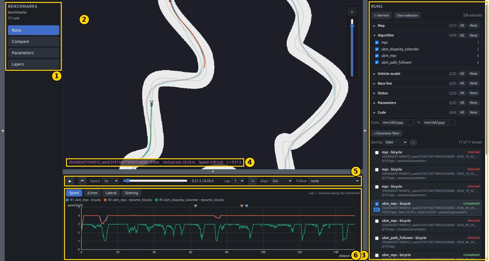
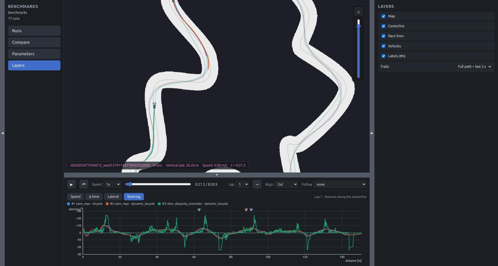
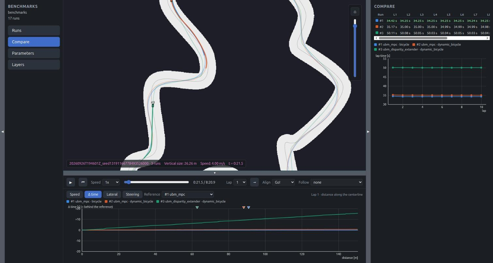
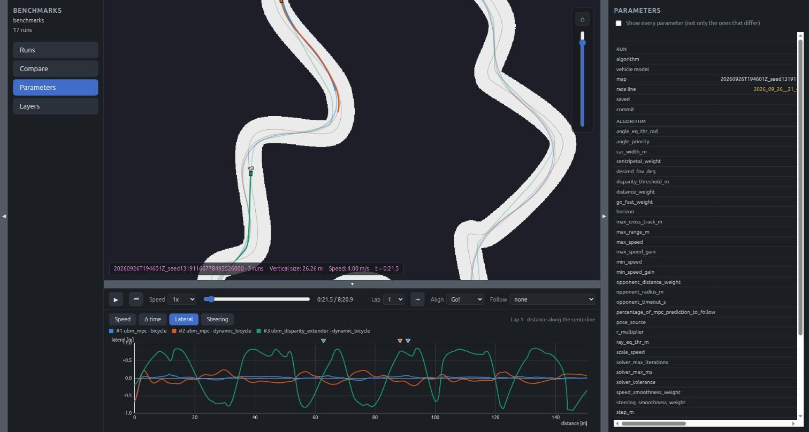
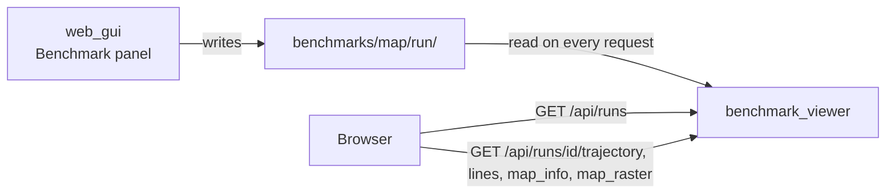

# Benchmark viewer

`benchmark_viewer` is a web page over the benchmark runs recorded by
`web_gui`'s Benchmark panel. It is for answering questions such as "which
algorithm is faster on this track, and where does it gain the time?": filter
the runs, compare their lap times and parameters, and replay several of them
together on the map.

It is read-only. Nothing is simulated: everything comes from the files of
each run.

## Where the runs come from

`web_gui`'s [Benchmark panel](web_gui.md#benchmark) drives the vehicle alone
for a fixed number of laps and writes one folder per run:

```
benchmarks/<map name>/<date>_<algorithm>_<vehicle model>/
    summary.toml       the run's status, laps, parameters, code version
    trajectory.csv     the vehicle's pose, speed and commands over time
    map/               a copy of the map driven
    race_line.csv      a copy of the race line the laps were timed against
```

Each folder is self-contained, so a run still replays after its map was
regenerated, renamed or deleted.

## Running it

```sh
./target/release/benchmark_viewer
```

Then open <http://localhost:1997>.

| Option | Meaning |
|---|---|
| `--benchmarks-root DIR` | Folder to read the runs from (default `benchmarks`) |
| `--bind-addr ADDR` | Address and port to serve on (default `0.0.0.0:1997`) |

It can run while `web_gui` is benchmarking: press **Refresh** to see the new
runs.

## The page at a glance



| # | Part | What it is |
|---|---|---|
| 1 | Panel list | The benchmarks folder, how many runs it holds, and the four panels. |
| 2 | Map | The track, with every selected run replayed as a vehicle in its own color. |
| 3 | Panel | The selected panel: **Runs**, **Compare**, **Parameters** or **Layers**. |
| 4 | Status bar | The track, how many runs are replayed, the view's size, the speed of the followed run (or of the first one), and the playback time. |
| 5 | Transport bar | Play/pause, speed, seek, and how the runs are lined up. |
| 6 | Charts | The selected runs over one lap: speed, time difference, lateral error, steering. |

## Runs

The Runs panel (in the overview above) lists every run found, and is where
runs are picked.

**A run's row** shows its algorithm and vehicle model, its status
(Completed, Timeout or Aborted), its map, race line and date, how many laps
it completed with its best lap and total time, and "unsaved parameters" when
it ran with values tuned in the GUI but not saved to the config files.

**Ticking a run selects it.** Up to 8 runs can be selected. Each gets a
number (`#1`, `#2`, ...) and a color, used everywhere: on the map, in the
charts and in the tables.

**Filters** narrow the list. Each group lists the values found in the runs,
with how many runs have each:

| Filter | Separates runs by |
|---|---|
| Map | The track. Two versions of a map under the same name are told apart. |
| Algorithm | The algorithm that drove |
| Vehicle model | The physics model simulated |
| Race line | The method of the line followed, or "none" for an algorithm that follows no line |
| Status | Completed, Timeout, Aborted |
| Parameters | Whether the run used the saved config values or values tuned live |
| Code | The git commit the run was made with, and whether there were uncommitted changes |

Below them:

- **From / To** keep the runs of a date range.
- **+ Parameter filter** adds a rule on a parameter's value, such as
  `speed_scale ≥ 0.8`. A run must meet every rule.
- **Sort by** date, total time, best lap, mean lap, map or algorithm. The
  arrow flips the order.

Run folders that cannot be read are listed at the bottom of the panel.
Filters, sorting and the selection are remembered by the browser across
reloads.

## The map and the replay

Every selected run is replayed from its recorded poses, as a vehicle with its
number and a trail in its color. The runs are shown together, as if they had
driven at the same time.

The transport bar:

| Control | Effect |
|---|---|
| Play/pause | Also the **Space** key |
| Back to the start | |
| Speed | From 0.25x to 8x |
| Seek slider | Jump anywhere in the runs |
| Lap | The lap the charts show |
| Jump (the arrow next to Lap) | Go to the start of that lap |
| Align | **Go!**: every run starts from its own start signal, so the replay is a race between them. **Lap start**: every run is shifted so the picked lap starts at the same moment, which compares that one lap. |
| Follow | Keep the view on one run |
| Track | Only shown when the selected runs were driven on several tracks: picks the one displayed |

Only runs driven on the same track are shown together.

### Layers



Switches for what the map shows: the map image, the centerline, the race
lines, the vehicles, their `#n` labels, and how much of each trail is drawn
(the full path plus the last 3 seconds, only the last 3 seconds, or none).

## Charts

The bottom charts show the picked lap of every selected run, over the
distance driven along the lap. Because runs may follow different race lines,
all are measured along one common line: the track's centerline (or the
first run's race line, for a track without one).

| Tab | Shows |
|---|---|
| **Speed** | The vehicle's speed |
| **Δ time** | Time lost or gained against a reference run, picked next to the tabs. Positive means behind the reference. A rising line is a stretch where the run loses time. |
| **Lateral** | Distance from the run's own race line |
| **Steering** | The commanded steering angle |

- The small triangles above the chart mark where each run is at the playback
  time.
- Hovering the chart shows the values at that distance, and marks where each
  run was at that point on the map.

The overview shows the Speed tab, and the screenshots of the other panels
show the other three.

## Compare



The lap times of the selected runs:

- a table with one row per run and one column per lap, the fastest run of
  each lap highlighted;
- a chart of lap time against lap number, one line per run. A flat line is a
  consistent run. A drifting one is an algorithm that changes behaviour over
  the laps.

## Parameters



The selected runs side by side, one column per run: the map, race line and
code version, then every parameter of the algorithm and of the vehicle model.

By default only the parameters that **differ** between the runs are listed,
which answers "what did I change between these two runs?" directly. The
checkbox at the top shows every parameter instead. The table is wider than
the panel: scroll it sideways to see the values.

## How it works



- **The server only reads files.** Every route is a `GET`. `GET /api/runs`
  scans the folder again each time, so nothing is cached and **Refresh** is
  enough to see new runs.
- **The replay happens in the browser.** The page downloads each selected
  run's trajectory once, then builds every frame from it: it interpolates the
  pose at the playback time and hands the shapes straight to the map canvas.
  No drawing is fetched from the server while playing.
- **The canvas and the clock are shared.** The map canvas (`map_view.js`),
  the chart helpers (`chart.js`) and the playback clock
  (`playback_clock.js`) are the same files `web_gui` and `replay_web_gui`
  use.
- **A run is named by its id,** `<map>/<run folder>`. The server accepts
  nothing but two plain folder names, so a request can never reach outside
  the benchmarks folder.
- **A "track" is the exact map files, not the map's name.** `summary.toml`
  stores a hash of the map and of the race line, which is how two versions of
  a map under one name are told apart, and why only runs on identical files
  are replayed together.
- **The math is tested.** `track_math.js` (interpolating a trajectory,
  finding lap starts, projecting onto the reference line) has no page
  dependency and is run under `node` by `cargo test`.

### What a run's files hold

`summary.toml`:

| Section | Holds |
|---|---|
| top level | `status`, when it started, the countdown, the laps requested, the pose source used for timing |
| `[code]` | The git commit, and whether there were uncommitted changes |
| `[map]` | The map's name, hashes of its files, the centerline's length, the lap timeout |
| `[race_line]` | The file, its method, whether the algorithm followed it, its hash and length |
| `[algorithm]` | Its name, every parameter's value, and whether those are the saved ones |
| `[vehicle]` | The model, its parameters and limits |
| `[results]`, `[[laps]]` | Total time, best, mean and spread of the lap times, then each lap |

`trajectory.csv` has one row per sample (40 Hz by default), with the columns
`t_s`, `lap`, `x_m`, `y_m`, `heading_rad`, `speed_mps`, `steering_cmd_rad`,
`speed_cmd_mps`, `s_m` (distance along the race line), `lateral_m`, and the
estimated pose `est_x_m`, `est_y_m`, `est_heading_rad`.

### HTTP API

| Route | Purpose |
|---|---|
| `GET /api/runs` | Every run's id and summary, and the folders that could not be read |
| `GET /api/runs/<id>/trajectory` | The run's trajectory, as columns |
| `GET /api/runs/<id>/lines` | The race line driven and the map's centerline |
| `GET /api/runs/<id>/map_info` | The copied map's size, resolution and origin |
| `GET /api/runs/<id>/map_raster` | The copied map's image |

### Where things are

| File | Role |
|---|---|
| `src/bin/benchmark_viewer/main.rs` | The server and its routing |
| `src/bin/benchmark_viewer/cli.rs` | The command-line options |
| `src/bin/benchmark_viewer/runs_api.rs` | The API above |
| `src/bin/benchmark_viewer/static/app.js` | The Runs, Compare, Parameters and Layers panels |
| `src/bin/benchmark_viewer/static/replay.js` | The replay on the map and the transport bar |
| `src/bin/benchmark_viewer/static/charts.js` | The bottom charts |
| `src/bin/benchmark_viewer/static/track_math.js` | The math under the replay and the charts, with `track_math.test.js` |
| `src/benchmark.rs`, `src/benchmark/` | The run folder's layout, summary and trajectory, shared with `web_gui` |
| `src/web/gui/benchmark_api.rs`, `benchmark_orchestrator.rs` | The side that records the runs |
