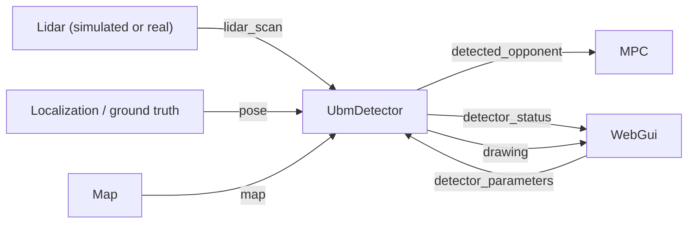

# Detector

How the `UbmDetector` executor finds an opponent in the ego vehicle's LIDAR
scan, tracks it, and publishes it on `detected_opponent` for whoever needs
it (today, the [MPC](autonomous_algorithms.md#mpc)). It's driven from
`web_gui`'s [Detector panel](web_gui.md#detector).

It's a Rust port of the UniBo team's ROS2 Python detector by
[@AlbYoda](https://github.com/AlbYoda)
(`other_repos/ubm/detector_py/detector_py/detector_py.py`). The Rust
functions name the Python ones they port (`detect_opp`, `KalmanFilter2D`,
`_make_predictions`, `has_neighbor_below_threshold`), so the two can be
compared side by side. [What changed in the port](#what-changed-in-the-port)
lists where they differ.

The idea is a **map difference**: from the ego vehicle's pose, cast every
ray of the scan on the map, which gives the scan the LIDAR would see if the
track were empty. Wherever the real scan is consistently shorter, something
that isn't on the map is in the way. The best such stretch becomes the
opponent:
- its position is measured from the stretch's rays;
- a constant-velocity **Kalman filter** smooths it and estimates its
  velocity;
- a **bounding box** is fitted around its points.

## Architecture

`UbmDetector` is one executor, added by `web_gui`. It polls for a new scan
on the ego vehicle's `lidar_scan` topic every `poll_interval_ms` (5 ms) and
processes each scan once, however fast they come. It only looks at the
ego's LIDAR, so it only ever detects opponents for the ego vehicle.

Every scan needs two other inputs:
- **the ego pose**, from `pose_source`: 0 = localization (SLAM must be
  localizing, see [SLAM](slam.md#localization)), 1 = ground truth
  (simulation only);
- **the selected map**, to cast the expected rays on.

When either is missing, the detector publishes an empty
`DetectedOpponent`, clears its drawing, and says why on
`detector_status` (for example "No map is loaded."). The Detector panel
shows that message.

## Topics

| Topic | Type | Direction | What it holds |
|---|---|---|---|
| `detected_opponent` | `DetectedOpponent` | out | The opponent found in the latest scan, filtered. Published after every scan |
| `detector_status` | `DetectorStatus` | out | Why it isn't detecting (or `None`), the parameters in effect, and how long the latest scan took (`scan_ms`) |
| `detector_parameters` | `DetectorParameters` | in | The parameter values a driver (the web GUI) wants, applied before the next scan |
| `drawing` | `Drawing` | out | What's drawn on the map, see [Drawing](#drawing) |

`DetectedOpponent` (in `src/topics/autonomy/detection.rs`) holds:

| Field | Meaning |
|---|---|
| `detected` | Whether the latest scan saw it |
| `position` | Filtered position of its center, in the map frame (m) |
| `velocity` | Filtered velocity, in the map frame (m/s) |
| `bounding_box` | Oriented rectangle around the latest scan's points of it (`center`, `heading_rad`, `length_m`, `width_m`, `corners`). `None` when not `detected` |
| `predictions` | Where the filter expects it, one point every `prediction_dt_s`. Empty when not `detected` |

When the scan misses the opponent, `detected` is false but `position` and
`velocity` still hold the filter's prediction. That prediction drifts the
longer the opponent goes unseen, so a consumer should only trust it for a
short time (the MPC's `opponent_timeout_s`).

## How a scan is processed

### 1. The expected scan

The sensor's position comes from the ego pose plus the LIDAR's mounting
offset, so every ray, expected or real, starts at the sensor. Each ray is
cast on the map (`cast_ray`, in `src/environment/raycast.rs`) up to the
detection range. That range is `max_detection_range_m`, but never more than
the LIDAR's own maximum: otherwise every ray that hit nothing would look
like an object in front of a farther wall.

A ray the real LIDAR reports at or beyond that range is set to the range in
both scans, so it can never look like a difference.

### 2. Finding the stretches (`find_plateaus`)

All in `src/perception/map_difference.rs`:

1. **Difference.** For each ray, `expected - real`, clamped at 0. Only
   rays where the real scan is *shorter* than the map count: something in
   front of a wall, not a missing wall.
2. **Median filter** over `median_filter_kernel_size` rays, which removes
   isolated spikes (a single stray return). It reflects the values at
   either end, like scipy's `median_filter`.
3. **Edges.** A jump in the filtered difference larger than
   `gradient_threshold` is an object's edge when:
   - one side of it is at (or near) zero, so it goes from nothing in front
     of the map to something, or back; or
   - it's between two non-zero levels **and** the (median-filtered) real
     scan also moves there by at least 0.15 m. Otherwise it's the map
     jumping *behind* the object (a wall's corner), which would cut the
     object in pieces too narrow to count.

   With `gradient_threshold = 0`, the threshold is picked from the scan
   itself: the gradients' median plus twice their median absolute
   deviation.
4. **Candidates.** The stretches before the first edge, between each two
   edges, and after the last one.
5. **Filtering.** A stretch is kept only if:
   - it's at least `min_object_width_m` wide, measured as rays × angle
     between rays × its median range, so a car isn't lost as it gets
     farther away and covers fewer rays;
   - its real ranges spread less than `object_std_threshold_m` (standard
     deviation);
   - the real scan is on average at least
     `distance_from_walls_threshold_m` shorter than the map across it.
6. **Ranking**, by `selection`:
   - **0, best score:** `spread / (1 + width / min_width) - mean_difference`,
     lowest first. Wide, flat stretches far in front of the map win.
   - **1, closest** (the default): lowest median range first. That's the
     opponent the MPC has to avoid first.

### 3. Rejecting walls

The stretches are tried in rank order. For each, the opponent's center is
measured along the stretch's middle ray, at its median range plus
`robot_radius_m`: the LIDAR sees the opponent's near side, and its center
is that much farther away.

With `ignore_walls = 1`, a center within `ignore_walls_radius_px` map
pixels of a non-drivable pixel is taken for a piece of wall the map is
slightly off on, and the next stretch is tried. The first one that passes
is the detection. If none does, the scan has no detection.

### 4. Tracking (`Kalman`)

The opponent's center goes through a constant-velocity Kalman filter. The
x and y axes never interact in the model (same noises, measured
independently), so the 4-state filter is implemented as two independent
2-state ones (position, velocity), which is exactly equivalent.

- **Predict**, on every scan, by the time since the previous scan. The time
  comes from the scans' own timestamps, so a slow loop doesn't skew the
  model. `kf_process_noise` is the standard deviation of the opponent's
  acceleration: higher follows it faster, but noisier.
- **Update** with the measured center when there's a detection.
  `kf_measurement_noise` is how far off a detection is expected to be:
  higher is smoother, but lags.
- **Predictions**: a copy of the filter is stepped `prediction_count` times
  by `prediction_dt_s`, giving the opponent's expected positions from now
  on.

The filter starts at rest at the map origin with unit covariance, as in
the Python version. The first few detections pull it onto the opponent.

### 5. Bounding box (`fit_rectangle`)

The scan's points on the stretch (in the map frame) get an oriented
rectangle fitted around them. It uses the closeness criterion of Zhang et
al., *Efficient L-Shape Fitting for Vehicle Detection Using Laser
Scanners*:
- every whole-degree heading in `[0°, 90°)` is tried;
- for each, every point's distance to the nearest of the rectangle's sides
  is computed, capped below at `min_2_points_dist_m` so that a single point
  lying on a side can't dominate;
- the heading where the points hug the sides closest wins.

Only the sides facing the LIDAR are seen, so the box can be smaller than
the opponent.

## Drawing

Drawn on the map, above the LIDAR's hits. Each element can be toggled in
the [Layers](web_gui.md#layers) panel:

| Element | Default | What it shows |
|---|---|---|
| Bounding box | on | The fitted rectangle (cyan) |
| Opponent | on | The filtered center (pink dot) and its velocity: a line to where it will be in one second |
| Predictions | off | The predicted positions (pink points) |
| Expected scan | off | Where each ray hits on the map alone (white points), useful to see if the pose or map is off |

## Parameters (`config/perception/ubm_detector.toml`)

Every parameter but `poll_interval_ms` can be tuned live from the Detector
panel, applied from the next scan. **Save parameters** writes them back to
the file (leaving its comments and layout untouched), and **Load from
file** goes back to what's saved. The TOML file documents each one.

| Parameter | Default | Meaning |
|---|---|---|
| `poll_interval_ms` | 5 | How often to check for a new scan (ms). Not live-tunable |
| `pose_source` | 0 | 0 = localization, 1 = ground truth (simulation only) |
| `max_detection_range_m` | 30.0 | Ranges beyond this are clamped to it, in both scans |
| `median_filter_kernel_size` | 5 | Rays the median filter spans. 1 for none |
| `gradient_threshold` | 0.6 | A jump in the difference larger than this (m) is an edge. 0 picks it from the scan |
| `min_object_width_m` | 0.15 | Narrowest an object may be, across the rays that see it |
| `object_std_threshold_m` | 1.0 | Most an object's ranges may spread (standard deviation) |
| `distance_from_walls_threshold_m` | 0.15 | Least the real scan must be shorter than the map's, on average, across an object |
| `robot_radius_m` | 0.3 | How far behind the surface seen the opponent's center is |
| `ignore_walls` | 1 | 1 drops a detection close to a wall, 0 keeps it |
| `ignore_walls_radius_px` | 2 | How close to a wall (map pixels) a detection may be before it's dropped |
| `kf_process_noise` | 5.0 | Kalman filter: opponent's acceleration (m/s²) |
| `kf_measurement_noise` | 0.2 | Kalman filter: how far off a detection is (m) |
| `prediction_count` | 10 | How many predicted positions to publish |
| `prediction_dt_s` | 0.1 | Time between two predicted positions (s) |
| `min_2_points_dist_m` | 0.01 | Bounding box fit: points closer than this to a side count as this close |
| `selection` | 1 | Which object wins when there are several: 0 = best score, 1 = closest |

## What changed in the port

The pipeline is the Python one. The first three differences fix cases where
the original missed the opponent. The tests in `map_difference.rs` cover
the last two of those.

- **Every stretch is tried against the walls, not only the best one.** The
  original checked just the best-scoring stretch, so a stretch of wall the
  map was slightly off on could hide the opponent behind it.
- **Minimum width in meters, not rays** (`min_object_width_m` instead of
  `min_object_size = 5` rays). A car's rear, 0.25 m wide, covers only 4
  rays of the simulated LIDAR from about 4.5 m on, so a 5-ray minimum lost
  it there.
- **A jump between two non-zero levels is an edge only if the real scan
  moves too.** Otherwise a wall's corner right behind the opponent cut it in
  two pieces, each too narrow to count.
- **`selection`**: the original always took the best score. The closest
  object is now the default, which is what the MPC needs.
- **The Kalman filter's time step comes from the scans' timestamps**,
  not from the wall clock when the scan is processed.

## Trying it

1. Start `web_gui` and load a map (see [Web GUI](web_gui.md#running-it)).
2. Add an opponent from the [Opponents](web_gui.md#opponents) panel.
3. In the Detector panel, set `pose_source` to 1 (ground truth), or start
   localization from the Localization panel and leave it at 0.
4. Drive the ego vehicle behind the opponent. The bounding box and the
   pink opponent dot follow it, and the status line shows the time per scan.

If nothing is found, turn on **Expected scan** in the Layers panel: if the
white points don't sit on the walls, the pose or the map is off, and every
wall looks like a difference.

## Where things are

| File | Role |
|---|---|
| `src/perception/ubm_detector.rs` | `UbmDetector`: the executor, `detect` (expected scan, stretches, wall rejection), the `Tracker`, the drawing |
| `src/perception/map_difference.rs` | The pure steps: `find_plateaus`, `median_filter`, `near_wall`, `Kalman`, `fit_rectangle`, and their tests |
| `src/perception/config.rs` | `UbmDetectorConfig`, the live-tunable parameters, saving and loading them |
| `config/perception/ubm_detector.toml` | The parameters, each documented |
| `src/topics/autonomy/detection.rs` | `DetectedOpponent`, `BoundingBox`, `DetectorStatus`, `DetectorParameters` and their topic names |
| `src/environment/raycast.rs` | `cast_ray`, used for the expected scan |
| `src/localization/pose_source.rs` | The pose sources |
| `src/web/gui/detector_api.rs` | `GET /api/detector`, `POST /api/detector_parameter`, `/api/detector_parameters_save`, `/api/detector_parameters_load` |
| `src/bin/web_gui/main.rs` | Loads the config and adds the detector |
| `other_repos/ubm/detector_py/` | The original Python detector |
