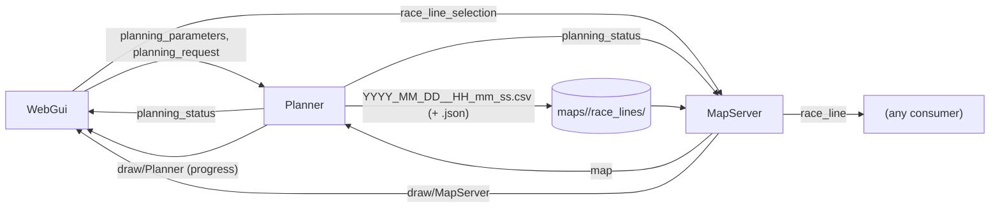

# Planning

How the `Planner` executor plans a race line for the selected map, and how
it's driven from `web_gui`'s **Planning** panel.

There are two objectives, picked in the panel:
- **Minimum curvature:** the closed curve, kept half the vehicle's width
  plus a safety margin away from both walls, whose squared curvature summed
  over the lap is smallest. A speed profile goes on top.
- **Minimum time:** the path *and* speeds that complete a lap fastest for a
  point mass inside a friction ellipse, starting from the minimum-curvature
  line. See [Minimum time](#minimum-time).

It's pure Rust: OpEn's PANOC and augmented Lagrangian solvers (the
`optimization_engine` crate), with hand-written gradients.

## Architecture

- **`planning_parameters`:** the parameter values `web_gui` wants, the whole
  set at once. The planner applies them whenever it's idle, so they take
  effect **before** Start is pressed.
- **`planning_request`:** a counter and an objective (`min_curvature` or
  `min_time`). Each bump asks for a race line for the map currently on
  `map`.
- **`planning_status`:** idle or computing, the current step (e.g.
  `Optimizing - iteration 3/30, moved up to 0.300 m`), every parameter with
  the value in effect, and the latest outcome. The outcome holds the file
  written or the error, the lap length and time, the maximum curvature of
  the race line and of the centerline, and how long planning took - plus,
  for minimum time, its file and lap numbers or why it failed. The planner
  only writes it when something changes.
- **`race_line`:** published by `MapServer` for the selected map, as closed
  `x,y,speed` points plus the file name and method. When a map is loaded it
  holds the map's newest planned line, or its centerline if it has none.
  When `planning_status` reports lines saved for that map, `MapServer`
  switches to the newest one (the one just saved).
- **`race_line_selection`:** written by `web_gui`'s **Race Lines** panel:
  a map folder and one of its race line files. `MapServer` switches to it
  on every new write, if it's for the loaded map.
- **Drawing:** `MapServer` draws the line over the map, colored by speed
  (blue at the slowest point, green, then red at the fastest). A planned
  race line is drawn thicker than a centerline. While computing, the
  planner draws the line it's optimizing around (thin, white) and the
  latest solution: amber for minimum curvature, purple for minimum time.

## The pipeline

1. **Track** (`planning/track.rs`). The drivable pixels 4-connected to the
   start/finish line's midpoint. Exactly two walls must touch them: the
   outer one and one inner island. Anything else fails with a message
   saying how many walls were found. For example, an obstacle on the
   track makes three: clean the map up.
2. **Reference line.**
   - A map with a `centerline.csv` (generated maps) uses it.
   - A map without one (e.g. saved by SLAM) gets one computed from its
     walls (`planning/centerline.rs`): the zero line of
     `distance to inner wall − distance to outer wall`. Both distances come
     from an exact Euclidean distance transform. The line is traced with
     marching squares, giving a single closed curve with sub-pixel accuracy
     and none of a skeleton's side branches. It's resampled, smoothed with
     a moving average (`centerline_smoothing_window`), and saved as the
     map's `centerline.csv` too.

   Either way, the line is turned to run in the direction of travel given
   by the start/finish line, starts at its point nearest that line, and is
   resampled every `spacing_m`.
3. **Minimum curvature** (`planning/min_curvature.rs`).
   - Each point may only move sideways along the reference's normal:
     `p_i = c_i + α_i·n_i`.
   - Each offset is bounded by the free space either side of the point,
     raycast in the map: `−w_right + m ≤ α_i ≤ w_left − m`, where
     `m = w/2 + safety_margin_m`, `w` the vehicle's width (its
     `vehicle_geometry`, from the car's calibration). These are box constraints,
     which PANOC projects onto exactly.
   - The discrete curvature `κ_i = (d_i × s_i)/|d_i|³` (central first and
     second differences) is linearized in the offsets (a Gauss-Newton
     step). The cost `Σκ_i² + λ·Σ(α_{i+1}−α_i)²` becomes a quadratic whose
     gradient only couples neighbors, so each evaluation costs O(n).
   - **Curvature limit.** The vehicle can't turn tighter than its steering
     allows: a kinematic bicycle turns with curvature `tan(δ)/L`, `L` its
     wheelbase. The line may use `max_steering_fraction` of the steering
     lock `δ_max` (the smaller of its two sides, from the car's calibration,
     read from `vehicle_limits`), so it never turns tighter than
     `κ_max = tan(max_steering_fraction·δ_max)/L`. The rest of the lock is
     left for the controller to correct with. Minimizing `Σκ²` alone doesn't
     bound the largest curvature: it happily concentrates the turning in one
     tight spot. So the cost gets a penalty `w·Σ max(|κ_i| − κ_max, 0)²`,
     which is convex and zero wherever the line is within the limit. `w`
     starts at 1 and grows tenfold, up to 1000, after every iteration whose
     line is still over the limit. A large `w` from the start makes the
     problem too stiff for PANOC while the line is still rough, e.g. a
     computed centerline's kinks. The penalty aims 2% below `κ_max`, and the
     final line may exceed it by up to 2%. A line tighter than that is
     refused: planning fails with where it turns too tight. Then the track
     is too tight for the vehicle: raise `max_steering_fraction`, or lower
     the safety margin.
   - Each iteration also caps every move at `max_step_m`, so the
     linearization stays accurate. The problem is then solved again around
     the new line: the iterative scheme of Heilmeier et al., which TUM's
     global race trajectory optimization uses too. It stops once no point
     moves more than `tolerance_m`, or after `iterations`.
   - Linearizing only the second difference, with the point spacing held
     fixed, is simpler but wrong. Moving points toward the inside of a
     corner shrinks their second difference, so that model takes the inside
     of every corner for the flattest line, which is a shortest path. On a
     ring it hugs the inner wall instead of the outer one.
4. **Speed profile** (`planning/speed_profile.rs`).
   - The vehicle's grip is a **friction ellipse**. On each segment `i → i+1`,
     `a_lon = (v²_{i+1} − v²_i)/(2d_i)` and `a_lat = v²_i·κ_i` must satisfy
     `(a_lon/max_decel_mps2)² + (a_lat/max_lateral_accel_mps2)² ≤ 1`:
     braking or accelerating in a corner leaves less grip to turn.
     Accelerating is further capped by the motor, `a_lon ≤ max_accel_mps2`.
   - Every point starts at `v = min(max_speed_mps, √(max_lateral_accel_mps2/|κ|))`.
   - Then backward (braking) and forward (accelerating) passes around the
     closed loop, until nothing changes. In the braking pass `v_i` appears
     on both sides of the ellipse inequality; squared, that's a quadratic,
     solved in closed form.
   - These are exactly the minimum-time optimizer's constraints, so a
     profile from here is a feasible starting point for it.

The race line is saved as a new file in the map's `race_lines/`, named
after the local date and time: `YYYY_MM_DD__HH_mm_ss.csv` (with a `_2`,
`_3`, ... suffix if that name is taken). It uses the same `x,y,speed`
format as `centerline.csv`, and never replaces an earlier line. `s`,
heading and curvature aren't stored: they follow from the points.

Next to it, a `.json` sidecar of the same name records the method
(`min_curvature` or `min_time`) and when it was saved, in ms since the
epoch. See `environment/race_lines.rs`.

### Race Lines panel

The **Race Lines** button in the left panel lists every `*.csv` in the
loaded map's `race_lines/`, newest first. Each entry shows the name, the
computation method, the estimated lap time (every segment at the mean of
its two ends' speeds), and the lap length. The one `MapServer` publishes
is highlighted. Click another one to follow it instead.

Files without a sidecar still list: `centerline.csv` as the centerline,
the older `race_line.csv` and `race_line_min_time.csv` as minimum
curvature and minimum time, anything else as an unknown method. They're
dated by their modification time. By default the newest line is used,
except that the centerline is only used when there's no other line.

## Minimum time

`planning/min_time.rs`, run after minimum curvature when the objective is
**Minimum time**. It saves its line as a new file (same format, at
`min_time_spacing_m`) right after the minimum-curvature one it started from,
so it's the newer of the two. On a generated
track the minimum-time lap is about 12% faster than the minimum-curvature
one, both timed with the same speed profile, and takes about 12 s to plan.
The fastest line isn't the flattest: on a ring, minimum curvature runs
along the outer wall, minimum time along the inner one, since at the
cornering limit a lap of a circle takes `2π·√(R/a_lat)`.

- **Variables:** every point's sideways offset `n_i` from the
  minimum-curvature line and its squared speed `V_i = v_i²`.
- **Offsets follow a B-spline.** They aren't free per point: they follow a
  periodic cubic B-spline through control values
  `min_time_control_spacing_m` apart, `n = B·z`. With free per-point offsets
  PANOC made no progress at all (100k inner iterations for 1 mm): curvature
  reacts to them like `1/spacing²`, squared by the penalty, so the problem is
  hopelessly stiff. With the spline, the ring converges in 5 outer
  iterations. The box stays exact: B-spline weights are nonnegative and sum
  to one, so bounding each control value by the tightest point limit over
  its support keeps every point on the track. This is slightly conservative
  where the width changes quickly.
- **Exact geometry:** positions, segment lengths and curvatures are computed
  from the offsets, not linearized.
- **Cost:** the lap time `Σ 2d_i/(v_i + v_{i+1})`, exact for a constant
  acceleration along each segment.
- **Constraints:** the box (offsets inside the track, speeds in
  `[min_speed_mps, max_speed_mps]`) is projected exactly. The friction
  ellipse and the motor limit, per point, go through the augmented
  Lagrangian as `F1(u) ∈ C`, where `C` is one unit disk per point (the
  scaled ellipse), one half-line `≤ 1` per point (the scaled motor
  limit), and one interval `[−1, 1]` per point (the curvature over
  `κ_max`, the steering limit - see [the pipeline](#the-pipeline)).
- **Warm start:** the minimum-curvature line at its own speed profile, which
  is feasible (its curvature too, since minimum curvature aims just below
  the limit).
- **Outer loop:** run one iteration at a time, carrying the Lagrange
  multipliers and penalty over, so the panel shows each one ("lap 20.9 s,
  limits exceeded by up to 0.2%") and planning can be cancelled. It has
  converged once no limit is exceeded by more than `min_time_tolerance`.
- **Speeds:** the saved ones are recomputed with the speed profile on the
  final path, so they respect the limits exactly; the ALM only does up to
  its tolerance.
- **If it doesn't converge** (`min_time_max_outer_iterations`,
  `min_time_max_duration_s`), the panel says why, no minimum-time file is
  written, and the minimum-curvature line is still saved.

After planning, `MapServer` follows the newest line: the minimum-time one
if it converged. Earlier lines stay on disk, and you can switch back to any
of them from the Race Lines panel.

### About PANOC here

The curvature terms make this problem stiff: second differences, squared,
give a Hessian whose largest eigenvalue grows like `1/spacing⁴`. PANOC
typically needs thousands of iterations per solve, which is still fast
because each one is O(n). A full plan of a generated track takes about 7 s.

When PANOC hits `solver_max_iterations` without converging, OpEn returns
its iterate with the smallest fixed-point residual, which can be one of its
very first. The planner therefore fails with a clear message rather than
use that. If you see it, raise `solver_max_iterations`, or `spacing_m`.

## Driving it: the Planning panel

- **Objective:** Minimum curvature or Minimum time. This browser remembers
  the choice.
- **Start computation** plans for the selected map. It's disabled while
  computing and with no map selected. The status line shows the current
  step. Once done, the outcome line shows the file written and the lap's
  numbers, or why it failed.
- **Parameters:** one slider per parameter. A change is applied as soon as
  the planner is idle, so tune them before starting. **Save parameters**
  writes the values in effect into `config/planning/race_line.toml`,
  keeping its comments. **Load from file** goes back to that file's values.

## Parameters (`config/planning/race_line.toml`)

| Parameter | Meaning |
|---|---|
| `spacing_m` | Distance between the race line's points. |
| `centerline_smoothing_window` | Points averaged to smooth a centerline computed from the walls. |
| `safety_margin_m` | The line keeps half the vehicle's width (its `vehicle_geometry`) plus `safety_margin_m` from either wall. |
| `max_steering_fraction` | Share of the vehicle's steering lock the line may use: it never turns tighter than `tan(max_steering_fraction·δ_max)/wheelbase`. |
| `smoothness_weight` | `λ`: penalty on neighboring offsets differing. `0` is pure minimum curvature. |
| `max_step_m` | Farthest any point may move in one iteration. |
| `iterations`, `tolerance_m` | Most outer iterations, and the move below which the line has converged. |
| `solver_max_iterations` | PANOC's iteration budget per solve. |
| `max_speed_mps` | Top speed. |
| `max_lateral_accel_mps2`, `max_decel_mps2` | The friction ellipse's lateral and longitudinal semi-axes. |
| `max_accel_mps2` | The motor's forward acceleration limit. |
| `min_time_spacing_m` | Minimum time: spacing of its points and of its CSV. |
| `min_time_control_spacing_m` | Minimum time: spacing of the B-spline control values its offsets follow. |
| `min_speed_mps` | Minimum time: lowest speed allowed anywhere. |
| `min_time_max_outer_iterations`, `min_time_max_duration_s` | Minimum time: iteration and time limits. |
| `min_time_tolerance` | Minimum time: converged once no limit is exceeded by more than this fraction. |
| `solver_tolerance`, `poll_interval_ms` | Not tunable from the panel: PANOC's tolerance, and how often the planner polls. |

## Not done yet

- **Separate left and right steering limits.** The curvature limit uses
  the smaller side of the steering lock both ways.
- **A richer vehicle model.** Minimum time uses a point mass: no load
  transfer, no yaw dynamics, and grip that doesn't depend on speed.
