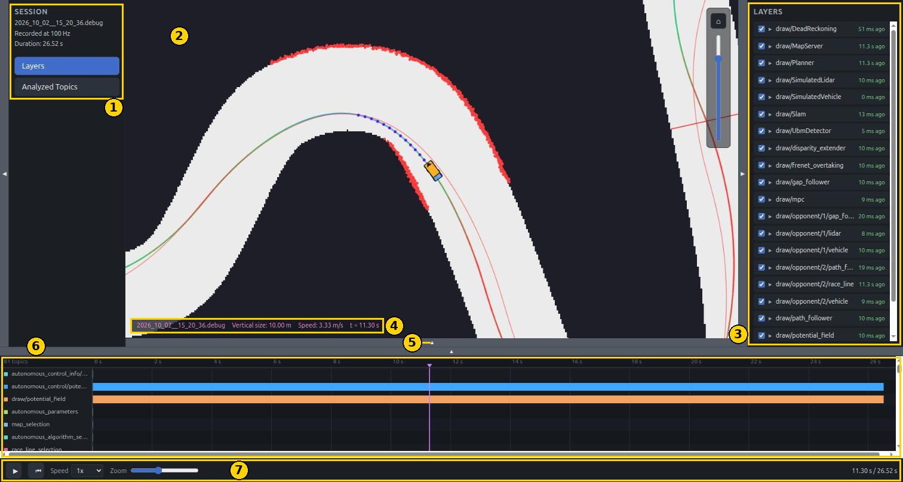
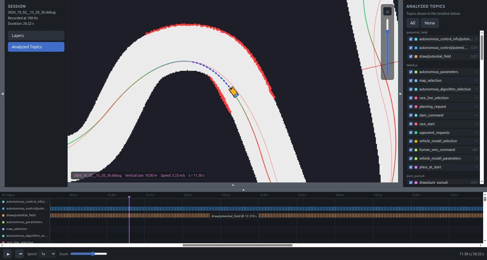
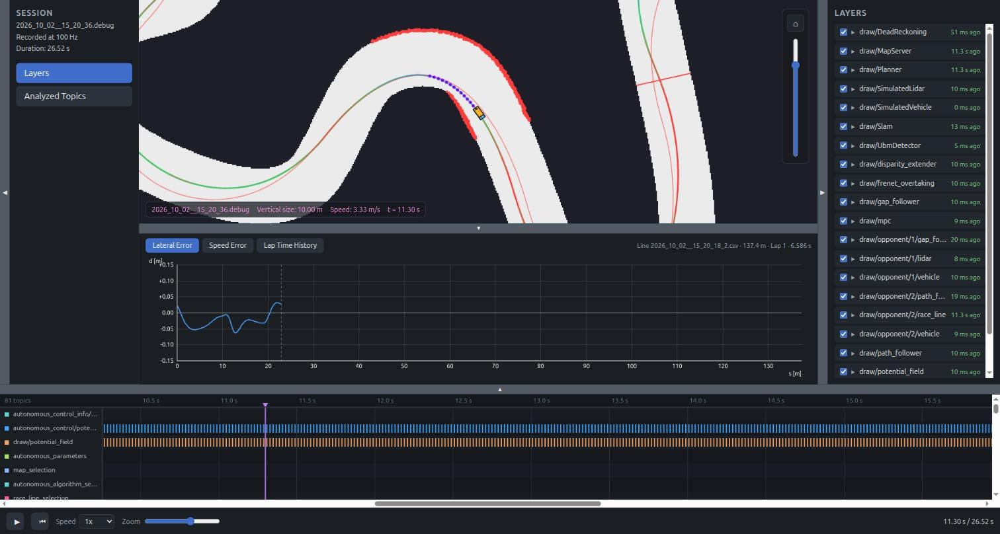
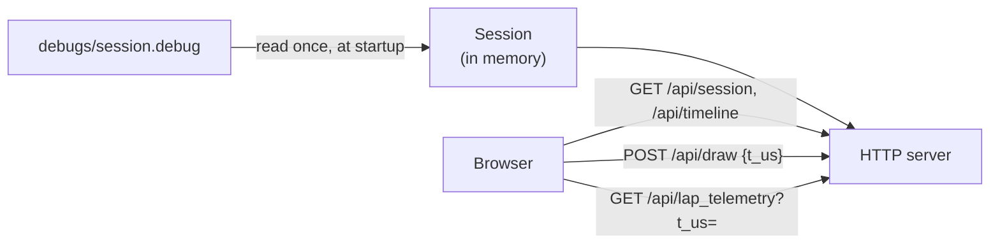

# Replay web GUI

`replay_web_gui` plays back a debug session recorded by `web_gui`. It shows
the same map as `web_gui`, with whatever every executor drew at the time, plus
a timeline of when each topic was written. It is the tool for looking at a
run again, slowly, after something went wrong.

It is read-only and needs only the recorded file: not `config/`, not `maps/`,
not the car.

## Recording a session

A session is recorded by `web_gui`, in one of two ways:

- from its **Debug** panel: **Start recording**, then **Stop & save**
  (see [Web GUI](web_gui.md#debug));
- from the command line, from the very start: `./target/release/web_gui --debug`.

The file goes into `debugs/`, named after the date and time unless a name is
given.

A recording holds every topic that some executor writes: sensor data,
commands, statuses, and all the drawings. At the recording rate (100 Hz by
default), each topic that was written since the last snapshot is saved with
the time it was written. So the file holds what *every* algorithm wanted, not
only the one that was driving.

## Running it

```sh
./target/release/replay_web_gui --file debugs/<session>.debug
```

Then open <http://localhost:1998>.

| Option | Meaning |
|---|---|
| `--file PATH` | The `.debug` file to play back (required) |
| `--bind-addr ADDR` | Address and port to serve on (default `0.0.0.0:1998`) |

The port differs from `web_gui`'s, so both can run side by side, for example
to compare a live session with a recorded one.

The whole file is loaded into memory at startup, so a long recording takes a
moment to open and as much memory as its size.

## The page at a glance



| # | Part | What it is |
|---|---|---|
| 1 | Session | The file's name, the rate it was recorded at and its duration, then the two panels. |
| 2 | Map canvas | The drawings as they were at the playback time. Same canvas as `web_gui`: wheel to zoom, drag to pan. |
| 3 | Panel | **Layers** or **Analyzed Topics**. |
| 4 | Status bar | File name, how many meters the canvas shows top to bottom, the vehicle's speed, and the playback time. |
| 5 | Lap telemetry toggle | Opens the lap charts between the map and the timeline. |
| 6 | Timeline | One row per topic, one tick per recorded write. The purple line is the playback time. |
| 7 | Transport bar | Play/pause, back to the start, playback speed, timeline zoom, and the time. |

The thin bars with arrows hide and show the session list, the panel and the
timeline.

## The map

The canvas shows what the recorded executors drew, exactly as `web_gui` showed
it live. Nothing is simulated again: the vehicle moves because its recorded
drawing moves.

- **Everything follows the playback time.** Paused, the picture stands still.
  Playing at 0.1x, it moves ten times slower.
- **A drawing fades as it did live.** If an executor stopped publishing
  during the session, its drawing fades out at that moment of the replay too.
- **Every algorithm's drawing is there,** not only the selected one's,
  because all algorithms run all the time. Tick another algorithm in the
  Layers panel to see what it would have done at the same instant.

### Layers

The Layers panel (in the overview above) is the same as
[web_gui's](web_gui.md#layers): one row per drawing topic, with a checkbox
for the whole drawing and one per named element. The age on the right is
relative to the playback time.

## The timeline



The timeline answers the question "was this topic written, and when?".

- **One row per topic, one tick per recorded write.** A topic written at
  50 Hz shows as a regular comb. A gap in the comb is a moment its writer
  published nothing. A single tick is a one-off event, such as a map selection
  or a parameter change.
- **Each topic has its own color,** the same one every time the file is
  opened.
- **Hovering a tick** shows the topic's name and the time of that write.

The **Analyzed Topics** panel picks which topics get a row. They are grouped
by the executor that wrote them, each with its color and the number of writes
recorded. **All** and **None** tick or untick everything.

Mouse controls on the timeline:

| Input | Effect |
|---|---|
| Right click, or right drag | Jump to that time, or scrub through the recording |
| Left drag | Pan the timeline |
| Wheel over the ticks | Zoom the time axis around the pointer |
| Wheel over the topic names, or Shift + wheel | Scroll through the rows |

The transport bar:

- **Play/pause** and **back to the start**.
- **Speed**, from 0.1x to 8x.
- **Zoom**, the same as the wheel.
- While playing, the timeline scrolls by itself to keep the playback line in
  view.

## Lap telemetry



The toggle under the map opens the same lap panel as in
[web_gui](web_gui.md#bottom-panel-lap-telemetry), showing the lap telemetry
as it was recorded at the playback time: the lateral and speed errors along
the lap, and the lap times so far.

## How it works



- **No executors, no topics.** Unlike `web_gui`, this binary has no `Runner`
  and no `Captain`. It reads the file into a `Session` and serves it.
- **The clock lives in the browser.** The page owns the playback time
  (`src/web/playback_clock.js`) and sends it with every request, as `t_us`,
  microseconds since the start of the recording. The server answers with each
  drawing topic's last value at or before that time, as a live read would have
  seen it.
- **The same drawing protocol as `web_gui`.** `POST /api/draw` and
  `GET /api/draw/raster` behave as described in
  [Web GUI](web_gui.md#drawings), so the canvas code (`map_view.js`,
  `draw_layers.js`) is shared unchanged. The only difference is which clock
  ages the drawings.
- **Only two things are topic-specific:** the drawings and the lap telemetry.
  Every other topic appears only as ticks on the timeline. Its values are in
  the file but are not shown.
- **A file cut short still opens.** The format has no index at its end, so a
  recording interrupted by a crash or a power cut is read up to its last
  complete record (see `src/core/debug_format.rs`).

### HTTP API

| Route | Purpose |
|---|---|
| `GET /api/session` | The file's name, recording rate and duration |
| `GET /api/timeline` | Every topic with its writer and the times it was written |
| `POST /api/draw` | The drawings at playback time `t_us` |
| `GET /api/draw/raster` | A map image of a drawing |
| `GET /api/lap_telemetry?t_us=...` | The lap telemetry recorded last at or before `t_us` |

### Where things are

| File | Role |
|---|---|
| `src/bin/replay_web_gui/main.rs` | Loads the session and serves it |
| `src/bin/replay_web_gui/cli.rs` | The command-line options |
| `src/bin/replay_web_gui/session.rs` | The recording in memory: timestamps per topic, drawings, lap telemetry |
| `src/bin/replay_web_gui/debug_api.rs` | The API above |
| `src/bin/replay_web_gui/handlers.rs` | Routes each request |
| `src/bin/replay_web_gui/static/` | The page: `index.html`, `style.css`, `app.js`, `timeline.js` |
| `src/web/*.js`, `src/web/base.css` | The canvas, drawing layers, lap panel and playback clock, shared with the other web UIs |
| `src/core/debug_executor.rs` | The recorder, on the `web_gui` side |
| `src/core/debug_format.rs` | The `.debug` file format |
