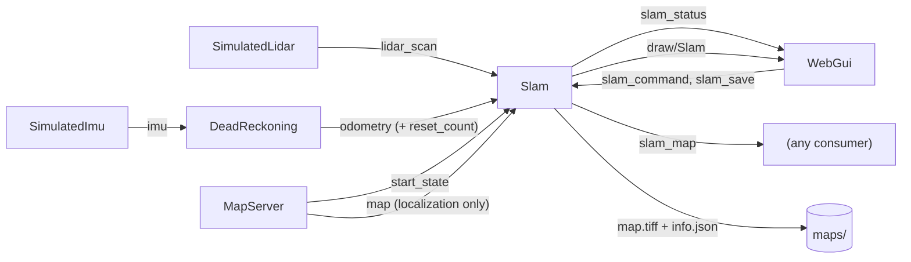

# SLAM

How the `Slam` executor builds a map of the track while the vehicle drives,
saves it under `maps/`, and localizes the vehicle on a known map, and how
it's driven from `web_gui`'s **Mapping** and **Localization** panels.

`Slam` is a pure-Rust port of the mapping core of
[slam_toolbox](../other_repos/slam_toolbox), which is itself a ROS wrapper
around the Karto mapper (`other_repos/slam_toolbox/lib/karto_sdk`). None of
the C++ is linked: each Rust module ports one Karto piece and names it in its
doc comments, so the two can be compared side by side.

It does what Karto's `Mapper` does:
- matches each scan against the recent ones;
- links it into a **pose graph**;
- **closes loops** when the vehicle comes back to a place it has already
  mapped, optimizing the whole graph;
- builds an occupancy grid from every scan.

The optimizer replaces slam_toolbox's Ceres solver. It's our own
Levenberg-Marquardt, with the sparse linear algebra from the `faer` crate.

## Architecture



The diagram shows the simulation. On the real car, `HokuyoLidar` publishes
`lidar_scan` and `Vesc` publishes `imu` instead; nothing else changes.

- **Inputs:** `lidar_scan`, `odometry`, `slam_command` and `slam_save`,
  plus `map` and `start_state` while localizing. SLAM never reads
  `vehicle_status`, which is the simulator's ground truth. It only knows
  what a real car would know.
- **`slam_status`:** the state SLAM is actually in, how many scans the map
  has, the latest corrected pose, the latest match response (0 to 1), how
  long the latest scan took to process, how many loops have been closed, and
  how long the latest optimization took. Also the outcome of the latest
  save (see [Saving the map](#saving-the-map)) and, while localizing, the
  correction `map_to_odom` (see [Localization](#localization)).
- **`slam_map`:** the occupancy grid, in SLAM's own frame (see
  [Frames](#frames)). Each pixel is one of `SlamMap::FREE` (255),
  `SlamMap::OCCUPIED` (0) or `SlamMap::UNKNOWN` (128), plus the trajectory.
  It's republished at most every `map_publish_period_s`, and only when it
  changes.
- **`draw/Slam`:** the map, the trajectory, a green vehicle at the corrected
  pose, and an amber circle wherever a loop was closed. They're drawn above
  the true map and below everything else. The map is opaque, and its
  unknown cells are grey, so it hides the true map underneath: toggle the
  layers in the Layers panel to compare the two.

## Driving it: `slam_command` / `slam_status`

| State | Meaning |
|---|---|
| `off` | Nothing in memory, no scans taken. Entering `off` throws the map away. |
| `waiting` | Paused: the map is kept, and new scans are ignored. |
| `running` | Every new scan is matched and added to the map. |
| `localizing` | Every new scan is matched against the selected map, which never changes (see [Localization](#localization)). |
| `localization_paused` | Paused: the localized pose is kept, and new scans are ignored. |

The Mapping panel's **Play**, **Pause** and **Clear** buttons write
`running`, `waiting` and `off`. The label shows the state reported on
`slam_status`, not the one requested, so it also tells you when SLAM isn't
running at all.

`web_gui` also writes `off` when **a map is selected** and, unless
localizing, when **the vehicle is placed at the start** (the "P" key). Both
make the old map meaningless: it's either a different track, or dead
reckoning (whose frame the map is built in) has just been reset. While
localizing, "P" leaves the state alone: SLAM restarts localization from the
start by itself when dead reckoning resets.

Two safety nets:

- **`SlamCommand::clear_requested`** is bumped on every `off` write, and SLAM
  clears whenever it changes. SLAM only sees the latest value of a topic, so
  without this a Clear quickly followed by Play (both landing between two of
  SLAM's ticks) would never clear.
- **`Odometry::reset_count`** is bumped by `DeadReckoning` on every reset.
  SLAM clears if it changes under a map, and only interpolates between
  samples of the same count.

## How a scan is processed

Each tick (`rate_hz`), SLAM:

1. Buffers the latest odometry sample (`odometry_buffer_len` of them).
2. Applies the command: `off` or a bumped `clear_requested` clears
   everything.
3. If `running`, takes the latest new scan and **interpolates the odometry
   pose at the instant the scan was written**. If odometry hasn't caught up
   to that instant yet, the scan waits for the next tick. Only the latest
   scan is ever processed, so a slow match simply skips scans. That matches
   slam_toolbox's asynchronous mode.
4. Runs `Mapper::process`, a port of Karto's `Mapper::Process`:
   1. **Carry the last correction over:** the new scan's prior is the last
      scan's *corrected* pose, moved by however much odometry says the
      vehicle moved since.
   2. **Throttle:** the scan is kept only if the vehicle moved
      `minimum_travel_distance_m`, turned `minimum_travel_heading_rad`, or
      `minimum_time_interval_s` passed since the last scan kept.
   3. **Match** the scan against the running buffer (the last
      `scan_buffer_size` scans, spanning at most
      `scan_buffer_maximum_scan_distance_m`). The correlative scan matcher
      brute-forces every pose in a `correlation_search_space_dimension_m`
      window and ±`coarse_search_angle_offset_rad` around the prior, first
      coarsely and then finely around the winner. Candidates far from the
      prior are penalized, so odometry still counts.
   4. **Link** it into the pose graph (see [below](#the-pose-graph-and-loop-closure)),
      and add it to the running buffer.
   5. **Try to close a loop**, and optimize the whole graph if one closes.
   6. **Add** it to the occupancy grid: each beam increments the pass count
      of every cell it crosses and the hit count of the cell it ends in. If a
      loop closed, every scan may have moved, so the grid is rebuilt from
      all of them instead.
5. Publishes `slam_status`, then `slam_map` and the drawing if they're due.

## The pose graph and loop closure

Sequential matching alone drifts: every small match error adds up along the
chain. It drifts worst where the track looks the same for a while (a long,
featureless straight), because matching can't tell how far along it the
vehicle is. After a lap, the start and the end of the map don't line up.
The pose graph fixes that.

Every kept scan is a **vertex**. Every accepted match is an **edge**: where
one scan sits relative to another, and how sure the match is (the inverse of
its covariance, so a match that's ambiguous along a corridor holds weakly
along it). Each new scan gets edges (Karto's `MapperGraph::AddEdges`) as
follows:

1. **To the previous scan**, and to the closest running scan within
   `link_scan_maximum_distance_m`, both measured by the sequential match.
2. **To nearby chains already linked to it** (`LinkNearChains`). These are
   runs of consecutive scans within `link_scan_maximum_distance_m` that can
   be reached through the graph without leaving that distance, other than
   the one the scan belongs to. Each run of at least
   `loop_match_minimum_chain_size` scans is matched, and linked if it scores
   above `link_match_minimum_response_fine`. The scan then moves to the
   covariance-weighted mean of every match. After a loop has closed, this
   keeps the second lap stitched to the first.

Then SLAM **looks for a loop** (`TryCloseLoop`). It looks for runs of at
least `loop_match_minimum_chain_size` consecutive old scans within
`loop_search_maximum_distance_m` that are *not* reachable through the graph
within that distance, meaning the vehicle is back somewhere it mapped long
ago. For each run:

1. A **coarse match** in a wide window (`loop_search_space_dimension_m`,
   8 m by default, since the drift may be large). It must score above
   `loop_match_minimum_response_coarse`, with both position variances below
   `loop_match_maximum_variance_coarse`.
2. A **fine match** around the coarse result, which must score at least
   `loop_match_minimum_response_fine`.
3. The scan is linked to the run with a **loop-closure edge**, and the
   **whole graph is optimized**.

**Optimization** (`optimizer.rs`) finds the poses that best agree with every
edge. It minimizes `Σ eᵀ Ω e`, where for each edge
`e = [R(θa)ᵀ(pb − pa) − p_ab ; wrap(θb − θa − θ_ab)]`, exactly slam_toolbox's
`PoseGraph2dErrorTerm`. The first scan's pose is held fixed. Each
Levenberg-Marquardt step solves the sparse normal equations with `faer`'s
sparse Cholesky. The symbolic factorization is computed once per
optimization and reused across iterations. It stops when the cost drops
by less than 0.1%, when no pose moves by more than 0.1 mm, or after
`optimizer_max_iterations` iterations. Every scan then moves to its
optimized pose, and the occupancy grid is rebuilt from all of them. The
correction spreads along the loop, weighted by how sure each edge is, so
most of it lands where the drift built up.

## Frames

SLAM's frame is the `odom` frame of the odometry it was built from. Its
origin is where dead reckoning was last reset (the start line), with x along
the vehicle's heading there. A real car has no world frame to give it.

To overlay the true map, the drawing places that frame at `start_state`, the
same way `DeadReckoning` draws its trail. A `Shape::Raster` can't be
rotated, so the drawing resamples the grid into world axes, using the
nearest cell for each pixel.

## Code map (Karto → Rust)

| Rust (`src/localization/slam/`) | Karto |
|---|---|
| `pose.rs` | `Pose2`, `Transform` |
| `odometry_buffer.rs` | the ROS TF buffer's role: pose at a timestamp |
| `scan.rs` | `LocalizedRangeScan`, range threshold filtering |
| `correlation_grid.rs` | `CorrelationGrid`, `SmearPoint`, `CalculateKernel` |
| `scan_matcher.rs` | `ScanMatcher::MatchScan`, `CorrelateScan`, `GetResponse`, `FindValidPoints`, `ComputePositionalCovariance`, `ComputeAngularCovariance`, `GridIndexLookup` |
| `occupancy_grid.rs` | `OccupancyGrid::AddScan`, `RayTrace`, `UpdateCell`, `Grid::TraceLine`, `CreateFromScans` - incremental and growable, see below |
| `matrix3.rs` | `Matrix3` |
| `pose_graph.rs` | `MapperGraph`'s bookkeeping: `LinkScans`, `LinkInfo`, `FindNearLinkedScans` (`TraverseForScans` + `NearScanVisitor`), `ComputeWeightedMean` |
| `optimizer.rs` | `solvers/ceres_solver.cpp` + `ceres_utils.h`: `PoseGraph2dErrorTerm`, `AngleManifold`, first node fixed |
| `map_saver.rs` | slam_toolbox's `map_saver` (which calls nav2's): the saved map's cleanup and start/finish line are our own |
| `localizer.rs` | the role of `ProcessLocalization`, but matching against the map's walls rather than stored scans |
| `mapper.rs` | `Mapper::Process`, `HasMovedEnough`, `ScanManager::AddRunningScan`, `MapperGraph::AddEdges`, `LinkChainToScan`, `LinkNearChains`, `FindNearChains`, `TryCloseLoop`, `FindPossibleLoopClosure`, `CorrectPoses` |
| `../slam.rs` | the executor, config, and drawing (slam_toolbox's ROS node) |

Differences from Karto that matter:

- **The occupancy grid is incremental.** Karto rebuilds it from every scan
  whenever it's asked for. Here each new scan is traced once, and the grid
  is only rebuilt from every scan when a loop closure has moved them.
- **The scan matcher is single-threaded** (Karto uses TBB). A sequential
  match takes about 7 ms in release builds with the default parameters,
  and about 15 ms once nearby chains are being linked on a second lap.
- **Optimization runs on the SLAM thread**, synchronously, as in Karto's
  `TryCloseLoop`. On a lap of about 700 scans it takes under 10 ms. Scans
  that arrive meanwhile are skipped, as with any slow match.
- **The lidar faces forward, and its position on the vehicle comes with
  each scan** (`LidarScan::mount_x_m`/`mount_y_m`, from the car's
  calibration). Readings are kept in the vehicle's frame, so there's no
  separate sensor transform to configure.

## Parameters

Everything lives in `config/localization/slam.toml`, commented. Names follow
slam_toolbox's `config/mapper_params_online_async.yaml`, with units added.
The defaults are slam_toolbox's, except:

- `minimum_travel_distance_m` / `minimum_travel_heading_rad` are 0.2 (vs 0.5),
  which suits a 1/10 car on small tracks.
- `max_laser_range_m` is 12 (vs 20): readings beyond it only mark the cells
  they cross as free. The lidars themselves reach 30 m.

The loop-closure parameters (`do_loop_closing`, `link_*`, `loop_*`,
`optimizer_max_iterations`) have slam_toolbox's defaults.
`do_loop_closing = false` gives the plain chain of sequential matches, which
is useful for comparing the two.

**Parked vehicle:** as in Karto, a scan is kept every
`minimum_time_interval_s` (0.5 s) even when the vehicle doesn't move. Each
one links to every scan parked around it, so the per-scan time slowly grows
while parked (15 → 20 ms after a few minutes). Pause mapping while parked,
or raise `minimum_time_interval_s`.

If matches fail (a low `last_match_response` in the panel while odometry
drifts), try these:

- Widen `correlation_search_space_dimension_m` if odometry drifts more than
  half of it between two kept scans.
- Lower `minimum_travel_distance_m` so there's less drift between kept
  scans.
- Raise `distance_variance_penalty` / `angle_variance_penalty` to trust
  odometry less.

## Trying it

```sh
cargo run --release --bin web_gui   # release: the matcher is heavy in debug
```

`noise_scale` in `config/simulation/imu.toml` must be above `0` (it is
by default) so odometry drifts. Otherwise there's nothing for SLAM to
correct. Open the
**Mapping** panel, press **Play** and drive. DeadReckoning's purple vehicle
drifts away from the true one while SLAM's green one stays on it.

Measured on a generated track with IMU `noise_scale = 5`, the car following
the centerline at 2 m/s (driven by a scratch script from ground truth):

| Distance | Odometry error | SLAM error | SLAM heading error | Loops closed |
|---|---|---|---|---|
| 60 m | 2.42 m | 0.27 m | 4.6° | 0 |
| 120 m (end of the lap) | 4.66 m | 1.25 m | 6.3° | 0 |
| 130 m (back over the start) | 4.78 m | 0.40 m | 0.4° | 1 (optimized in 5.3 ms) |
| 140 m | 6.09 m | 0.19 m | 0.6° | 1 |

The SLAM error is measured against its latest kept scan, which lags the
vehicle by up to `minimum_travel_distance_m`.

The unit test `closing_the_loop_straightens_the_whole_trajectory`
(`mapper.rs`) repeats this in a synthetic ring corridor whose top straight
is featureless. Without loop closure the map comes out with that straight
about 1 m too short (worst scan error 1.08 m). With loop closure the whole
trajectory is corrected, to a worst error of 0.25 m, and the pose back over
the start is off by 3 mm.

## Saving the map

The Mapping panel's **Save map** saves the map built so far as a new map
folder: type a name and press the button. `web_gui` only writes the request
(`slam_save`: the name plus a counter bumped on every request, as with
`clear_requested`). SLAM does the saving itself, so any binary running
`Slam` can save maps, with or without `web_gui`. It saves under the maps
root it was created with (`web_gui --maps-root`, `maps/` by default), and
reports the saved folder or the error on `slam_status`'s `last_save`.

The folder has the same format as a generated map, minus the centerline,
which isn't known: `map.tiff` and an `info.json` with `"source": "real"` and
no `generation` block. The planner computes the centerline from the walls
the first time a race line is planned on the map (see `planning.md`).
`map_saver.rs` builds both files:

- **The binary map.** Only free space the vehicle can reach from its
  trajectory is white. The flood fill from the trajectory doesn't cross cells
  next to a wall, which plugs the one-cell holes beams slip through, and then
  grows back by one cell so the track still reaches its walls. Occupied and
  unknown cells, free specks outside the walls, and areas beams leaked into
  are all black. The map is cropped to the track plus a 10-pixel black
  border, since a ray leaving the image hits nothing.
- **The frame.** The saved map is in SLAM's own frame (see [Frames](#frames)).
- **The start/finish line** goes through the first scan's pose (where Play was
  pressed; the optimizer holds that pose fixed). Of the lines through it that
  span the track from border to border, and are at most 1.5 times as long as
  the shortest, it's the one closest to perpendicular to both borders. Each
  border's direction is fitted to its pixels within 0.3 m of the line's end.
  The ends are ordered so the direction of travel it carries (below) is the
  way the vehicle was heading.

**Start/finish line convention (every map):** the direction of travel is
`b - a` turned a quarter counterclockwise, i.e. `a` is on the driver's left.
`MapServer` places the vehicle from the line alone: at its midpoint, heading
that way (`StartFinishLine::start_pose`). The generator writes its lines in
that order too.

## Localization

The **Localization** panel's **Start** and **Pause** write `localizing` and
`localization_paused`. Start is only enabled with a map selected, and never
while SLAM has a map of its own in memory (clear or save it first). SLAM
refuses it anyway in that case, and stays `waiting`.

It localizes on the **selected map**, the one `MapServer` publishes on
`map`, exactly as on the real car. In the simulator that's also the map the
vehicle drives in, so any map works: a generated one, or one SLAM saved.

This isn't slam_toolbox's localization mode. That one loads a serialized
pose graph and matches each scan against the stored scans nearby, linking
it into the graph temporarily (Karto's `ProcessLocalization`). Here the map
is just the binary raster every map folder has (`localizer.rs`):

- **Reference:** the map's wall points, the centers of black pixels next to a
  white one, extracted once per map.
- **Start:** odometry's origin is placed at `start_state`, where dead
  reckoning was last reset. A new map or a dead-reckoning reset restarts
  localization from there.
- **Each scan:** its prior is odometry's pose moved by the current
  correction. The same correlative scan matcher as mapping, with the same
  search window and penalties, matches it against the wall points around
  the prior. A match scoring at least `localization_minimum_response` moves
  the pose and updates the correction. A weaker one leaves the pose to
  odometry until a scan matches again.
- **Output:** `slam_status`'s `pose` (in the map's frame) and `map_to_odom`,
  the correction: composing the latest odometry onto it gives the pose
  between two scans too. The drawing shows a blue vehicle at the pose.

The map is never changed. There's no global relocalization: odometry must
start close to the truth (within the search window) and stay close enough
between scans, as with slam_toolbox's localization.

Measured on a generated track with IMU `noise_scale = 5`, the gap follower
driving for 90 s: odometry drifted up to 8.4 m, while the localized pose
(`map_to_odom` composed with the latest odometry) stayed within 5.6 cm and
1.6° of the truth. Each match took about 11 ms in a release build. On the
map SLAM saved of that track, the error stayed within 5 cm.

## What's next

- **Asynchronous optimization.** A long session with several laps grows the
  graph. Optimizing on a separate thread, as slam_toolbox's async mode does
  with its map updates, would keep scan matching on schedule.
- **Global relocalization:** finding the vehicle on the map with no idea
  where it is (slam_toolbox doesn't do this either).
