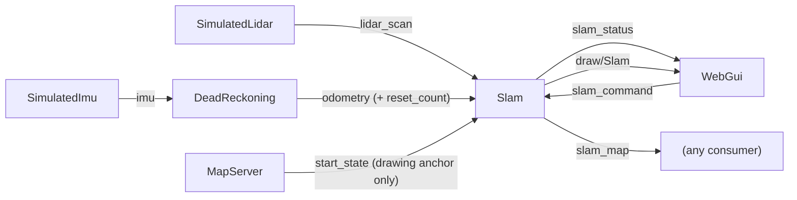

# SLAM

How the `Slam` executor builds a map of the track while the vehicle drives,
how it's driven from `web_gui`'s **Mapping** panel, and what's next.

`Slam` is a pure-Rust port of the mapping core of
[slam_toolbox](../other_repos/slam_toolbox), which is itself a ROS wrapper
around the Karto mapper (`other_repos/slam_toolbox/lib/karto_sdk`). None of
the C++ is linked: each Rust module ports one Karto piece and names it in its
doc comments, so the two can be compared side by side.

**Phase 1 (this one): scan matching, a chain of corrected poses, and an
occupancy grid. No loop closure yet** - see [Next step](#next-step-loop-closure).

## Architecture



- **Inputs:** `lidar_scan`, `odometry` and `slam_command`. SLAM never reads
  `vehicle_status`, which is the simulator's ground truth. It only knows
  what a real car would know.
- **`slam_status`:** the state SLAM is actually in, how many scans the map
  has, the latest corrected pose, the latest match response (0 to 1), and how
  long the latest scan took to process.
- **`slam_map`:** the occupancy grid, in SLAM's own frame (see
  [Frames](#frames)). Each pixel is one of `SlamMap::FREE` (255),
  `SlamMap::OCCUPIED` (0) or `SlamMap::UNKNOWN` (128), plus the trajectory.
  It's republished at most every `map_publish_period_s`, and only when it
  changes.
- **`draw/Slam`:** the map, the trajectory and a green vehicle at the
  corrected pose. They're drawn above the true map and below everything
  else. Toggle the layers in the Layers panel to compare the two maps.

## Driving it: `slam_command` / `slam_status`

| State | Meaning |
|---|---|
| `off` | Nothing in memory, no scans taken. Entering `off` throws the map away. |
| `waiting` | Paused: the map is kept, and new scans are ignored. |
| `running` | Every new scan is matched and added to the map. |

The Mapping panel's **Play**, **Pause** and **Clear** buttons write
`running`, `waiting` and `off`. The label shows the state reported on
`slam_status`, not the one requested, so it also tells you when SLAM isn't
running at all.

`web_gui` also writes `off` when **a map is selected** and when **the vehicle
is placed at the start** (the "P" key). Both make the old map meaningless:
it's either a different track, or dead reckoning (whose frame the map is
built in) has just been reset.

Two safety nets:

- **`SlamCommand::clear_requested`** is bumped on every `off` write, and SLAM
  clears whenever it changes. SLAM only sees the latest value of a topic, so
  without this a Clear quickly followed by Play (both landing between two of
  SLAM's ticks) would never clear.
- **`Odometry::reset_count`** is bumped by `DeadReckoning` on every reset.
  SLAM clears if it changes under a map, and only interpolates between
  samples of the same count.

## How a scan is processed

Each tick (`rate_hz`), SLAM:

1. Buffers the latest odometry sample (`odometry_buffer_len` of them).
2. Applies the command: `off` or a bumped `clear_requested` clears
   everything.
3. If `running`, takes the latest new scan and **interpolates the odometry
   pose at the instant the scan was written**. If odometry hasn't caught up
   to that instant yet, the scan waits for the next tick. Only the latest
   scan is ever processed, so a slow match simply skips scans. That matches
   slam_toolbox's asynchronous mode.
4. Runs `Mapper::process`, a port of Karto's `Mapper::Process`:
   1. **Carry the last correction over:** the new scan's prior is the last
      scan's *corrected* pose, moved by however much odometry says the
      vehicle moved since.
   2. **Throttle:** the scan is kept only if the vehicle moved
      `minimum_travel_distance_m`, turned `minimum_travel_heading_rad`, or
      `minimum_time_interval_s` passed since the last scan kept.
   3. **Match** the scan against the running buffer (the last
      `scan_buffer_size` scans, spanning at most
      `scan_buffer_maximum_scan_distance_m`). The correlative scan matcher
      brute-forces every pose in a `correlation_search_space_dimension_m`
      window and ±`coarse_search_angle_offset_rad` around the prior, first
      coarsely and then finely around the winner. Candidates far from the
      prior are penalized, so odometry still counts.
   4. **Add** the scan, at the matched pose, to the running buffer and to the
      occupancy grid. Each beam increments the pass count of every cell it
      crosses and the hit count of the cell it ends in.
5. Publishes `slam_status`, then `slam_map` and the drawing if they're due.

## Frames

SLAM's frame is the `odom` frame of the odometry it was built from. Its
origin is where dead reckoning was last reset (the start line), with x along
the vehicle's heading there. A real car has no world frame to give it.

To overlay the true map, the drawing places that frame at `start_state`, the
same way `DeadReckoning` draws its trail. A `Shape::Raster` can't be
rotated, so the drawing resamples the grid into world axes, using the
nearest cell for each pixel.

## Code map (Karto → Rust)

| Rust (`src/localization/slam/`) | Karto |
|---|---|
| `pose.rs` | `Pose2`, `Transform` |
| `odometry_buffer.rs` | the ROS TF buffer's role: pose at a timestamp |
| `scan.rs` | `LocalizedRangeScan`, range threshold filtering |
| `correlation_grid.rs` | `CorrelationGrid`, `SmearPoint`, `CalculateKernel` |
| `scan_matcher.rs` | `ScanMatcher::MatchScan`, `CorrelateScan`, `GetResponse`, `FindValidPoints`, `ComputePositionalCovariance`, `ComputeAngularCovariance`, `GridIndexLookup` |
| `occupancy_grid.rs` | `OccupancyGrid::AddScan`, `RayTrace`, `UpdateCell`, `Grid::TraceLine` - incremental and growable, see below |
| `mapper.rs` | `Mapper::Process`, `HasMovedEnough`, `ScanManager::AddRunningScan` |
| `../slam.rs` | the executor, config, and drawing (slam_toolbox's ROS node) |

Differences from Karto that matter:

- **The occupancy grid is incremental.** Karto rebuilds it from every scan
  whenever it's asked for, because loop closure can move any scan. Without
  loop closure a scan never moves once it's added, so each scan is traced
  once and the grid grows as the vehicle explores.
- **The scan matcher is single-threaded** (Karto uses TBB). A match takes
  about 8 ms in release builds with the default parameters.
- **The lidar sits on the vehicle's reference point, facing forward**, as
  `SimulatedLidar` raycasts. There's no sensor offset.

## Parameters

Everything lives in `config/localization/slam.toml`, commented. Names follow
slam_toolbox's `config/mapper_params_online_async.yaml`, with units added.
The defaults are slam_toolbox's, except:

- `minimum_travel_distance_m` / `minimum_travel_heading_rad` are 0.2 (vs 0.5),
  which suits a 1/10 car on small tracks.
- `max_laser_range_m` is 12, the simulated lidar's range.

If matches fail (a low `last_match_response` in the panel while odometry
drifts), try these:

- Widen `correlation_search_space_dimension_m` if odometry drifts more than
  half of it between two kept scans.
- Lower `minimum_travel_distance_m` so there's less drift between kept
  scans.
- Raise `distance_variance_penalty` / `angle_variance_penalty` to trust
  odometry less.

## Trying it

```sh
cargo run --release --bin web_gui   # release: the matcher is heavy in debug
```

Set `noise_scale` in `config/sensors/simulated_imu.toml` above `0` so
odometry drifts. Otherwise there's nothing for SLAM to correct. Then open the
**Mapping** panel, press **Play** and drive. DeadReckoning's purple vehicle
drifts away from the true one while SLAM's green one stays on it.

Measured on a generated track, gap follower driving at 1 m/s for about
15 s:

| IMU `noise_scale` | Odometry error (final) | SLAM error (final) |
|---|---|---|
| 1 | 0.20 m, 0.8° | 0.02 m, 0.2° |
| 5 | 1.48 m, 4.4° | 0.09 m, 0.6° |

## Next step: loop closure

Scan-to-recent-scans matching drifts slowly: every small match error adds up
along the chain. After a lap the map shows it as a seam where the start
should line up with the end. Loop closure fixes that, and it's the next
step. What to port from `lib/karto_sdk/src/Mapper.cpp`:

1. **Pose graph.** Make every kept scan a vertex (`MapperGraph::AddVertex`).
   Add edges from each scan to the previous one and to near scans of other
   chains (`AddEdges`, `LinkScans`, `LinkNearChains`, `FindNearChains`),
   weighted by the scan matcher's covariance, which `MatchResult::covariance`
   already reports. Edges to near chains only count above
   `link_match_minimum_response_fine`, and only within
   `link_scan_maximum_distance`.
2. **Loop detection.** Karto's `MapperGraph::TryCloseLoop` and
   `FindPossibleLoopClosure` look for old scans within
   `loop_search_maximum_distance` of the new scan and at least
   `loop_match_minimum_chain_size` scans apart. They match against those
   scans with a second scan matcher using a much larger window
   (`loop_search_space_dimension`), and accept the match when the coarse and
   fine responses pass `loop_match_minimum_response_coarse` / `_fine`.
3. **Optimization.** Replace Ceres (`solvers/ceres_solver.cpp`) with a small
   sparse Gauss-Newton or Levenberg-Marquardt solver over SE(2) poses in pure
   Rust (hand-rolled, or a pure-Rust crate), then write the optimized poses
   back (`MapperGraph::CorrectPoses`).
4. **Rebuild the grid.** Once poses can move, the incremental occupancy grid
   is no longer enough. After each correction, rebuild it from every scan,
   as Karto's `OccupancyGrid::CreateFromScans` does. That's why phase 1
   already keeps every scan (`Mapper::scans`), not only the running buffer.
   The running buffer will need re-deriving from the corrected poses too.
5. **Async.** Optimizing a large graph can take longer than a lidar period.
   The executor already skips scans that arrive while it's busy, but a long
   optimization would be better on its own thread, publishing corrected
   poses when it's done.
