# Web GUI

`web_gui` is the main application: it starts every part of the stack and
serves one web page to control it. This document goes through that page part
by part, with a screenshot of each, and then explains how it works underneath.

The screenshots were taken in simulation. On a real car the page is the same,
except for the few differences listed in [On the real car](#on-the-real-car).

## Running it

```sh
./target/release/web_gui
```

Then open <http://localhost:1999>. The page is served on every network
interface, so another device can open `http://<address of the machine>:1999`.
The command-line options are described in the [README](../README.md#web_gui).

The GUI's own settings are in `config/web/gui.toml`:

| Key | Meaning |
|---|---|
| `bind_addr` | Address and port the page is served on |
| `worker_threads` | How many requests are handled at the same time |
| `poll_interval_ms` | How long a worker waits for a request before checking whether it should stop |
| `human_max_speed_mps` | Speed a full W or S key press commands |
| `human_max_steering_rad` | Steering angle a full A or D key press commands |
| `grid_gap_m`, `grid_margin_m` | Spacing of a race's starting grid |
| `race_countdown_ms` | How long a race's countdown lasts |
| `benchmark_laps` | Laps one benchmark run drives |
| `benchmark_sample_rate_hz` | How often a benchmark run samples the vehicle into `trajectory.csv` |
| `benchmark_timeout_speed_mps` | A benchmark lap slower than the centerline driven at this speed ends the run as a timeout |

## The page at a glance

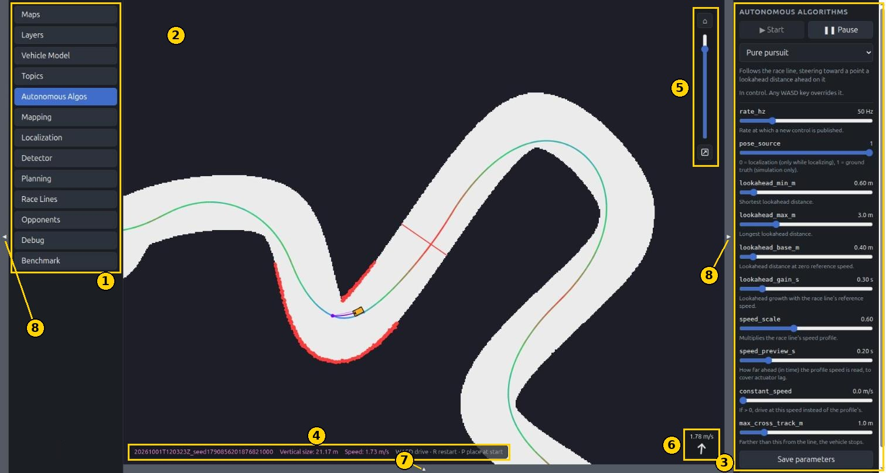

| # | Part | What it is |
|---|---|---|
| 1 | Panel list | One button per panel. The selected panel is shown on the right. |
| 2 | Map canvas | The map and everything drawn on it: the vehicle, LIDAR hits, the race line, what the algorithms draw. |
| 3 | Panel | The selected panel's content. |
| 4 | Status bar | The map's name, how many meters of world the canvas shows top to bottom, the vehicle's speed, and a reminder of the keys. |
| 5 | View controls | Home button, zoom slider, and the place-vehicle tool. |
| 6 | Drive readout | The vehicle's speed, and an arrow turned by its steering angle (straight is up). |
| 7 | Bottom panel toggle | Opens the [lap telemetry](#bottom-panel-lap-telemetry) under the map. |
| 8 | Side toggles | Hide or show the panel list and the panel, to give the map more room. |

## Keyboard and mouse

| Input | Effect |
|---|---|
| **W** / **S** | Drive forward / in reverse, at `human_max_speed_mps` |
| **A** / **D** | Steer left / right, by `human_max_steering_rad` |
| **R** | Restart everything, then reload the page |
| **P** | Place the vehicle on the start/finish line |
| **Esc** | Cancel the place-vehicle or start/finish line tool |
| Mouse wheel on the map | Zoom |
| Left drag on the map | Pan |

- **A human always overrides the autonomous algorithm.** While a WASD key is
  held, the vehicle follows it. When every key is released, control returns
  to the selected algorithm. To stop the car for good, press **Pause** in the
  Autonomous Algos panel. The full rules are in
  [Autonomous algorithms](autonomous_algorithms.md#safety-rules).
- **Keys are ignored while typing** in a text field or in an open pop-up, so
  typing a map name containing "r" does not restart everything.
- **Leaving the tab releases every key,** so the car never keeps driving on a
  key that was held when the window lost focus.
- **R resets what was not saved:** every parameter goes back to its config
  file's value, opponents are removed, and a debug recording ends.

## The map canvas

Everything on the canvas is a **drawing**. The GUI itself draws nothing: each
executor that wants something shown publishes shapes on its own
`draw/<executor>` topic, and the page paints whatever it finds there. A new
sensor or algorithm appears on the map without the GUI changing. See
[Drawings](#drawings) for how this works.

What the standard executors draw:

| Drawn by | What |
|---|---|
| `MapServer` | The map (light is drivable, dark is wall), the race line, and the start/finish line (red) |
| `SimulatedVehicle` | The vehicle, in orange |
| `SimulatedLidar` / `HokuyoLidar` | The LIDAR hits, as red dots |
| `Slam` | The map being built, or the estimated pose while localizing |
| `DeadReckoning` | The odometry pose and its trail (hidden by default) |
| `UbmDetector` | The detected opponent and its bounding box |
| The selected algorithm | Whatever it draws: its target point, its planned path, ... |
| Each opponent | Its vehicle, in the color picked for it |

Things worth knowing:

- **The race line is colored by its speed:** blue at its slowest point,
  through green, to red at its fastest.
- **Teal is "outside the map".** The canvas background is teal, so the edge
  of the map image is visible when zoomed out. On the real car it is dark red
  instead, so the page is never mistaken for the simulator.
- **A drawing that stops being updated fades out.** If an executor crashes or
  stalls, its drawing fades to 20% opacity instead of disappearing, so the
  last thing it drew can still be looked at.
- **The vehicle moves smoothly** even though the page polls at 30 Hz: between
  two samples it is moved forward by its speed.

The view controls (5 in the overview):

- **Home** centers the view on the vehicle, at 10 m of height.
- **The slider** zooms, like the mouse wheel.
- **Place vehicle** (the bottom button): click where the vehicle goes, then
  where it faces. An arrow follows the mouse in between. The simulated
  vehicle is placed there at rest. Esc or a right click cancels.

## Panels

### Maps

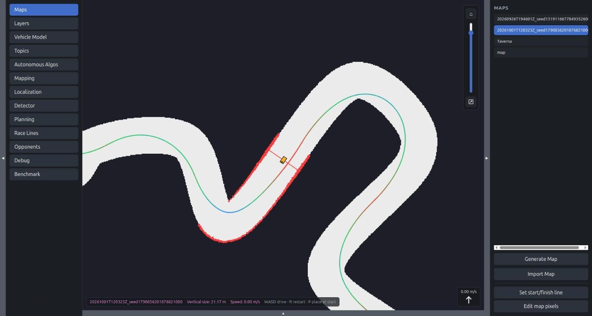

Lists the map folders under `maps/`. Clicking one selects it: `MapServer`
loads it, and the vehicle is placed on its start/finish line. On startup the
first map is selected if none is.

- **Generate Map** builds a random closed track from a seed.

  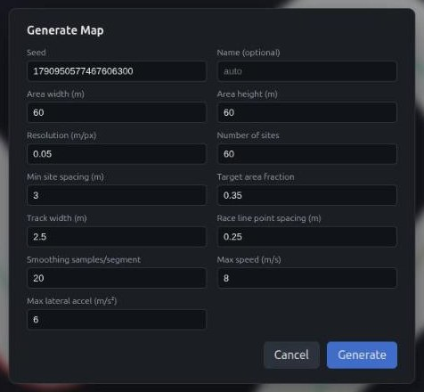

  The form is filled with the defaults from
  `config/environment/generation.toml`. A new map comes with its centerline,
  which is used as its race line until one is planned.

- **Import Map** turns an image into a map.

  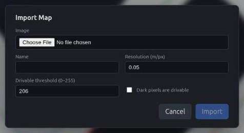

  The browser decodes the image (anything it can display, plus PGM, the ROS
  map format; TIFFs are decoded by the server). Pixels brighter than the
  threshold become drivable. Once the image is loaded, a preview appears, on
  which the start/finish line is clicked.

- **Set start/finish line** moves the selected map's line: click its left
  end, then its right end, as seen when driving through it. An arrow shows
  the direction of travel in between. The map's `info.json` is rewritten and
  the map reloaded.

- **Edit map pixels** opens a painter for the selected map's image, for
  example to clean up a map made by mapping.

  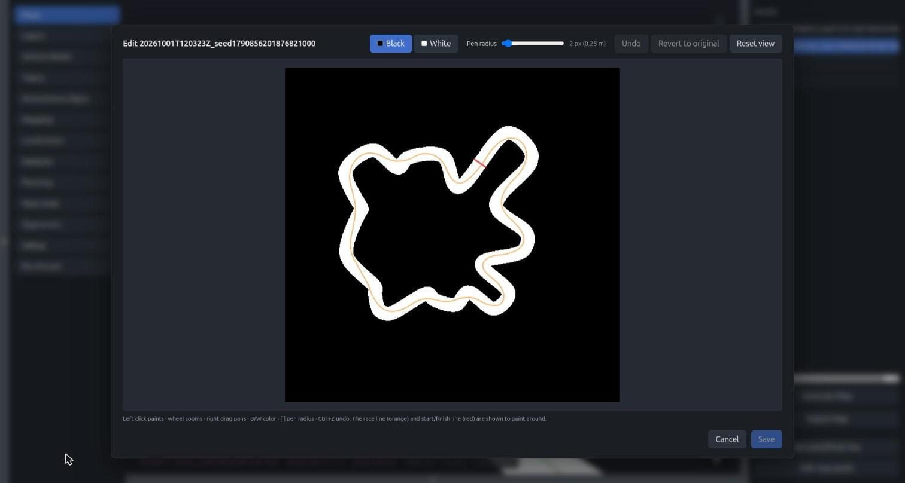

  Left click paints black (wall) or white (drivable) with a round pen. The
  wheel zooms and a right drag pans. The race line (orange) and the
  start/finish line (red) are shown to paint around. **Save** replaces the
  map's `map.tiff`. The first save keeps the original image aside, which
  **Revert to original** brings back.

### Layers

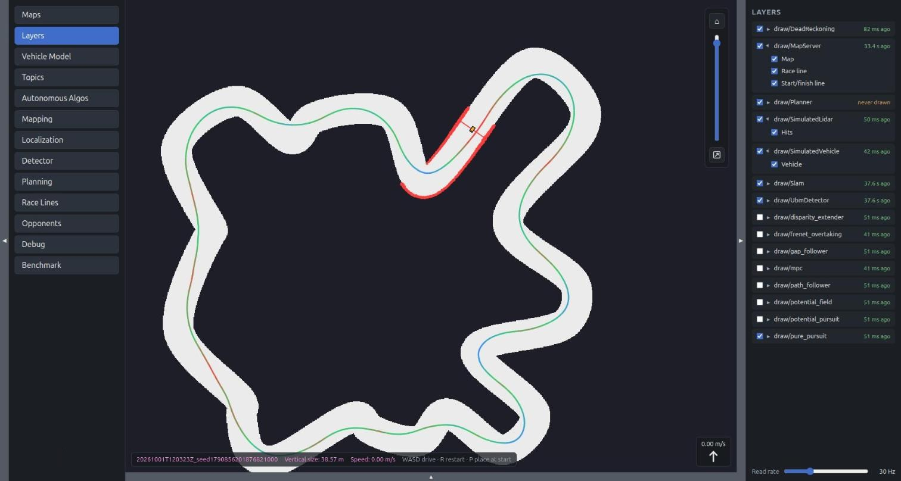

One row per drawing topic, with how long ago it was last written. "never
drawn" means the executor claimed the topic and has not published yet.

- The checkbox shows or hides the whole drawing.
- The arrow opens the drawing's named **elements** (for `MapServer`: Map,
  Race line, Start/finish line), each with its own checkbox.
- The algorithms' drawings follow the selection: selecting an algorithm shows
  its drawing and hides every other algorithm's. Between two selections the
  checkboxes are yours.
- **Read rate** is how often the page asks for the drawings, from 1 to
  100 Hz (30 Hz by default). Lower it on a slow connection.

### Vehicle Model

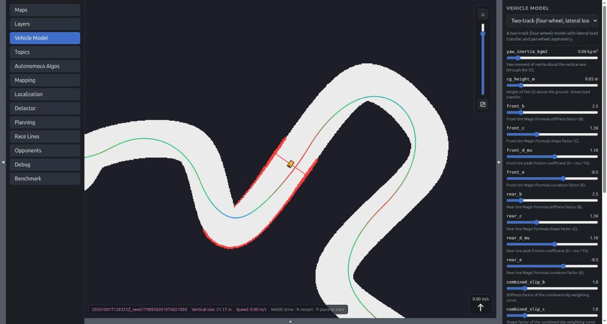

Simulation only. Picks which physics model simulates the vehicle, from the
kinematic bicycle to the two-track model (see
[the vehicle models](../src/simulation/vehicle_models/README.md)), and tunes
it live:

- One slider per parameter of the selected model.
- **Actuator limits** (steering rate, top speed, acceleration, braking) are
  shared by every model. They are also what the autonomous algorithms read on
  the `vehicle_limits` topic.
- **Save parameters** / **Save limits** write the values into the vehicle's
  config file. **Load from file** goes back to the file's values.

### Topics

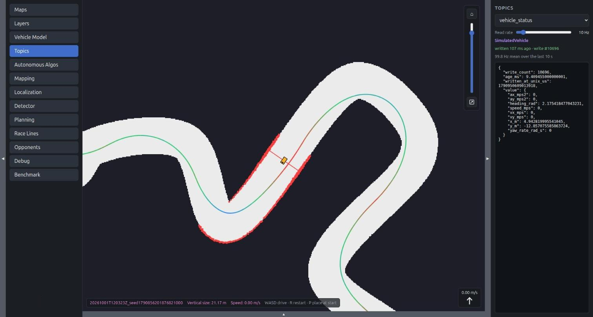

A generic inspector for any topic in the system. Pick one from the list and
the panel shows:

- which executor writes it (in purple);
- how long ago it was last written, and its write count;
- its mean write rate over the last 10 seconds;
- its current value, as JSON.

**Read rate** sets how often the value is re-read. This panel needs no code
per topic, so a topic added by a new executor can be inspected right away. It
is the first place to look when something does not behave: is the topic
written at all, at the expected rate, with a sensible value?

### Autonomous Algos

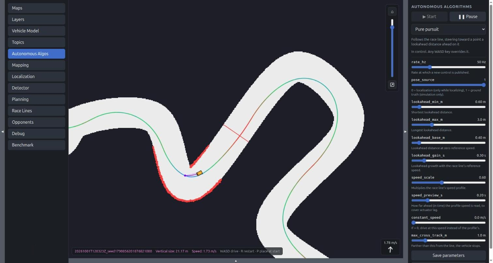

Picks the algorithm that drives, and tunes it.

- The dropdown lists every file in `src/autonomous_control/`. It only
  *picks* the algorithm.
- **Start** hands control to it. **Pause** takes control back: only a human
  drives. Switching algorithm while running hands control straight to the
  new one.
- Under the description, the status line says who is in control. An
  algorithm can add a message in yellow (for example why it holds the car
  stopped) and statistics in purple (for example its solve time).
- One slider per parameter the algorithm declares. A slider shows the value
  the algorithm is *actually* running with, so a value the algorithm clamped
  snaps back.
- **Save parameters** writes the values into
  `config/autonomous_control/<name>.toml`. **Load from file** goes back to
  the file's values.

The screenshot shows pure pursuit driving: the purple dot on the race line is
the target point it draws. See
[Autonomous algorithms](autonomous_algorithms.md) for every algorithm, and
the [tutorials](../tutorial/README.md) for writing one.

### Mapping

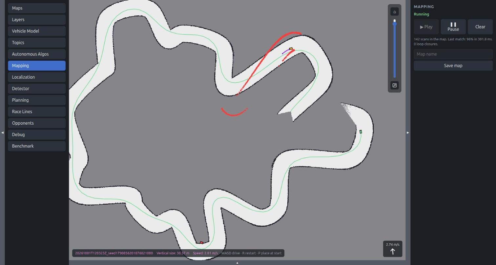

Builds a map of an unknown track with SLAM, while the car is driven around
it (by hand or by an algorithm that needs no map, such as the gap follower).

- **Play** starts or resumes mapping. **Pause** keeps the map. **Clear**
  throws it away.
- The details line shows how many scans are in the map, how well and how
  fast the last scan matched, and how many loop closures were found.
- **Save map** writes the map built so far as a new folder under `maps/`.

In the screenshot the light area is what SLAM has mapped so far, gray is
unknown, and the green vehicle with its trail is SLAM's estimate of the pose.
The map is built in SLAM's own frame, which starts where mapping started, so
in simulation it does not line up with the simulator's vehicle. See
[SLAM](slam.md).

### Localization

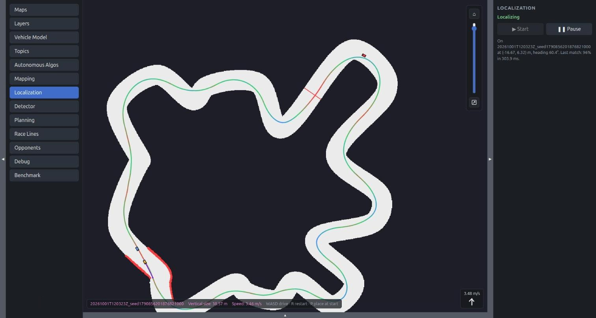

Finds where the car is on the selected map, by matching each LIDAR scan
against it.

- **Start** is only offered with a map selected, and not while SLAM holds a
  map it is building: clear or save that one first.
- **Pause** keeps the last pose.
- The details line shows the estimated pose and how the last match went.

The estimated pose is drawn as a blue vehicle. Algorithms that follow a race
line need this running when their `pose_source` is 0, which is what the real
car uses.

### Detector

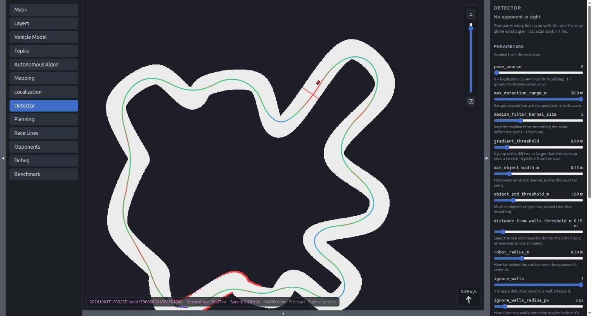

Shows what `UbmDetector` is doing. It finds an opponent by comparing each
LIDAR scan with the scan the map alone would give.

- The status line says whether an opponent is in sight, or why the detector
  is not detecting (for example "Localization isn't running").
- The parameters are tuned live and applied from the next scan, with the same
  **Save parameters** and **Load from file** buttons as the other panels.
- The opponent found and its bounding box are drawn on the map by the
  detector itself.

See [Detector](detector.md) for how it works.

### Planning

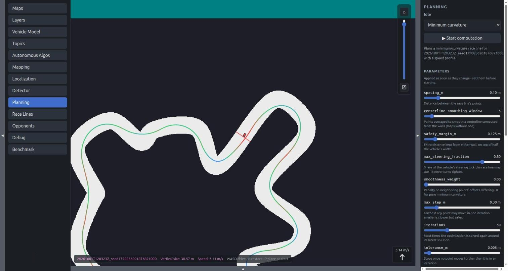

Computes a race line for the selected map.

- The dropdown picks what the line minimizes: curvature or lap time.
- **Start computation** asks the planner for a line. When it is done, the
  line is saved in the map's folder and becomes the one in use.
- The parameters are applied as soon as they change, so set them before
  starting.

See [Planning](planning.md).

### Race Lines

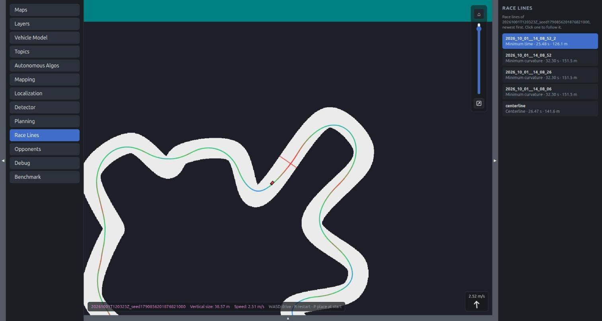

Every race line of the selected map, newest first, each with its method, lap
time and length. The highlighted one is the line in use: the one drawn on the
map and the one the algorithms follow. Clicking another switches to it.

### Opponents

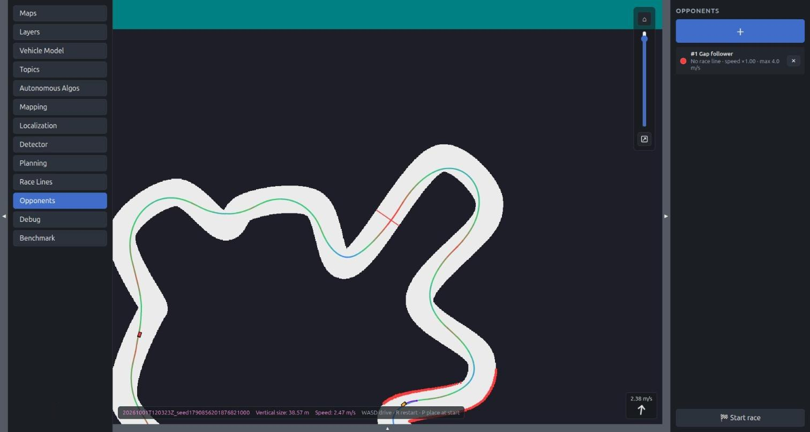

Simulation only. Adds other autonomous vehicles to the track.

- **+** opens the form below. Each opponent in the list can be removed with
  its **×**.

  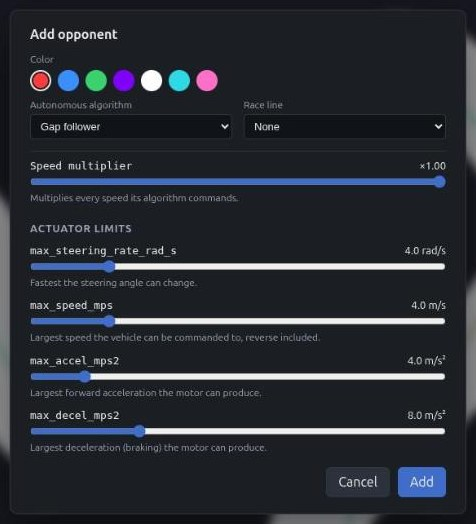

  An opponent has a color, an algorithm, optionally a race line (required by
  the algorithms that follow one), a speed multiplier, and its own actuator
  limits.

- **Start race** lines every vehicle up behind the start/finish line and
  releases them together after a countdown.

  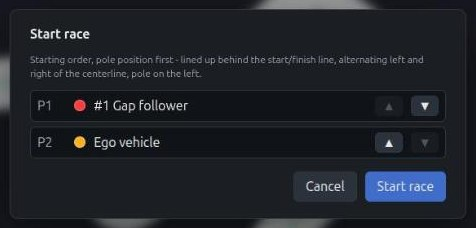

  The arrows change the starting order.

There are no collisions, but each vehicle's LIDAR sees the others. See
[Opponents](autonomous_algorithms.md#opponents).

### Debug

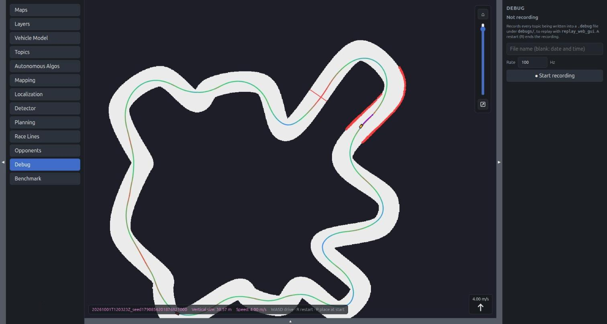

Records every topic into a `.debug` file under `debugs/`, at the chosen rate,
to play back later with `replay_web_gui`.

- **Start recording** begins a new file. A blank name gives it the date and
  time.
- **Stop & save** ends it. The file is complete once the status says so.
- The recording belongs to the server, not to the browser tab: every tab
  shows the same one, and a restart (R) ends it.

### Benchmark

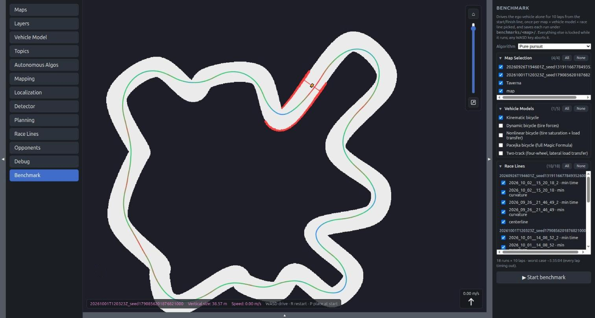

Simulation only. Drives the ego vehicle alone for a fixed number of laps,
once per combination of the maps, vehicle models and race lines ticked, and
saves every run under `benchmarks/<map>/`.

- Pick the algorithm, tick the combinations, and press **Start benchmark**.
  The line under the lists says how many runs that makes and the worst-case
  duration.
- Each run starts from the start/finish line with a countdown, like a race.
- While a benchmark runs, everything else is locked: the server refuses any
  request that would change the setup. **Abort**, or any WASD key, stops it.
- The results stay listed in the panel. Compare and replay them with
  `benchmark_viewer`.

### On the real car

When `web_gui` runs on a car, the page differs in three ways:

- The canvas background is dark red, and the car's name is shown in the
  bottom right corner.
- **Vehicle Model**, **Opponents** and **Benchmark** are hidden: they only
  exist in simulation.
- A **VESC** panel appears. It shows what the motor controller reports
  (battery voltage and estimated charge, speed, commanded speed, steering
  servo, current, temperature, tachometer), and tunes the VESC settings and
  the actuator limits from `config/actuators/vesc.toml` live, with the same
  save and load buttons.

## Bottom panel: lap telemetry

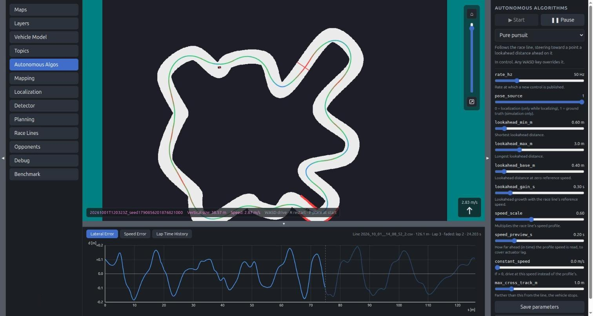

The toggle under the map opens the lap telemetry of the ego vehicle,
measured against the race line in use. It has three tabs:

- **Lateral Error:** the distance from the race line, in meters, along the
  lap. The current lap is drawn bright and the previous one faded, so the
  two can be compared corner by corner. Hovering shows the value at a point.
- **Speed Error:** the same for the difference between the vehicle's speed
  and the line's speed.
- **Lap Time History:** every completed lap with its time, distance and
  average speed. The fastest lap is green and the slowest red.

  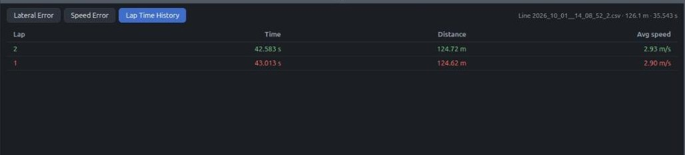

The panel only polls while it is open.

## How it works

### Architecture

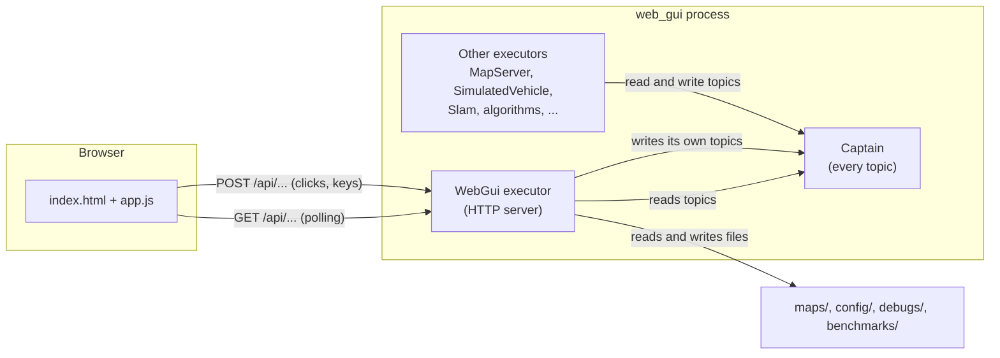

The GUI is one executor among the others, `WebGui` (`src/web/gui.rs`). It is
a small HTTP server that translates between the browser and the topics:

- **A `GET` reads a topic** and returns its value as JSON.
- **A `POST` writes a topic** that `WebGui` owns. The executor concerned
  picks the new value up on its next tick.

`WebGui` never calls another executor. Selecting a map, for example, only
writes the wanted name on `map_selection`. `MapServer` reads it, loads the
map, and publishes it on `map`, which the page then reads back. This is why
every panel shows what is *actually* in effect, and why two browser tabs
always agree.

The topics `WebGui` writes:

| Topic | Written when |
|---|---|
| `human_vesc_command` | A WASD key goes down or up |
| `map_selection` | A map is clicked |
| `race_line_selection` | A race line is clicked |
| `place_at_start` | P is pressed, or the place-vehicle tool is used |
| `vehicle_model_selection`, `vehicle_model_parameters` | The Vehicle Model panel |
| `vesc_parameters` | The VESC panel |
| `autonomous_algorithm_selection`, `autonomous_parameters` | The Autonomous Algos panel |
| `slam_command`, `slam_save` | The Mapping and Localization panels |
| `detector_parameters` | The Detector panel |
| `planning_parameters`, `planning_request` | The Planning panel |
| `opponent_requests`, `race_start` | The Opponents panel |

A few things go to disk rather than to a topic: the map list, generating,
importing and editing a map, and saving parameters into a config file.

### The server

- **`tiny_http`, with a pool of worker threads.** `worker_threads` workers
  each take requests in turn, so a slow request (generating a large map) does
  not stall the others.
- **No files to deploy.** `index.html`, the scripts and the stylesheets are
  compiled into the binary with `include_str!`.
- **Every response closes its connection.** A restart tears the server down,
  and no browser is left holding a connection to the old one.
- **`TCP_NODELAY` is set** on the listening socket. Without it, any response
  larger than 1 KiB was delayed by about 40 ms, which capped polling at about
  23 Hz (see `bind_http` in `src/web.rs`).
- **Topic responses carry their freshness.** A `GET` that reads a topic
  wraps the value with when it was written, its age and its write count. The
  page uses this to show a value as stale instead of showing an old value as
  if it were current.

### The page

The page is plain HTML, CSS and JavaScript, with no framework and no build
step. It **polls**: there is no WebSocket.

| What | How often |
|---|---|
| The drawings on the map | 30 Hz (the Layers panel's slider) |
| The drive readout | every 100 ms |
| The selected topic's value | 10 Hz (the Topics panel's slider) |
| The state of every panel (map, algorithm, SLAM, planner, ...) | every 500 ms |
| The held WASD command, re-sent as a safety net | every 250 ms |

The WASD command is sent the instant a key goes down or up, which is what
makes driving feel immediate. The 250 ms repeat only covers a lost request.

The scripts, in loading order:

| File | Role |
|---|---|
| `src/web/map_view.js` | The canvas: painting every kind of shape, zoom, pan, pointer tools |
| `src/web/draw_layers.js` | Keeps the drawings current, fades the stale ones, moves vehicles between samples |
| `src/web/chart.js` | Chart helpers |
| `src/web/lap_panel.js` | The bottom panel |
| `src/web/gui/static/app.js` | Everything specific to `web_gui`: the panels, the keys, the tools |
| `src/web/gui/static/benchmark.js` | The Benchmark panel |

The first four are shared with `replay_web_gui`, which shows a recording on
the same canvas.

### Drawings

A drawing is a list of shapes in world coordinates (meters): vehicles,
points, polylines, circles, arcs, sectors, rectangles, text and images. The
types are in `src/topics/drawing.rs`.

1. An executor claims its `draw/<name>` topic and writes a `Drawing` to it
   whenever what it wants shown changes.
2. The page sends `POST /api/draw` with the version of each drawing it
   already holds.
3. The server answers with every drawing topic, including the shapes only
   for those that changed. The map image is fetched separately from
   `GET /api/draw/raster`, only when it changes.
4. The page paints them, in the order their `z_index` gives.

A drawing's shapes are grouped into named elements, which is what the Layers
panel lists. Each element says whether it is visible by default, so a busy
debugging overlay stays hidden until someone ticks it.

### Live parameter tuning

Every panel with sliders works the same way:

1. Moving a slider sends the wanted value with a `POST`.
2. `WebGui` writes it on the owner's parameters topic.
3. The owner (an algorithm, the vehicle, the planner, the detector) clamps
   and applies it, and publishes the value now in effect in its status.
4. The page reads the status back and moves the slider to that value.

So the slider always shows the truth, and the bounds are enforced by the
owner, not by the page. For one second after a slider is moved, the page
leaves it alone, long enough for the value to make that round trip.

### Restart

R sends `POST /api/restart`. The runner stops every executor, then starts
over with a fresh captain (so every topic starts empty) and a fresh copy of
each executor (`Executor::fresh`), including the HTTP server. The page waits two seconds and reloads. `WebGui` carries two things
across a restart: the state of the debug recorder and the last benchmark's
results.

## HTTP API

Every route is in `src/web/gui/handlers.rs`. Bodies are JSON.

| Route | Purpose |
|---|---|
| `GET /`, `/style.css`, `/app.js`, `/benchmark.js`, `/map_view.js`, ... | The page and its assets |
| `GET /api/config` | The WASD limits, and whether this is a real car |
| `POST /api/restart` | Restart everything |
| `POST /api/human_vesc_command` | The WASD command |
| `POST /api/place_at_start` | Place the vehicle on the start line, or at a given pose |
| `GET /api/actuator_status` | Speed and steering, for the drive readout |
| `GET /api/lap_telemetry` | The bottom panel's data |
| `POST /api/draw`, `GET /api/draw/raster` | The drawings |
| `GET /api/topics`, `GET /api/topic?name=...` | The Topics panel |
| `GET /api/maps`, `GET /api/maps/<name>/info`, `GET /api/maps/<name>/raster` | The maps on disk |
| `GET /api/generate/defaults`, `POST /api/maps/generate` | Generate a map |
| `POST /api/maps/import`, `POST /api/maps/import/decode_tiff` | Import a map |
| `POST /api/maps/start_finish_line` | Move the start/finish line |
| `GET /api/map_edit`, `GET`/`POST /api/map_edit/raster` | The map pixel editor |
| `GET /api/map`, `POST /api/map_selection` | The selected map |
| `GET /api/race_lines`, `POST /api/race_line_selection` | The race lines |
| `GET /api/vehicle_models`, `GET /api/vehicle_model`, `POST /api/vehicle_model_selection` | The vehicle model |
| `POST /api/vehicle_model_parameter`, `/api/vehicle_model_parameters_save`, `/api/vehicle_model_parameters_load` | Its parameters |
| `POST /api/vehicle_limit`, `/api/vehicle_limits_save`, `/api/vehicle_limits_load` | The actuator limits |
| `GET /api/vesc`, `GET /api/vesc_parameters`, `POST /api/vesc_parameter`, `/api/vesc_parameters_save`, `/api/vesc_parameters_load` | The VESC panel |
| `GET /api/autonomous_algorithms`, `POST /api/autonomous_algorithm_selection` | The algorithms and the selection |
| `POST /api/autonomous_parameter`, `/api/autonomous_parameters_save`, `/api/autonomous_parameters_load` | The selected algorithm's parameters |
| `GET /api/slam`, `POST /api/slam_command`, `POST /api/slam_save` | Mapping and localization |
| `GET /api/detector`, `POST /api/detector_parameter`, `/api/detector_parameters_save`, `/api/detector_parameters_load` | The detector |
| `GET /api/planning`, `POST /api/planning_start`, `POST /api/planning_parameter`, `/api/planning_parameters_save`, `/api/planning_parameters_load` | The planner |
| `GET /api/opponents`, `POST /api/opponents`, `POST /api/opponents/delete`, `POST /api/race/start` | Opponents and races |
| `GET /api/debug`, `POST /api/debug/start`, `POST /api/debug/stop` | Debug recording |
| `GET /api/benchmark`, `GET /api/benchmark/options`, `POST /api/benchmark/start`, `POST /api/benchmark/abort` | Benchmarks |

While a benchmark runs, every `POST` is answered with `409`, except
`/api/benchmark/abort`, `/api/draw` and `/api/human_vesc_command`.

The API is handy from a terminal too, for example to script a test:

```sh
curl -X POST -H "Content-Type: application/json" \
     -d '{"name": "pure_pursuit", "running": true}' \
     localhost:1999/api/autonomous_algorithm_selection
curl "localhost:1999/api/topic?name=vehicle_status"
```

## Where things are

| File | Role |
|---|---|
| `src/bin/web_gui/main.rs` | Builds the runner: adds `WebGui` and every other executor |
| `src/bin/web_gui/cli.rs` | The command-line options |
| `config/web/gui.toml` | The GUI's settings |
| `src/web.rs` | What every web UI shares: response helpers, the shared assets, `bind_http` |
| `src/web/draw.rs` | The drawing protocol |
| `src/web/gui.rs` | The `WebGui` executor: the topics it claims, the worker threads |
| `src/web/gui/handlers.rs` | Routes each request to its handler |
| `src/web/gui/assets.rs` | Serves the embedded page |
| `src/web/gui/live_api.rs` | Config, map selection, WASD, place at start, restart, read-outs |
| `src/web/gui/maps_api.rs`, `map_edit_api.rs` | Maps on disk: list, generate, import, edit |
| `src/web/gui/draw_api.rs`, `topics_api.rs` | The drawings, and the generic topic inspector |
| `src/web/gui/autonomous_api.rs`, `vehicle_model_api.rs`, `vesc_api.rs`, `slam_api.rs`, `detector_api.rs`, `planning_api.rs`, `race_lines_api.rs`, `opponents_api.rs`, `debug_api.rs` | One file per panel |
| `src/web/gui/benchmark_api.rs`, `benchmark_orchestrator.rs` | The Benchmark panel, and the thread that drives its runs |
| `src/web/gui/static/` | The page: `index.html`, `style.css`, `app.js`, `benchmark.js` |
| `src/web/*.js`, `src/web/base.css` | The frontend shared with `replay_web_gui` |
| `src/topics/drawing.rs` | The `Drawing` and `Shape` types |
