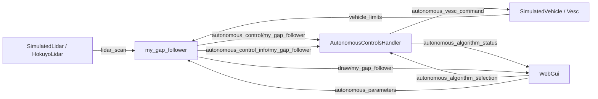

# Tutorial 1 - Gap follower

For creating a new autonomous algorithm you need to create a file
`src/autonomous_control/<name>.rs`, and it will be compiled with the same
`cargo build --release` that builds the rest of the project: `build.rs` finds
the file by itself, so no other file has to be edited.

This tutorial builds a gap follower that way, one step at a time. The gap
follower is the simplest algorithm that can drive a lap: it looks at the
LIDAR, finds the widest opening, and steers toward its middle. It needs no
map, no race line and no localization.

The project already has a `gap_follower.rs`. The file written here is called
`my_gap_follower.rs`, so both can live side by side and be compared. The code
is written to be easy to read, not to be fast.

You need Rust installed and the project building (see the
[README](../README.md)). No Rust experience is assumed: the **Rust note**
boxes explain the syntax when it first appears.

Contents:

1. [The theory](#1-the-theory)
2. [How an algorithm fits in the project](#2-how-an-algorithm-fits-in-the-project)
3. [Step 1 - Create the file](#step-1---create-the-file)
4. [Step 2 - Read the LIDAR](#step-2---read-the-lidar)
5. [Step 3 - Find the gaps](#step-3---find-the-gaps)
6. [Step 4 - Turn the best gap into a command](#step-4---turn-the-best-gap-into-a-command)
7. [Step 5 - Build and drive](#step-5---build-and-drive)
8. [Step 6 - Parameters in a config file, tuned live](#step-6---parameters-in-a-config-file-tuned-live)
9. [Step 7 - Draw on the map](#step-7---draw-on-the-map)
10. [Step 8 - Test the algorithm](#step-8---test-the-algorithm)
11. [The complete file](#the-complete-file)
12. [Limits, and where to go next](#limits-and-where-to-go-next)

## 1. The theory

### What the LIDAR gives

A 2D LIDAR measures the distance to the nearest wall in many directions. One
full sweep is a **scan**: a list of distances, in meters, spread evenly
across the sensor's field of view (FOV).

- Reading `0` points to one edge of the FOV, the last reading to the other
  edge, and the middle reading points straight ahead.
- With `n` readings and a field of view `fov`, reading `i` points at the angle

  ```
  angle(i) = -fov / 2 + i * fov / (n - 1)
  ```

- Angle `0` is straight ahead. A **negative** angle is to the **left** and a
  **positive** angle is to the **right**, as the map is drawn in `web_gui`.
  This is the opposite of ROS. It comes from the map's y axis pointing down.
- The steering command uses the same convention: a positive steering angle
  turns right. So the angle of a direction in the scan can be used directly
  as a steering angle.
- A reading that hits nothing reports the sensor's maximum distance.

The simulated LIDAR and the real car's Hokuyo both give 1081 readings over
270°, so two neighbouring readings are 0.25° apart.

### The idea

The car should drive where there is room. Each time a new command is needed,
the algorithm does this:

1. **Closest reading.** Find the nearest reading. That is the obstacle to
   stay away from.
2. **Bubble.** Ignore every reading within `bubble_radius_points` readings of
   the closest one. This keeps the car from aiming just past the edge of the
   nearest obstacle.
3. **Free readings.** A reading is *free* if it is outside the bubble and at
   least `far_threshold_m` away.
4. **Gaps.** A *gap* is a run of more than `min_gap_points` free readings in
   a row. Shorter runs are too narrow to be worth aiming at.
5. **Best gap.** The gap with the most readings wins.
6. **Steering.** Steer toward the middle of the best gap. If there is no gap
   at all, keep the previous steering.
7. **Speed.** Drive at a constant speed.

This is the follow-the-gap method from the
[F1TENTH course](https://f1tenth-coursekit.readthedocs.io/en/latest/lectures/ModuleB/lecture05.html),
in the form the project's own `gap_follower.rs` uses.

### A small example

Take a made-up scan of 10 readings over 180°, so the readings are 20° apart.
Use `far_threshold_m = 2`, `bubble_radius_points = 1` and
`min_gap_points = 1`.

| Reading | 0 | 1 | 2 | 3 | 4 | 5 | 6 | 7 | 8 | 9 |
|---|---|---|---|---|---|---|---|---|---|---|
| Angle | -90° | -70° | -50° | -30° | -10° | 10° | 30° | 50° | 70° | 90° |
| Distance (m) | 1.0 | 5.0 | 5.0 | 1.0 | **0.5** | 5.0 | 5.0 | 5.0 | 5.0 | 5.0 |
| Far enough? | no | yes | yes | no | no | yes | yes | yes | yes | yes |
| In the bubble? | | | | yes | yes | yes | | | | |
| Free? | no | yes | yes | no | no | **no** | yes | yes | yes | yes |

- The closest reading is number 4 (0.5 m). The bubble covers readings 3 to 5.
- Reading 5 is far, but it is in the bubble, so it is not free.
- There are two gaps: readings 1 to 2, and readings 6 to 9.
- The longest is 6 to 9. Its middle is at `(30° + 90°) / 2 = 60°`, to the
  right.
- The car cannot steer 60°, so the command is clamped to its maximum
  steering angle. The car turns right as hard as it can.

Step 8 turns this example into a test.

### What the parameters do

| Parameter | Larger value | Smaller value |
|---|---|---|
| `far_threshold_m` | Only long openings count, so the car reacts earlier to a wall ahead. Too large and nothing is free. | Almost everything is free, so the car aims at the middle of everything it sees. |
| `bubble_radius_points` | The car stays farther from the nearest wall. Too large and the bubble hides the way out of a corner. | The car cuts closer to the nearest wall. |
| `min_gap_points` | Narrow openings are ignored. | Noise can create tiny gaps. |
| `speed_mps` | Faster, with less time to react. | Slower and safer. |

## 2. How an algorithm fits in the project

### Executors and topics

The whole project is made of two kinds of pieces (see
[Core framework](../documentation/core_framework.md)):

- An **executor** is one part of the system running on its own thread at its
  own rate: the LIDAR driver, the simulated vehicle, the web GUI, and every
  autonomous algorithm.
- A **topic** is a named slot holding the latest value of some data. Each
  topic has exactly one writer and any number of readers. A reader always
  gets the newest value. There is no queue.

Executors never call each other. They only read and write topics. The
**captain** holds every topic, and every executor is handed a reference to
it. The **runner** starts all the executors.

An autonomous algorithm is an executor that reads sensor topics and writes
one command topic.

### What the gap follower talks to



| Topic | Type | Who writes it | What the gap follower does with it |
|---|---|---|---|
| `lidar_scan` | `LidarScan` | `SimulatedLidar` in simulation, `HokuyoLidar` on the car | Reads the distances |
| `vehicle_limits` | `ActuatorLimits` | `SimulatedVehicle` in simulation, `Vesc` on the car | Reads the maximum steering angle and speed |
| `vehicle_status` | `VehicleStatus` | `SimulatedVehicle` (simulation only) | Reads the true position, only to place its drawing (step 7) |
| `autonomous_control/my_gap_follower` | `VescCommand` | the gap follower | Writes the steering and speed it wants |
| `autonomous_control_info/my_gap_follower` | `AutonomousAlgorithmInfo` | the gap follower | Writes its label, description and parameters |
| `autonomous_parameters` | `AutonomousParameters` | `WebGui` | Reads the slider values (step 6) |
| `draw/my_gap_follower` | `Drawing` | the gap follower | Writes shapes to show on the map (step 7) |

The same code runs in simulation and on the car. The algorithm does not know
which one it is: it only sees a `lidar_scan` topic, whoever writes it.

### From the algorithm's command to the wheels

The algorithm does **not** drive the vehicle directly. It writes the command
it *would like* on its own topic. Then:

1. Every algorithm in `src/autonomous_control/` runs all the time, each
   writing its own command topic.
2. `AutonomousControlsHandler` (in `src/autonomous_control.rs`) reads which
   algorithm is selected in `web_gui` and copies that algorithm's command to
   `autonomous_vesc_command`, 100 times per second.
3. `SimulatedVehicle` (or `Vesc` on the real car) follows
   `autonomous_vesc_command`, within the vehicle's limits.

Three safety rules follow from this, and the algorithm gets them for free:

- If the algorithm is paused or not selected, the vehicle gets `(0, 0)`:
  wheels straight, stopped.
- If the algorithm's last command is older than 1 second, the vehicle gets
  `(0, 0)`. So an algorithm must publish more than once per second. If it
  crashes or hangs, the car stops.
- A human always wins. While a WASD key is held in `web_gui`, or the joystick
  asks for anything, the human's command is followed instead.

### How the file gets compiled

Nothing lists the algorithms by hand. When `cargo build` runs, it first runs
`build.rs`, which looks at every `.rs` file directly inside
`src/autonomous_control/` (except `shared.rs`) and generates a small Rust
file. For this tutorial's file it contains, roughly:

```rust
#[path = "/.../src/autonomous_control/my_gap_follower.rs"]
mod my_gap_follower;

pub fn all() -> Vec<Box<dyn crate::Executor>> {
    vec![
        always_left::new(Instance::ego("always_left")),
        // ... one line per file ...
        my_gap_follower::new(Instance::ego("my_gap_follower")),
    ]
}
```

`src/autonomous_control.rs` includes that generated file, and `web_gui`'s
`main.rs` adds everything `all()` returns to the runner. So the contract is
small:

- **The file name is the algorithm's name.** It must be `snake_case`
  (lowercase letters, digits, underscores, not starting with a digit), or the
  build stops with an error. The name `my_gap_follower` becomes the executor's
  name, the topic names, the config file's name and the value `web_gui`
  selects.
- **The file must define `pub fn new(instance: Instance) -> Box<dyn Executor>`.**
  That is the one function the generated code calls.

### The `Instance`

`new` receives an `Instance`. It says which vehicle this copy of the
algorithm drives:

- `instance.name` is the executor's name: `my_gap_follower` for the main
  ("ego") vehicle.
- `instance.vehicle` gives the names of that vehicle's topics:
  `instance.vehicle.lidar_scan()`, `instance.vehicle.vehicle_limits()`, and
  so on.
- `instance.algorithm_topics()` gives this copy's own command and info
  topics.

Always get topic names from the `Instance`, never by writing
`"lidar_scan"` in the code. The reason is opponents: when an opponent is
added in `web_gui`, it runs another copy of the same file, with topics named
`opponent/1/lidar_scan` and so on. The `Instance` hides that difference.

## Step 1 - Create the file

Create `src/autonomous_control/my_gap_follower.rs` with this content. It is
a complete algorithm that does nothing: it tells the car to stand still.

```rust
//! Tutorial gap follower: steers toward the middle of the widest free gap
//! the LIDAR sees. See `tutorial/01_gap_follower.md`.

use crate::autonomous_control::{AutonomousControlExt, Instance};
use crate::topics::{AutonomousAlgorithmInfo, VescCommand};
use crate::{Captain, Executor, Ticker};
use std::any::Any;

/// How often a command is published, in Hz.
const RATE_HZ: f64 = 50.0;

/// Entry point build.rs calls - required, with exactly this signature.
pub fn new(instance: Instance) -> Box<dyn Executor> {
    Box::new(MyGapFollower { id: 0, instance })
}

struct MyGapFollower {
    id: u16,
    instance: Instance,
}

impl Executor for MyGapFollower {
    fn init(&mut self, id: u16) {
        self.id = id;
    }

    fn claim_writing_topics(&mut self, captain: &Captain) {
        captain.claim_autonomous_control(
            self.id,
            &self.instance.algorithm_topics(),
            AutonomousAlgorithmInfo::new(
                "My gap follower",
                "Tutorial: steers toward the middle of the widest gap.",
            )
            .requires_lidar(),
        );
    }

    fn run(&mut self, captain: &Captain) {
        // The topic this algorithm writes.
        let command_topic = captain.autonomous_control(&self.instance.algorithm_topics());
        let mut ticker = Ticker::new(RATE_HZ);

        while captain.is_running(self.id) {
            // For now: stand still, wheels straight.
            command_topic
                .write(self.id, VescCommand::new(0.0, 0.0))
                .expect("lost writer authorization for this algorithm's command topic");
            ticker.wait();
        }
    }

    fn name(&self) -> String {
        self.instance.name.clone()
    }

    fn as_any(&self) -> &dyn Any {
        self
    }

    fn fresh(&self) -> Box<dyn Executor> {
        new(self.instance.clone())
    }
}
```

What each part is for:

- **`use ...`** brings names from the rest of the project into this file.
  `crate` means "this project".
- **`RATE_HZ`** is how many commands per second the algorithm publishes.
- **`new`** is the entry point `build.rs` calls. It builds the algorithm's
  data and returns it. `id: 0` is a placeholder until `init` is called.
- **`struct MyGapFollower`** is the data the algorithm keeps: its `id` (given
  by the runner) and its `Instance`.
- **`impl Executor for MyGapFollower`** is what makes it an executor. The
  runner calls these functions:

  | Function | When it is called | What to do there |
  |---|---|---|
  | `init` | Once, first | Remember the `id` the runner assigned |
  | `claim_writing_topics` | Once, before any thread starts | Say which topics this executor writes |
  | `run` | Once, on the executor's own thread | The main loop |
  | `name` | Any time | Return `instance.name` |
  | `as_any` | Any time | Always just `self` |
  | `fresh` | On a restart (R in `web_gui`) | Build a brand-new copy |

- **`claim_autonomous_control`** claims the command topic and the info topic,
  and writes the info: the label and description `web_gui` shows.
  `.requires_lidar()` tells `web_gui` that an opponent using this algorithm
  needs its own simulated LIDAR.
- **The loop in `run`** repeats until the runner says to stop
  (`captain.is_running`). Each turn of the loop is one *tick*: write a
  command, then `ticker.wait()` sleeps until the next tick is due.
  `VescCommand::new(steering, speed)` takes the steering angle in radians
  and the speed in m/s.

> **Rust note**
> - `Box<dyn Executor>` means "some value that is an `Executor`, whatever its
>   real type". `Executor` is a *trait*: a list of functions a type promises
>   to have, like an interface in other languages.
> - `&` means "lend": `&Captain` is a captain that is borrowed, not owned.
>   `&mut self` means the function may change the struct's fields.
> - `let` creates a variable that cannot change. `let mut` creates one that
>   can.
> - `.expect("...")` means "this must have worked, otherwise stop the program
>   with this message". Writing can only fail if this executor is not the
>   topic's writer, which `claim_writing_topics` rules out.
> - `captain.claim_autonomous_control(...)` only works because of the line
>   `use crate::autonomous_control::AutonomousControlExt`. That trait adds
>   the function to `Captain`. Without the `use`, the compiler says the
>   method does not exist.

You can already build and run this (see [step 5](#step-5---build-and-drive)):
"My gap follower" appears in the list of algorithms, and the car stays still.

## Step 2 - Read the LIDAR

The algorithm needs the scan and the vehicle's limits. Extend the `use` line
for the topic types:

```rust
use crate::topics::{ActuatorLimits, AutonomousAlgorithmInfo, LidarScan, VescCommand};
```

In `run`, before the loop, get a handle to each topic:

```rust
        // The topics it reads.
        let scan_topic = captain.topic::<LidarScan>(&self.instance.vehicle.lidar_scan());
        let limits_topic = captain.topic::<ActuatorLimits>(&self.instance.vehicle.vehicle_limits());
```

Inside the loop, read them every tick:

```rust
            let scan = scan_topic.read();
            let limits = limits_topic.read();

            // No scan yet: stay stopped.
            if scan.points.len() < 2 {
                command_topic
                    .write(self.id, VescCommand::new(0.0, 0.0))
                    .expect("lost writer authorization for this algorithm's command topic");
                ticker.wait();
                continue;
            }
```

- `captain.topic::<LidarScan>(name)` finds the topic called `name` holding a
  `LidarScan`. It is looked up once, before the loop.
- `read()` returns a copy of the latest value. The limits are read every tick
  too, because they can be changed live in `web_gui`.
- `scan.points` is the list of distances described in the theory.
  `scan.fov` is the field of view in radians, and `scan.angle_rad(i)`
  computes the angle of reading `i` with the formula from the theory.
- Before the LIDAR has published anything, the topic holds an empty scan.
  `continue` skips the rest of this tick.

The algorithm runs at 50 Hz and the LIDAR at 40 Hz. That is fine: when no
new scan has arrived, `read()` returns the same scan again.

## Step 3 - Find the gaps

The algorithm itself is four small functions. They know nothing about topics
or executors: they take numbers and return numbers. Add them at the bottom of
the file, after the `impl Executor` block.

First, a type for a gap, and the closest reading:

```rust
/// A run of free readings, from index `first` to index `last` (both included).
#[derive(Debug, Clone, Copy, PartialEq)]
struct Gap {
    first: usize,
    last: usize,
}

impl Gap {
    /// How many readings the gap holds.
    fn length(&self) -> usize {
        self.last - self.first + 1
    }
}

/// The index of the closest reading.
fn closest_point(points: &[f32]) -> usize {
    let mut closest = 0;
    for (i, &distance_m) in points.iter().enumerate() {
        if distance_m < points[closest] {
            closest = i;
        }
    }
    closest
}
```

> **Rust note**
> - `&[f32]` is a borrowed list of 32-bit decimal numbers. `usize` is the
>   type of an index or a count: a whole number that is never negative.
> - `for (i, &distance_m) in points.iter().enumerate()` walks the list and
>   gives both the index `i` and the value `distance_m` of each element.
> - The last line of a function, written without `;`, is the value it
>   returns.
> - `#[derive(Debug, Clone, Copy, PartialEq)]` asks the compiler to write
>   the code that lets a `Gap` be printed, copied and compared with `==`.

Then the free readings (steps 2 and 3 of the theory):

```rust
/// For every reading, whether the car could drive that way: it's far enough,
/// and outside the bubble around the closest reading.
fn free_points(
    points: &[f32],
    closest: usize,
    far_threshold_m: f32,
    bubble_radius_points: usize,
) -> Vec<bool> {
    let mut free = Vec::new();
    for (i, &distance_m) in points.iter().enumerate() {
        let is_far = distance_m >= far_threshold_m;
        let in_bubble = i.abs_diff(closest) <= bubble_radius_points;
        free.push(is_far && !in_bubble);
    }
    free
}
```

`Vec<bool>` is a growable list of true/false values, one per reading.
`i.abs_diff(closest)` is how many readings apart `i` and `closest` are. A
plain `i - closest` would not do: a `usize` cannot go below zero.

Then the gaps (step 4 of the theory). The function walks the list and counts
how many free readings in a row it has seen. When the run ends, it is kept if
it is long enough:

```rust
/// Every run of more than `min_gap_points` free readings in a row.
fn find_gaps(free: &[bool], min_gap_points: usize) -> Vec<Gap> {
    let mut gaps = Vec::new();
    // How many free readings in a row end just before reading `i`.
    let mut run = 0;
    for (i, &is_free) in free.iter().enumerate() {
        if is_free {
            run += 1;
        } else {
            if run > min_gap_points {
                gaps.push(Gap {
                    first: i - run,
                    last: i - 1,
                });
            }
            run = 0;
        }
    }
    // A run that reaches the end of the scan.
    if run > min_gap_points {
        gaps.push(Gap {
            first: free.len() - run,
            last: free.len() - 1,
        });
    }
    gaps
}
```

And the longest gap (step 5 of the theory):

```rust
/// The gap with the most readings, or `None` if there are no gaps.
fn longest_gap(gaps: &[Gap]) -> Option<Gap> {
    let mut best: Option<Gap> = None;
    for &gap in gaps {
        let is_longer = match best {
            None => true,
            Some(best) => gap.length() > best.length(),
        };
        if is_longer {
            best = Some(gap);
        }
    }
    best
}
```

> **Rust note**
> Rust has no `null`. A value that may be missing has the type `Option<...>`:
> it is either `Some(value)` or `None`. `match` looks at which one it is, and
> the compiler refuses code that forgets the `None` case. Here `None` means
> "no gap found".

## Step 4 - Turn the best gap into a command

Add the parameters as constants at the top of the file, next to `RATE_HZ`:

```rust
/// A reading at least this far away is "free", in meters.
const FAR_THRESHOLD_M: f32 = 2.2;
/// A gap needs more than this many free readings in a row.
const MIN_GAP_POINTS: usize = 4;
/// Readings this close (in index) to the closest one are never free.
const BUBBLE_RADIUS_POINTS: usize = 80;
/// The speed to drive at, in m/s.
const SPEED_MPS: f64 = 3.0;
```

With 0.25° between readings, a bubble radius of 80 readings is 20° on each
side of the closest reading, and a gap needs more than 4 readings, so more
than 1°.

The steering must survive from one tick to the next, for the ticks where no
gap is found. Declare it before the loop:

```rust
        // Kept between ticks: used again when no gap is found.
        let mut steering_rad = 0.0;
```

Now replace the "stand still" command in the loop. After the "no scan yet"
check, the rest of the loop becomes:

```rust
            // The algorithm.
            let closest = closest_point(&scan.points);
            let free = free_points(&scan.points, closest, FAR_THRESHOLD_M, BUBBLE_RADIUS_POINTS);
            let gaps = find_gaps(&free, MIN_GAP_POINTS);
            let best = longest_gap(&gaps);

            // Steer toward the middle of the best gap, if there is one.
            if let Some(gap) = best {
                let middle_rad = (scan.angle_rad(gap.first) + scan.angle_rad(gap.last)) / 2.0;
                steering_rad = (middle_rad as f64).clamp(
                    -limits.max_steering_angle_rad,
                    limits.max_steering_angle_rad,
                );
            }
            let speed_mps = SPEED_MPS.min(limits.max_speed_mps);

            command_topic
                .write(self.id, VescCommand::new(steering_rad, speed_mps))
                .expect("lost writer authorization for this algorithm's command topic");

            ticker.wait();
```

- `if let Some(gap) = best { ... }` runs the block only when a gap was found,
  and calls it `gap` inside. With no gap, `steering_rad` keeps its old value.
- The middle of the gap is the average of the angles of its first and last
  readings. As the theory says, that angle is used directly as the steering
  angle.
- `clamp(low, high)` keeps the value between the two limits. The vehicle
  would clamp it anyway, but reading `vehicle_limits` is how an algorithm
  knows what "full lock" and "top speed" are without hardcoding them.
- `middle_rad as f64` converts a 32-bit number to a 64-bit one. The scan uses
  `f32`, the command uses `f64`, and Rust never converts between them by
  itself.

The file now holds a complete gap follower.

## Step 5 - Build and drive

From the repository root:

```sh
cargo build --release
./target/release/web_gui
```

The first release build takes a few minutes. While developing,
`cargo run --bin web_gui` builds faster and runs slower. `cargo build` reruns
`build.rs` whenever a file in `src/autonomous_control/` is added, removed or
changed, so the new algorithm is picked up without doing anything else.

Then:

1. Open <http://localhost:1999>.
2. Select a map, for example `Atlanta_2025`, one of the race tracks the
   repository ships, or generate a random track from the GUI.
3. In the **Autonomous Algos** panel, pick **My gap follower** and press
   **Start**. The car drives.
4. **Pause** stops it. Holding a WASD key takes over while the key is held.

If the build fails, the compiler's message names the file and line. Two
errors are specific to this project:

- *"an algorithm's file name must be a snake_case Rust identifier"*: rename
  the file.
- *"cannot find function `new`"* in the generated file: the `pub fn new` with
  the exact signature from step 1 is missing.

## Step 6 - Parameters in a config file, tuned live

Constants need a rebuild every time one changes. The project has a better
way: the parameters live in a TOML file, and `web_gui` shows a slider for
each one while the algorithm is selected.

**1. Create the config file** `config/autonomous_control/my_gap_follower.toml`.
The file must have the algorithm's name.

```toml
# Configuration for the tutorial gap follower
# (src/autonomous_control/my_gap_follower.rs).

# How often a command is published, in Hz.
rate_hz = 50.0
# A reading at least this far away is "free", in meters.
far_threshold_m = 2.2
# A gap needs more than this many free readings in a row.
min_gap_points = 4
# Readings this close (in index) to the closest one are never free.
bubble_radius_points = 80
# The speed to drive at, in m/s.
speed_mps = 3.0
```

**2. Replace the constants with a config struct.** Delete the five `const`
lines and add this instead. Each field has the same name as a key in the
file:

```rust
/// The parameters, loaded from `config/autonomous_control/my_gap_follower.toml`.
#[derive(Debug, Clone, Copy, PartialEq, serde::Serialize, serde::Deserialize)]
pub struct MyGapFollowerConfig {
    /// How often a command is published, in Hz.
    pub rate_hz: f64,
    /// A reading at least this far away is "free", in meters.
    pub far_threshold_m: f32,
    /// A gap needs more than this many free readings in a row.
    pub min_gap_points: usize,
    /// Readings this close (in index) to the closest one are never free.
    pub bubble_radius_points: usize,
    /// The speed to drive at, in m/s.
    pub speed_mps: f64,
}

impl Default for MyGapFollowerConfig {
    /// The copy of the config file compiled into the program, used when the
    /// file can't be read at runtime.
    fn default() -> Self {
        toml::from_str(include_str!(
            "../../config/autonomous_control/my_gap_follower.toml"
        ))
        .expect("my_gap_follower.toml must match MyGapFollowerConfig")
    }
}
```

`serde::Serialize` and `serde::Deserialize` generate the code that converts
the struct to and from text, which is what reading the TOML file and applying
a slider both rely on. `include_str!` copies the file into the program at
compile time, as a fallback for when the program is started from another
folder.

**3. Load the config in `new`,** and keep it in the struct:

```rust
pub fn new(instance: Instance) -> Box<dyn Executor> {
    Box::new(MyGapFollower {
        id: 0,
        config: load_config(&instance.config_name),
        instance,
    })
}
```

```rust
struct MyGapFollower {
    id: u16,
    instance: Instance,
    config: MyGapFollowerConfig,
}
```

`load_config` reads `config/autonomous_control/<name>.toml` when the program
starts, so editing the file needs a restart but not a rebuild.

**4. Declare the sliders.** Each one names a config field and gives its
minimum, maximum and step:

```rust
/// The sliders web_gui shows: one per config field, with (min, max, step).
fn parameters() -> [AlgorithmParameter; 5] {
    [
        AlgorithmParameter::float("rate_hz", 5.0, 200.0, 1.0)
            .unit("Hz")
            .description("How often a command is published."),
        AlgorithmParameter::float("far_threshold_m", 0.5, 12.0, 0.1)
            .unit("m")
            .description("A reading at least this far away is free."),
        AlgorithmParameter::int("min_gap_points", 0, 100, 1)
            .unit("points")
            .description("A gap needs more than this many free readings in a row."),
        AlgorithmParameter::int("bubble_radius_points", 0, 180, 1)
            .unit("points")
            .description("Readings this close to the closest one are never free."),
        AlgorithmParameter::float("speed_mps", 0.5, 10.0, 0.1)
            .unit("m/s")
            .description("The speed to drive at."),
    ]
}
```

Use `float` for decimal fields (`f32`, `f64`) and `int` for whole-number
fields (`usize`). A name that matches no field stops the program at startup.
Pick limits that are always safe: `rate_hz` must stay well above 1 Hz, or
every command would be too old and the car would never move.

**5. Publish them with the info,** in `claim_writing_topics`:

```rust
            .requires_lidar()
            .with_parameters(&self.config, parameters()),
```

**6. Apply slider changes in the loop.** Before the loop, create a tuner, and
build the ticker from the config:

```rust
        let mut tuner = ParameterTuner::new(self.id, &self.instance);
        let mut ticker = Ticker::new(self.config.rate_hz);
```

At the top of the loop:

```rust
            // Apply any slider moved in web_gui.
            if tuner.update(captain, &mut self.config) {
                ticker = Ticker::new(self.config.rate_hz);
            }
```

`tuner.update` reads the `autonomous_parameters` topic, which `web_gui`
writes when a slider moves. It copies any new value into `self.config`, and
returns `true` if something changed. The ticker was built from `rate_hz`, so
it is rebuilt then.

**7. Use the config instead of the constants:**

```rust
            let free = free_points(
                &scan.points,
                closest,
                self.config.far_threshold_m,
                self.config.bubble_radius_points,
            );
            let gaps = find_gaps(&free, self.config.min_gap_points);
```

```rust
            let speed_mps = self.config.speed_mps.min(limits.max_speed_mps);
```

**8. Update the `use` lines:**

```rust
use crate::autonomous_control::{AutonomousControlExt, Instance, ParameterTuner, load_config};
```

and add `AlgorithmParameter` to the `crate::topics` list.

Rebuild and run. With **My gap follower** selected, the panel shows five
sliders. Moving one changes the driving at once. **Save parameters** writes
the current values into the TOML file, and **Load from file** goes back to
the file's values.

## Step 7 - Draw on the map

An algorithm is much easier to tune when you can see what it sees. Any
executor can publish a **drawing**: a list of shapes in map coordinates.
`web_gui` draws whatever it finds on the `draw/...` topics, without knowing
anything about the algorithm.

The gap follower will draw the bubble in red, the gaps in green and the
chosen gap in purple, each as a "pie slice" starting at the LIDAR.

The scan only holds angles relative to the car. To draw on the map, the
car's position and heading are needed. In simulation they come from the
`vehicle_status` topic, the simulator's true pose. On the real car that
topic does not exist, so the drawing is skipped there. The driving does not
depend on it.

**1. Claim the drawing topic,** at the end of `claim_writing_topics`:

```rust
        captain.claim_drawing(self.id);
```

**2. Get the topics,** in `run` before the loop:

```rust
        let drawing_topic = captain.drawing(self.id);
```

```rust
        // Only exists in simulation, and only used for the drawing.
        let status_topic =
            captain.try_topic::<VehicleStatus>(&self.instance.vehicle.vehicle_status());
```

`captain.topic` stops the program if the topic does not exist.
`captain.try_topic` returns an `Option` instead: `None` on the real car.

**3. Add two functions** at the bottom of the file. `sector` builds one pie
slice, and `draw` builds the whole drawing:

```rust
/// What to show on the map: the bubble in red, the gaps in green, the
/// chosen gap in purple.
fn draw(
    scan: &LidarScan,
    status: &VehicleStatus,
    config: &MyGapFollowerConfig,
    closest: usize,
    gaps: &[Gap],
    best: Option<Gap>,
) -> Drawing {
    let last_index = scan.points.len() - 1;
    let bubble = sector(
        scan,
        status,
        closest.saturating_sub(config.bubble_radius_points),
        (closest + config.bubble_radius_points).min(last_index),
        scan.points[closest],
        Color::RED,
    );

    let mut gap_shapes = Vec::new();
    let mut best_shapes = Vec::new();
    for &gap in gaps {
        if Some(gap) == best {
            best_shapes.push(sector(
                scan,
                status,
                gap.first,
                gap.last,
                config.far_threshold_m,
                Color::PURPLE,
            ));
        } else {
            gap_shapes.push(sector(
                scan,
                status,
                gap.first,
                gap.last,
                config.far_threshold_m,
                Color::GREEN,
            ));
        }
    }

    Drawing::default()
        .element("Bubble", [bubble], false)
        .element("Gaps", gap_shapes, false)
        .element("Chosen gap", best_shapes, false)
        .stale_after(Drawing::DEFAULT_STALE_AFTER)
}

/// A "pie slice" from the LIDAR, covering readings `first` to `last`.
fn sector(
    scan: &LidarScan,
    status: &VehicleStatus,
    first: usize,
    last: usize,
    radius_m: f32,
    color: Color,
) -> Shape {
    // Where the LIDAR is on the map: the vehicle's position plus its mount.
    let (x_m, y_m) = scan.origin_m(status.x_m, status.y_m, status.heading_rad);
    Shape::CircularSector {
        x_m,
        y_m,
        radius_m: radius_m as f64,
        // Scan angles are relative to the vehicle: add its heading.
        start_rad: status.heading_rad + scan.angle_rad(first) as f64,
        end_rad: status.heading_rad + scan.angle_rad(last) as f64,
        filled: false,
        color,
    }
}
```

- The bubble's slice is as long as the distance to the closest reading. A
  gap's slice is as long as `far_threshold_m`: every reading in a gap is at
  least that far.
- `closest.saturating_sub(n)` subtracts but stops at 0, and `.min(last_index)`
  stops at the last reading. Together they keep the bubble inside the scan.
- `.element(name, shapes, false)` adds a named group of shapes. The name
  appears in `web_gui`'s Layers list. `false` means "hidden by default":
  `web_gui` shows an algorithm's drawing only while that algorithm is
  selected.
- `.stale_after(...)` tells the viewer to fade the drawing out if it stops
  being updated.

**4. Publish the drawing,** in the loop, after writing the command:

```rust
            if let Some(status_topic) = &status_topic {
                let status = status_topic.read();
                let drawing = draw(&scan, &status, &self.config, closest, &gaps, best);
                drawing_topic
                    .write(self.id, drawing)
                    .expect("lost writer authorization for this algorithm's drawing topic");
            }
```

**5. Update the `use` line** for the topics:

```rust
use crate::topics::{
    ActuatorLimits, AlgorithmParameter, AutonomousAlgorithmInfo, Color, Drawing, DrawingExt,
    LidarScan, Shape, VehicleStatus, VescCommand,
};
```

`DrawingExt` is the trait that adds `claim_drawing` and `drawing` to the
captain, like `AutonomousControlExt` in step 1.

Rebuild, run and select the algorithm. The slices follow the car, and moving
the `bubble_radius_points` or `far_threshold_m` slider changes them at once.

## Step 8 - Test the algorithm

Because the four functions of step 3 do not depend on topics, they can be
tested without running anything. Add this at the very bottom of the file. The
first test is the example from the theory:

```rust
#[cfg(test)]
mod tests {
    use super::*;

    #[test]
    fn the_longest_gap_outside_the_bubble_is_chosen() {
        // 10 readings: a short opening, an obstacle, and a long opening.
        let points = [1.0, 5.0, 5.0, 1.0, 0.5, 5.0, 5.0, 5.0, 5.0, 5.0];
        let closest = closest_point(&points);
        assert_eq!(closest, 4);

        // Reading 5 is far, but inside the bubble around reading 4.
        let free = free_points(&points, closest, 2.0, 1);
        assert!(!free[5]);
        let gaps = find_gaps(&free, 1);
        assert_eq!(
            gaps,
            vec![Gap { first: 1, last: 2 }, Gap { first: 6, last: 9 }]
        );
        assert_eq!(longest_gap(&gaps), Some(Gap { first: 6, last: 9 }));
    }

    #[test]
    fn no_free_reading_means_no_gap() {
        let free = free_points(&[1.0, 1.0, 1.0], 0, 2.0, 0);
        assert_eq!(longest_gap(&find_gaps(&free, 0)), None);
    }
}
```

Run the tests of this file with:

```sh
cargo test my_gap_follower
```

`#[cfg(test)]` means the block is only compiled for `cargo test`, so it adds
nothing to the real program.

## The complete file

<details>
<summary><code>src/autonomous_control/my_gap_follower.rs</code></summary>

```rust
//! Tutorial gap follower: steers toward the middle of the widest free gap
//! the LIDAR sees. See `tutorial/01_gap_follower.md`.

use crate::autonomous_control::{AutonomousControlExt, Instance, ParameterTuner, load_config};
use crate::topics::{
    ActuatorLimits, AlgorithmParameter, AutonomousAlgorithmInfo, Color, Drawing, DrawingExt,
    LidarScan, Shape, VehicleStatus, VescCommand,
};
use crate::{Captain, Executor, Ticker};
use std::any::Any;

/// Entry point build.rs calls - required, with exactly this signature.
pub fn new(instance: Instance) -> Box<dyn Executor> {
    Box::new(MyGapFollower {
        id: 0,
        config: load_config(&instance.config_name),
        instance,
    })
}

/// The parameters, loaded from `config/autonomous_control/my_gap_follower.toml`.
#[derive(Debug, Clone, Copy, PartialEq, serde::Serialize, serde::Deserialize)]
pub struct MyGapFollowerConfig {
    /// How often a command is published, in Hz.
    pub rate_hz: f64,
    /// A reading at least this far away is "free", in meters.
    pub far_threshold_m: f32,
    /// A gap needs more than this many free readings in a row.
    pub min_gap_points: usize,
    /// Readings this close (in index) to the closest one are never free.
    pub bubble_radius_points: usize,
    /// The speed to drive at, in m/s.
    pub speed_mps: f64,
}

impl Default for MyGapFollowerConfig {
    /// The copy of the config file compiled into the program, used when the
    /// file can't be read at runtime.
    fn default() -> Self {
        toml::from_str(include_str!(
            "../../config/autonomous_control/my_gap_follower.toml"
        ))
        .expect("my_gap_follower.toml must match MyGapFollowerConfig")
    }
}

/// The sliders web_gui shows: one per config field, with (min, max, step).
fn parameters() -> [AlgorithmParameter; 5] {
    [
        AlgorithmParameter::float("rate_hz", 5.0, 200.0, 1.0)
            .unit("Hz")
            .description("How often a command is published."),
        AlgorithmParameter::float("far_threshold_m", 0.5, 12.0, 0.1)
            .unit("m")
            .description("A reading at least this far away is free."),
        AlgorithmParameter::int("min_gap_points", 0, 100, 1)
            .unit("points")
            .description("A gap needs more than this many free readings in a row."),
        AlgorithmParameter::int("bubble_radius_points", 0, 180, 1)
            .unit("points")
            .description("Readings this close to the closest one are never free."),
        AlgorithmParameter::float("speed_mps", 0.5, 10.0, 0.1)
            .unit("m/s")
            .description("The speed to drive at."),
    ]
}

struct MyGapFollower {
    id: u16,
    instance: Instance,
    config: MyGapFollowerConfig,
}

impl Executor for MyGapFollower {
    fn init(&mut self, id: u16) {
        self.id = id;
    }

    fn claim_writing_topics(&mut self, captain: &Captain) {
        captain.claim_autonomous_control(
            self.id,
            &self.instance.algorithm_topics(),
            AutonomousAlgorithmInfo::new(
                "My gap follower",
                "Tutorial: steers toward the middle of the widest gap.",
            )
            .requires_lidar()
            .with_parameters(&self.config, parameters()),
        );
        captain.claim_drawing(self.id);
    }

    fn run(&mut self, captain: &Captain) {
        // The topic this algorithm writes.
        let command_topic = captain.autonomous_control(&self.instance.algorithm_topics());
        let drawing_topic = captain.drawing(self.id);
        // The topics it reads.
        let scan_topic = captain.topic::<LidarScan>(&self.instance.vehicle.lidar_scan());
        let limits_topic = captain.topic::<ActuatorLimits>(&self.instance.vehicle.vehicle_limits());
        // Only exists in simulation, and only used for the drawing.
        let status_topic =
            captain.try_topic::<VehicleStatus>(&self.instance.vehicle.vehicle_status());

        let mut tuner = ParameterTuner::new(self.id, &self.instance);
        let mut ticker = Ticker::new(self.config.rate_hz);
        // Kept between ticks: used again when no gap is found.
        let mut steering_rad = 0.0;

        while captain.is_running(self.id) {
            // Apply any slider moved in web_gui.
            if tuner.update(captain, &mut self.config) {
                ticker = Ticker::new(self.config.rate_hz);
            }

            let scan = scan_topic.read();
            let limits = limits_topic.read();

            // No scan yet: stay stopped.
            if scan.points.len() < 2 {
                command_topic
                    .write(self.id, VescCommand::new(0.0, 0.0))
                    .expect("lost writer authorization for this algorithm's command topic");
                ticker.wait();
                continue;
            }

            // The algorithm.
            let closest = closest_point(&scan.points);
            let free = free_points(
                &scan.points,
                closest,
                self.config.far_threshold_m,
                self.config.bubble_radius_points,
            );
            let gaps = find_gaps(&free, self.config.min_gap_points);
            let best = longest_gap(&gaps);

            // Steer toward the middle of the best gap, if there is one.
            if let Some(gap) = best {
                let middle_rad = (scan.angle_rad(gap.first) + scan.angle_rad(gap.last)) / 2.0;
                steering_rad = (middle_rad as f64).clamp(
                    -limits.max_steering_angle_rad,
                    limits.max_steering_angle_rad,
                );
            }
            let speed_mps = self.config.speed_mps.min(limits.max_speed_mps);

            command_topic
                .write(self.id, VescCommand::new(steering_rad, speed_mps))
                .expect("lost writer authorization for this algorithm's command topic");

            if let Some(status_topic) = &status_topic {
                let status = status_topic.read();
                let drawing = draw(&scan, &status, &self.config, closest, &gaps, best);
                drawing_topic
                    .write(self.id, drawing)
                    .expect("lost writer authorization for this algorithm's drawing topic");
            }

            ticker.wait();
        }
    }

    fn name(&self) -> String {
        self.instance.name.clone()
    }

    fn as_any(&self) -> &dyn Any {
        self
    }

    fn fresh(&self) -> Box<dyn Executor> {
        new(self.instance.clone())
    }
}

/// A run of free readings, from index `first` to index `last` (both included).
#[derive(Debug, Clone, Copy, PartialEq)]
struct Gap {
    first: usize,
    last: usize,
}

impl Gap {
    /// How many readings the gap holds.
    fn length(&self) -> usize {
        self.last - self.first + 1
    }
}

/// The index of the closest reading.
fn closest_point(points: &[f32]) -> usize {
    let mut closest = 0;
    for (i, &distance_m) in points.iter().enumerate() {
        if distance_m < points[closest] {
            closest = i;
        }
    }
    closest
}

/// For every reading, whether the car could drive that way: it's far enough,
/// and outside the bubble around the closest reading.
fn free_points(
    points: &[f32],
    closest: usize,
    far_threshold_m: f32,
    bubble_radius_points: usize,
) -> Vec<bool> {
    let mut free = Vec::new();
    for (i, &distance_m) in points.iter().enumerate() {
        let is_far = distance_m >= far_threshold_m;
        let in_bubble = i.abs_diff(closest) <= bubble_radius_points;
        free.push(is_far && !in_bubble);
    }
    free
}

/// Every run of more than `min_gap_points` free readings in a row.
fn find_gaps(free: &[bool], min_gap_points: usize) -> Vec<Gap> {
    let mut gaps = Vec::new();
    // How many free readings in a row end just before reading `i`.
    let mut run = 0;
    for (i, &is_free) in free.iter().enumerate() {
        if is_free {
            run += 1;
        } else {
            if run > min_gap_points {
                gaps.push(Gap {
                    first: i - run,
                    last: i - 1,
                });
            }
            run = 0;
        }
    }
    // A run that reaches the end of the scan.
    if run > min_gap_points {
        gaps.push(Gap {
            first: free.len() - run,
            last: free.len() - 1,
        });
    }
    gaps
}

/// The gap with the most readings, or `None` if there are no gaps.
fn longest_gap(gaps: &[Gap]) -> Option<Gap> {
    let mut best: Option<Gap> = None;
    for &gap in gaps {
        let is_longer = match best {
            None => true,
            Some(best) => gap.length() > best.length(),
        };
        if is_longer {
            best = Some(gap);
        }
    }
    best
}

/// What to show on the map: the bubble in red, the gaps in green, the
/// chosen gap in purple.
fn draw(
    scan: &LidarScan,
    status: &VehicleStatus,
    config: &MyGapFollowerConfig,
    closest: usize,
    gaps: &[Gap],
    best: Option<Gap>,
) -> Drawing {
    let last_index = scan.points.len() - 1;
    let bubble = sector(
        scan,
        status,
        closest.saturating_sub(config.bubble_radius_points),
        (closest + config.bubble_radius_points).min(last_index),
        scan.points[closest],
        Color::RED,
    );

    let mut gap_shapes = Vec::new();
    let mut best_shapes = Vec::new();
    for &gap in gaps {
        if Some(gap) == best {
            best_shapes.push(sector(
                scan,
                status,
                gap.first,
                gap.last,
                config.far_threshold_m,
                Color::PURPLE,
            ));
        } else {
            gap_shapes.push(sector(
                scan,
                status,
                gap.first,
                gap.last,
                config.far_threshold_m,
                Color::GREEN,
            ));
        }
    }

    Drawing::default()
        .element("Bubble", [bubble], false)
        .element("Gaps", gap_shapes, false)
        .element("Chosen gap", best_shapes, false)
        .stale_after(Drawing::DEFAULT_STALE_AFTER)
}

/// A "pie slice" from the LIDAR, covering readings `first` to `last`.
fn sector(
    scan: &LidarScan,
    status: &VehicleStatus,
    first: usize,
    last: usize,
    radius_m: f32,
    color: Color,
) -> Shape {
    // Where the LIDAR is on the map: the vehicle's position plus its mount.
    let (x_m, y_m) = scan.origin_m(status.x_m, status.y_m, status.heading_rad);
    Shape::CircularSector {
        x_m,
        y_m,
        radius_m: radius_m as f64,
        // Scan angles are relative to the vehicle: add its heading.
        start_rad: status.heading_rad + scan.angle_rad(first) as f64,
        end_rad: status.heading_rad + scan.angle_rad(last) as f64,
        filled: false,
        color,
    }
}

#[cfg(test)]
mod tests {
    use super::*;

    #[test]
    fn the_longest_gap_outside_the_bubble_is_chosen() {
        // 10 readings: a short opening, an obstacle, and a long opening.
        let points = [1.0, 5.0, 5.0, 1.0, 0.5, 5.0, 5.0, 5.0, 5.0, 5.0];
        let closest = closest_point(&points);
        assert_eq!(closest, 4);

        // Reading 5 is far, but inside the bubble around reading 4.
        let free = free_points(&points, closest, 2.0, 1);
        assert!(!free[5]);
        let gaps = find_gaps(&free, 1);
        assert_eq!(
            gaps,
            vec![Gap { first: 1, last: 2 }, Gap { first: 6, last: 9 }]
        );
        assert_eq!(longest_gap(&gaps), Some(Gap { first: 6, last: 9 }));
    }

    #[test]
    fn no_free_reading_means_no_gap() {
        let free = free_points(&[1.0, 1.0, 1.0], 0, 2.0, 0);
        assert_eq!(longest_gap(&find_gaps(&free, 0)), None);
    }
}
```

</details>

## Limits, and where to go next

- **It only reacts.** The gap follower has no memory and no map. On a track
  with tight hairpins the car can turn around or circle in place. The
  project's own `gap_follower` behaves the same way there.
- **The speed is constant.** A natural next step is to slow down when the
  steering angle is large. `disparity_extender.rs` does that.
- **The car's width is ignored.** The bubble is the only margin.
  `disparity_extender.rs` widens every obstacle by half the car's width,
  which it reads from the `vehicle_geometry` topic.
- **The project's `gap_follower.rs`** is the same method. It finds the gaps
  in a single pass over the scan instead of four functions, which is faster
  and harder to read.
- **To remove the algorithm,** delete its `.rs` file and its `.toml` file,
  and rebuild.

More on the pieces used here:

- [Autonomous algorithms](../documentation/autonomous_algorithms.md): every
  algorithm in the project, live tuning, opponents, and the safety rules.
- [Core framework](../documentation/core_framework.md): executors, topics,
  the captain and the runner.
- [Tutorial 2 - Pure pursuit](02_pure_pursuit.md): an algorithm that follows
  a race line, using the map, the planner's output and localization.
