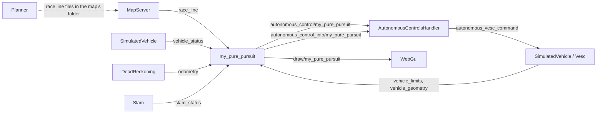

# Tutorial 2 - Pure pursuit

For creating a new autonomous algorithm you need to create a file
`src/autonomous_control/<name>.rs`, and it will be compiled with the same
`cargo build --release` that builds the rest of the project: `build.rs` finds
the file by itself, so no other file has to be edited.

This tutorial builds a pure pursuit controller that way, one step at a time.
Pure pursuit follows a **race line**: a closed path around the track that the
project's planner computes. It picks a point on the line a short distance
ahead of the car and steers along the arc that reaches it.

Where the [gap follower](01_gap_follower.md) only needs the LIDAR, pure
pursuit needs to know *where the car is on the map*. So this tutorial also
shows how an algorithm uses the map server, the planner's output and
localization.

The project already has a `pure_pursuit.rs`. The file written here is called
`my_pure_pursuit.rs`, so both can live side by side and be compared. The code
is written to be easy to read, not to be fast.

The tutorial stands on its own, but it explains the Rust syntax and the
executor framework more briefly than [tutorial 1](01_gap_follower.md). Read
that one first if this is your first algorithm.

Contents:

1. [The theory](#1-the-theory)
2. [How pure pursuit fits in the project](#2-how-pure-pursuit-fits-in-the-project)
3. [Step 1 - Create the file](#step-1---create-the-file)
4. [Step 2 - Read the race line](#step-2---read-the-race-line)
5. [Step 3 - Get the pose](#step-3---get-the-pose)
6. [Step 4 - Find the nearest point](#step-4---find-the-nearest-point)
7. [Step 5 - Find the target point](#step-5---find-the-target-point)
8. [Step 6 - Compute the steering and the speed](#step-6---compute-the-steering-and-the-speed)
9. [Step 7 - Publish the command, or stop and say why](#step-7---publish-the-command-or-stop-and-say-why)
10. [Step 8 - Build and drive](#step-8---build-and-drive)
11. [Step 9 - Parameters in a config file, tuned live](#step-9---parameters-in-a-config-file-tuned-live)
12. [Step 10 - Draw on the map](#step-10---draw-on-the-map)
13. [Step 11 - Test the algorithm](#step-11---test-the-algorithm)
14. [The complete file](#the-complete-file)
15. [Limits, and where to go next](#limits-and-where-to-go-next)

## 1. The theory

### The car as a bicycle

For steering, a car is well described by a bicycle: one rear wheel that
cannot turn and one front wheel that can. The distance between the two is
the **wheelbase** `L`.

When the front wheel is turned by an angle `δ` (delta), the rear wheel moves
along a circle of radius `R`, with

```
tan(δ) = L / R        so        δ = atan(L / R)
```

A small steering angle gives a large circle. So the question "how much do I
steer?" becomes "which circle do I want to drive along?".

### The pursuit circle

Pure pursuit picks a **target point** on the race line, some distance ahead.
Then it finds the one circle that:

- passes through the rear axle,
- is tangent to the car's heading there (the car is already driving in that
  direction),
- passes through the target point.

Look at it from the rear axle, with the car pointing along the horizontal
axis:

```
    side
     ^
     C   <- centre of the circle, at distance R to the side
     |
     |              * target
     |           .
     |    ld  .
     |     .
     |  .   α
     o--------------------> heading
  rear axle
```

- `ld` is the straight-line distance from the rear axle to the target.
- `α` (alpha) is the angle between the car's heading and the direction of
  the target.

In this frame the target is at `(ld·cos α, ld·sin α)` and the centre of the
circle is at `(0, R)`. The target is on the circle, so its distance to the
centre is `R`:

```
(ld·cos α)² + (ld·sin α - R)² = R²
ld² - 2·R·ld·sin α = 0
R = ld / (2·sin α)
```

Putting this radius into the bicycle formula gives the **pure pursuit law**:

```
δ = atan( 2 · L · sin α / ld )
```

That one line is the whole controller. The rest of the algorithm is about
finding `α` and `ld`.

Some things to notice:

- A target straight ahead gives `α = 0`, so `δ = 0`: drive straight.
- A target to one side gives a steering angle toward that side. No sign has
  to be flipped: in this project a positive `α` and a positive steering angle
  both mean "toward increasing heading", which is to the right as the map is
  drawn in `web_gui`.
- The car never actually drives the whole arc. A new target is picked at
  every tick, a little further along the line. The car keeps chasing a point
  it never reaches, which is where the name comes from.

### One tick, step by step

1. **Pose.** Get the car's position and heading on the map, and move the
   position back to the rear axle.
2. **Nearest point.** Find the point of the race line nearest to the rear
   axle. This says where on the line the car is.
3. **Target point.** Walk forward along the line from the nearest point,
   until a point is at least the **lookahead distance** away from the rear
   axle.
4. **Steering.** Apply the pure pursuit law.
5. **Speed.** Each point of the race line carries the speed the planner
   wants there. Use the speed of the nearest point, scaled down.

### The lookahead distance

The lookahead distance is the main thing to tune:

| Lookahead | Effect |
|---|---|
| Short | The car follows the line closely, but steers nervously and can oscillate on straights. |
| Long | The car is smooth and stable, but cuts corners, because it aims at a point past the corner. |

A faster car needs a longer lookahead. This tutorial uses a fixed distance.
The project's `pure_pursuit.rs` grows it with the speed.

## 2. How pure pursuit fits in the project

### Executors and topics, briefly

- An **executor** is one part of the system on its own thread: a sensor
  driver, the simulator, the web GUI, every algorithm.
- A **topic** is a named slot holding the latest value of some data, with one
  writer and any number of readers.
- Executors only communicate through topics. The **captain** holds all the
  topics and is handed to every executor.

An autonomous algorithm is an executor that reads some topics and writes a
command topic. [Tutorial 1](01_gap_follower.md#2-how-an-algorithm-fits-in-the-project)
explains this, and how `build.rs` compiles the file, in more detail.

### What pure pursuit talks to



| Topic | Type | Who writes it | What pure pursuit does with it |
|---|---|---|---|
| `race_line` | `SelectedRaceLine` | `MapServer` | Reads the line to follow |
| `vehicle_status` | `VehicleStatus` | `SimulatedVehicle` (simulation only) | The car's true pose, when `pose_source = 1` |
| `odometry` | `Odometry` | `DeadReckoning` | With `slam_status`, the car's estimated pose, when `pose_source = 0` |
| `slam_status` | `SlamStatus` | `Slam` | See above |
| `vehicle_geometry` | `VehicleGeometry` | `SimulatedVehicle` or `Vesc` | Reads the wheelbase and where the rear axle is |
| `vehicle_limits` | `ActuatorLimits` | `SimulatedVehicle` or `Vesc` | Reads the maximum steering angle and speed |
| `autonomous_control/my_pure_pursuit` | `VescCommand` | pure pursuit | Writes the steering and speed it wants |
| `autonomous_control_info/my_pure_pursuit` | `AutonomousAlgorithmInfo` | pure pursuit | Writes its label, parameters, and a message when it holds the car stopped |
| `draw/my_pure_pursuit` | `Drawing` | pure pursuit | Writes shapes to show on the map |

### The race line

A map is a folder in `maps/`. Next to the map image it holds race lines, as
CSV files with one `x, y, speed` row per point.

- `MapServer` publishes one of them on the `race_line` topic: the line picked
  in `web_gui`'s **Race Lines** panel. By default that is the map's newest
  planned line, or its centerline if nothing was planned yet.
- The **Planning** panel computes a new race line for the selected map
  (see [Planning](../documentation/planning.md)).
- The line is **closed**: after the last point comes the first one again.
- Positions are in meters, in the map's frame. That frame has x to the right
  and y **down**, as the map is drawn. A heading is the angle from the x
  axis, and it grows clockwise on the screen.

The algorithm never opens a file. It reads the topic, so when another line is
picked in the GUI, the next tick follows the new one.

### The pose

A pose is a position and a heading on the map: `x_m`, `y_m`, `heading_rad`.
There are two places to get it from. The project has one function for both,
`pose(captain, vehicle, source)` in `src/localization/pose_source.rs`:

- **Source 1, ground truth.** The simulator knows exactly where its car is
  and publishes it on `vehicle_status`. This is perfect, always available in
  simulation, and does not exist on the real car.
- **Source 0, localization.** This is what the real car uses. `DeadReckoning`
  integrates the wheel speed and the IMU into `odometry`, a pose that is
  smooth but drifts. `Slam` matches the LIDAR scan against the map and
  publishes the correction, `map_to_odom`, on `slam_status`. The two combined
  give the pose on the map. It only works while localization is running:
  start it from the **Localization** panel.

The function returns either a pose, or a sentence saying why there is none
("Localization isn't running - start it in the Localization panel."). This
tutorial starts with the ground truth, because it works at once in the
simulator, and makes the source a parameter in step 9.

The pose is the pose of the car's **center of gravity**. The pure pursuit
law is about the **rear axle**, which is `lr` meters behind it. `lr` and the
wheelbase come from the `vehicle_geometry` topic. They are the vehicle's
measurements, from its calibration, never parameters of the algorithm.

### From the algorithm's command to the wheels

As for every algorithm, the command is not followed directly:

1. Pure pursuit writes the command it wants on
   `autonomous_control/my_pure_pursuit`.
2. `AutonomousControlsHandler` copies the selected algorithm's command to
   `autonomous_vesc_command`. If the algorithm is paused, not selected, or
   its last command is older than 1 second, it writes `(0, 0)` instead.
3. `SimulatedVehicle` or `Vesc` follows that command, unless a human is
   driving with WASD or the joystick.

## Step 1 - Create the file

Create `src/autonomous_control/my_pure_pursuit.rs` with this content. It is a
complete algorithm that tells the car to stand still.

```rust
//! Tutorial pure pursuit: follows the race line by steering toward a point a
//! fixed distance ahead on it. See `tutorial/02_pure_pursuit.md`.

use crate::autonomous_control::{AutonomousControlExt, Instance};
use crate::topics::{AutonomousAlgorithmInfo, VescCommand};
use crate::{Captain, Executor, Ticker};
use std::any::Any;

/// How often a command is published, in Hz.
const RATE_HZ: f64 = 50.0;

/// Entry point build.rs calls - required, with exactly this signature.
pub fn new(instance: Instance) -> Box<dyn Executor> {
    Box::new(MyPurePursuit { id: 0, instance })
}

struct MyPurePursuit {
    id: u16,
    instance: Instance,
}

impl Executor for MyPurePursuit {
    fn init(&mut self, id: u16) {
        self.id = id;
    }

    fn claim_writing_topics(&mut self, captain: &Captain) {
        captain.claim_autonomous_control(
            self.id,
            &self.instance.algorithm_topics(),
            AutonomousAlgorithmInfo::new(
                "My pure pursuit",
                "Tutorial: follows the race line toward a point a fixed distance ahead.",
            )
            .requires_race_line(),
        );
    }

    fn run(&mut self, captain: &Captain) {
        // The topic this algorithm writes.
        let command_topic = captain.autonomous_control(&self.instance.algorithm_topics());
        let mut ticker = Ticker::new(RATE_HZ);

        while captain.is_running(self.id) {
            // For now: stand still, wheels straight.
            command_topic
                .write(self.id, VescCommand::new(0.0, 0.0))
                .expect("lost writer authorization for this algorithm's command topic");
            ticker.wait();
        }
    }

    fn name(&self) -> String {
        self.instance.name.clone()
    }

    fn as_any(&self) -> &dyn Any {
        self
    }

    fn fresh(&self) -> Box<dyn Executor> {
        new(self.instance.clone())
    }
}
```

- The file name `my_pure_pursuit` becomes the algorithm's name, used for its
  topics and its config file. It must be `snake_case`.
- `pub fn new(instance: Instance) -> Box<dyn Executor>` is the function
  `build.rs` calls. It must exist with exactly this signature.
- `impl Executor` makes the struct an executor: `init` stores the id the
  runner assigns, `claim_writing_topics` says which topics it writes, and
  `run` is the main loop, on its own thread.
- `claim_autonomous_control` claims the command and info topics.
  `.requires_race_line()` tells `web_gui` that an opponent can only use this
  algorithm together with a race line.
- Each turn of the loop is one *tick*: write a command, then `ticker.wait()`
  sleeps until the next one is due, 50 times per second.
- `instance` says which vehicle this copy drives. Topic names always come
  from it (`self.instance.vehicle.race_line()`), never from a string in the
  code, because an opponent's copy of the algorithm uses topics with a
  prefix, such as `opponent/1/race_line`.

[Tutorial 1, step 1](01_gap_follower.md#step-1---create-the-file) explains
every line of this skeleton.

## Step 2 - Read the race line

One tick of the algorithm can end in two ways: with a command, or with a
reason why the line cannot be followed. Rust has a type for exactly that,
`Result`. All the work of a tick goes into one function, `follow`, that
returns a `Result`. Add it after the `impl Executor` block:

```rust
impl MyPurePursuit {
    /// One tick of pure pursuit: the command to follow the race line - or,
    /// as an error, why the line can't be followed.
    fn follow(
        &self,
        captain: &Captain,
        limits: &ActuatorLimits,
        geometry: &VehicleGeometry,
    ) -> Result<VescCommand, String> {
        // 1. The race line.
        let line_topic = captain
            .try_topic::<SelectedRaceLine>(&self.instance.vehicle.race_line())
            .ok_or("Nothing publishes a race line.")?;
        let points = line_topic.read().into_value().points;
        if points.len() < 3 {
            return Err("No race line on the selected map.".to_string());
        }
```

The function is not finished: the next steps add to it, in order.

- `captain.try_topic::<SelectedRaceLine>(name)` looks for the topic. It
  returns an `Option`: `None` if no executor publishes a race line at all.
- `read()` returns the latest value with some bookkeeping (when it was
  written). `.into_value()` keeps just the value, and `.points` is the list
  of points. Each point is a `SpeedPoint` with the fields `x`, `y` and
  `speed_mps`.
- With no map selected, or a map with no line, the list is empty.

> **Rust note**
> - `Result<VescCommand, String>` is either `Ok(a command)` or
>   `Err(a text)`. The caller must handle both.
> - `.ok_or("...")` turns an `Option` into a `Result`: `Some(x)` becomes
>   `Ok(x)`, and `None` becomes `Err("...")`.
> - The `?` at the end means: "if this is an `Err`, leave the function now
>   and return that error. Otherwise give me the value inside." It replaces
>   an `if` after every operation that can fail.
> - `return Err(...)` leaves the function with an error by hand.

Add the new names to the `use` lines:

```rust
use crate::topics::{
    ActuatorLimits, AutonomousAlgorithmInfo, SelectedRaceLine, VehicleGeometry, VescCommand,
};
```

## Step 3 - Get the pose

Continue `follow`:

```rust
        // 2. The pose, moved back from the center of gravity to the rear axle.
        let pose = pose(captain, &self.instance.vehicle, POSE_GROUND_TRUTH)?;
        let rear_axle = pose.moved_back(geometry.lr_m());
```

- `pose(...)` is the project's function described in
  [The pose](#the-pose). It returns a `Result`, so `?` hands its error text
  straight to the caller of `follow`. For now the source is fixed to the
  simulator's ground truth.
- `moved_back(d)` returns the same pose, `d` meters behind along its heading:
  `x - d·cos(heading)`, `y - d·sin(heading)`. `geometry.lr_m()` is the
  distance from the center of gravity back to the rear axle.

Add the `use` lines:

```rust
use crate::geometry::{Pose, wrap_to_pi};
use crate::localization::pose_source::{POSE_GROUND_TRUTH, pose};
```

`Pose` and `wrap_to_pi` are used in step 6.

## Step 4 - Find the nearest point

Two small functions, added at the bottom of the file. They only do geometry:

```rust
/// The distance from `point` to `(x_m, y_m)`.
fn distance_m(point: &SpeedPoint, x_m: f64, y_m: f64) -> f64 {
    let dx = point.x - x_m;
    let dy = point.y - y_m;
    (dx * dx + dy * dy).sqrt()
}

/// The index of the point of the line closest to `(x_m, y_m)`.
fn nearest_point(points: &[SpeedPoint], x_m: f64, y_m: f64) -> usize {
    let mut nearest = 0;
    for (i, point) in points.iter().enumerate() {
        if distance_m(point, x_m, y_m) < distance_m(&points[nearest], x_m, y_m) {
            nearest = i;
        }
    }
    nearest
}
```

`nearest_point` looks at every point of the line and remembers the index of
the closest one. `for (i, point) in points.iter().enumerate()` walks the list
giving both the index and the point. `usize` is the type of an index.

Use them in `follow`:

```rust
        // 3. The nearest point of the line.
        let nearest = nearest_point(&points, rear_axle.x_m, rear_axle.y_m);
        let off_line_m = distance_m(&points[nearest], rear_axle.x_m, rear_axle.y_m);
        if off_line_m > MAX_CROSS_TRACK_M {
            return Err(format!("{off_line_m:.2} m off the race line."));
        }
```

If the car is far from the line, something is wrong: it was placed
elsewhere, or the pose is bad. Steering hard toward a distant line is not
safe, so the algorithm stops instead. `format!` builds a text, and
`{off_line_m:.2}` prints the variable with two decimals.

Add the constant at the top of the file, next to `RATE_HZ`, and the `use`
line for `SpeedPoint`:

```rust
/// Farther than this from the line, the vehicle stops, in meters.
const MAX_CROSS_TRACK_M: f64 = 1.0;
```

```rust
use crate::environment::SpeedPoint;
```

## Step 5 - Find the target point

Another function at the bottom of the file:

```rust
/// The index of the first point, going forward along the line from
/// `nearest`, that is at least `lookahead_m` away from `(x_m, y_m)`.
fn target_point(
    points: &[SpeedPoint],
    nearest: usize,
    x_m: f64,
    y_m: f64,
    lookahead_m: f64,
) -> usize {
    let mut target = nearest;
    // At most one lap, so the loop always ends.
    for _ in 0..points.len() {
        if distance_m(&points[target], x_m, y_m) >= lookahead_m {
            break;
        }
        // The line is closed: after the last point comes the first.
        target = (target + 1) % points.len();
    }
    target
}
```

- It starts at the nearest point and steps forward one point at a time,
  until a point is far enough.
- `%` is the remainder of a division. `(target + 1) % points.len()` goes back
  to index 0 after the last point, which is how the search continues across
  the start of the lap.
- `for _ in 0..points.len()` repeats at most once per point. Without that
  limit, a lookahead larger than the whole track would loop forever.

Starting from the *nearest* point matters. Searching the whole line for "a
point at the lookahead distance" would also find the one *behind* the car.

In `follow`:

```rust
        // 4. The target: the first point at least `LOOKAHEAD_M` away.
        let target = target_point(&points, nearest, rear_axle.x_m, rear_axle.y_m, LOOKAHEAD_M);
```

And the constant:

```rust
/// How far ahead the target point is, in meters.
const LOOKAHEAD_M: f64 = 1.0;
```

## Step 6 - Compute the steering and the speed

The pure pursuit law from the theory, as a function at the bottom of the
file:

```rust
/// The pure pursuit law: the front-wheel angle that puts the rear axle on
/// the circular arc through `target`: `atan(2 L sin(alpha) / ld)`.
fn steering_angle(rear_axle: Pose, target: &SpeedPoint, wheelbase_m: f64) -> f64 {
    let dx = target.x - rear_axle.x_m;
    let dy = target.y - rear_axle.y_m;
    // ld: the straight-line distance to the target.
    let ld = (dx * dx + dy * dy).sqrt();
    if ld < 1e-9 {
        return 0.0;
    }
    // alpha: the direction of the target, relative to where the car points.
    let alpha = wrap_to_pi(dy.atan2(dx) - rear_axle.heading_rad);
    (2.0 * wheelbase_m * alpha.sin() / ld).atan()
}
```

- `dy.atan2(dx)` is the direction from the rear axle to the target, as an
  angle on the map. Subtracting the car's heading gives `α`.
- `wrap_to_pi` brings an angle back between -π and π. Without it, a heading
  of 3.1 and a direction of -3.1 would look 6.2 radians apart, when they are
  almost the same direction.
- The `ld < 1e-9` check avoids dividing by zero if the target is exactly on
  the rear axle.

Finish `follow`:

```rust
        // 5. The steering that drives an arc through the target.
        let steering_rad = steering_angle(rear_axle, &points[target], geometry.wheelbase_m).clamp(
            -limits.max_steering_angle_rad,
            limits.max_steering_angle_rad,
        );

        // 6. The speed the race line asks for here, scaled down.
        let speed_mps = (SPEED_SCALE * points[nearest].speed_mps).clamp(0.0, limits.max_speed_mps);

        Ok(VescCommand::new(steering_rad, speed_mps))
    }
}
```

- `clamp(low, high)` keeps a value between two limits. The steering stays
  within what the servo can do, and the speed within the vehicle's top speed.
- The race line's speed is what the planner computed for a car driving the
  line perfectly. Pure pursuit cuts corners, so it needs a margin:
  `SPEED_SCALE` multiplies the speed down.
- `Ok(...)` on the last line is the successful result.

And the constant:

```rust
/// Multiplies the race line's speed, pure number.
const SPEED_SCALE: f64 = 0.5;
```

## Step 7 - Publish the command, or stop and say why

Back in `run`. Before the loop, get the two topics `follow` needs:

```rust
        // The topics it reads.
        let limits_topic = captain.topic::<ActuatorLimits>(&self.instance.vehicle.vehicle_limits());
        let geometry_topic =
            captain.topic::<VehicleGeometry>(&self.instance.vehicle.vehicle_geometry());
```

Then replace the "stand still" command. The whole loop becomes:

```rust
        while captain.is_running(self.id) {
            let limits = limits_topic.read();
            let geometry = geometry_topic.read();

            // Either follow the line, or stop and say why.
            let (command, message) = match self.follow(captain, &limits, &geometry) {
                Ok(command) => (command, None),
                Err(why) => (
                    VescCommand::new(0.0, 0.0),
                    Some(format!("{why} Vehicle held stopped.")),
                ),
            };

            report_message(captain, self.id, &self.instance, message);
            command_topic
                .write(self.id, command)
                .expect("lost writer authorization for this algorithm's command topic");

            ticker.wait();
        }
```

- `match` looks at the result of `follow`. On `Ok`, the command is used and
  there is no message. On `Err`, the command is "stopped, wheels straight"
  and the message is the reason.
- `message` is an `Option`: `Some(text)` or `None`.
- `report_message` puts the message into the algorithm's info topic, and
  `web_gui` shows it in yellow in the **Autonomous Algos** panel. `None`
  clears it. It only rewrites the topic when the message changes, so calling
  it every tick is fine.
- The limits and the geometry are read every tick, because they can change
  live in `web_gui`.

Stopping is the safe answer to anything unexpected. An algorithm that keeps
publishing its last steering angle when it has lost the pose would drive the
car into a wall.

Update the first `use` line:

```rust
use crate::autonomous_control::{AutonomousControlExt, Instance, report_message};
```

The file now holds a complete pure pursuit.

## Step 8 - Build and drive

From the repository root:

```sh
cargo build --release
./target/release/web_gui
```

The first release build takes a few minutes. While developing,
`cargo run --bin web_gui` builds faster and runs slower.

Then:

1. Open <http://localhost:1999> and select a map.
2. In the **Autonomous Algos** panel, pick **My pure pursuit** and press
   **Start**. The car follows the race line.
3. **Pause** stops it. Holding a WASD key takes over while the key is held.

If the car does not move, read the yellow message in the panel. It is the
text `follow` returned:

- *"No race line on the selected map."* Select a map. A map's centerline is
  used until a line is planned in the **Planning** panel.
- *"... m off the race line."* Drive the car back to the line with WASD, or
  place it at the start (P).

A centerline that was never planned carries one constant speed, so the car
takes every corner at the same speed. Plan a race line to get a real speed
profile, or lower the speed scale.

## Step 9 - Parameters in a config file, tuned live

Constants need a rebuild every time one changes. Move them to a TOML file,
and `web_gui` shows a slider for each one while the algorithm is selected.

**1. Create the config file**
`config/autonomous_control/my_pure_pursuit.toml`. The file must have the
algorithm's name.

```toml
# Configuration for the tutorial pure pursuit
# (src/autonomous_control/my_pure_pursuit.rs).

# How often a command is published, in Hz.
rate_hz = 50.0
# Where the vehicle's pose comes from: 0 = localization (the real car, or
# the simulation with localization running), 1 = the simulator's ground
# truth (simulation only).
pose_source = 1
# How far ahead the target point is, in meters.
lookahead_m = 1.0
# Multiplies the race line's speed, pure number.
speed_scale = 0.5
# Farther than this from the line, the vehicle stops, in meters.
max_cross_track_m = 1.0
```

**2. Replace the constants with a config struct.** Delete the four `const`
lines and add this. Each field has the same name as a key in the file:

```rust
/// The parameters, loaded from `config/autonomous_control/my_pure_pursuit.toml`.
#[derive(Debug, Clone, Copy, PartialEq, serde::Serialize, serde::Deserialize)]
pub struct MyPurePursuitConfig {
    /// How often a command is published, in Hz.
    pub rate_hz: f64,
    /// Where the pose comes from: 0 = localization, 1 = the simulator's ground truth.
    pub pose_source: u8,
    /// How far ahead the target point is, in meters.
    pub lookahead_m: f64,
    /// Multiplies the race line's speed, pure number.
    pub speed_scale: f64,
    /// Farther than this from the line, the vehicle stops, in meters.
    pub max_cross_track_m: f64,
}

impl Default for MyPurePursuitConfig {
    /// The copy of the config file compiled into the program, used when the
    /// file can't be read at runtime.
    fn default() -> Self {
        toml::from_str(include_str!(
            "../../config/autonomous_control/my_pure_pursuit.toml"
        ))
        .expect("my_pure_pursuit.toml must match MyPurePursuitConfig")
    }
}
```

`serde::Serialize` and `serde::Deserialize` generate the code that converts
the struct to and from text. `include_str!` copies the file into the program
at compile time, as a fallback for when the program is started from another
folder.

**3. Load the config in `new`,** and keep it in the struct:

```rust
pub fn new(instance: Instance) -> Box<dyn Executor> {
    let mut config: MyPurePursuitConfig = load_config(&instance.config_name);
    // An opponent has no localization: it always uses the simulator's pose.
    if instance.is_opponent() {
        config.pose_source = POSE_GROUND_TRUTH;
    }
    Box::new(MyPurePursuit {
        id: 0,
        instance,
        config,
    })
}
```

```rust
struct MyPurePursuit {
    id: u16,
    instance: Instance,
    config: MyPurePursuitConfig,
}
```

`load_config` reads `config/autonomous_control/<name>.toml` when the program
starts. The `is_opponent` check is needed because only the main vehicle has
localization: `Slam` follows one car. An opponent added in `web_gui` runs
its own copy of this file and exists only in simulation, so its copy always
uses the ground truth.

**4. Declare the sliders.** Each one names a config field and gives its
minimum, maximum and step:

```rust
/// The sliders web_gui shows: one per config field, with (min, max, step).
fn parameters() -> [AlgorithmParameter; 5] {
    [
        AlgorithmParameter::float("rate_hz", 5.0, 200.0, 1.0)
            .unit("Hz")
            .description("How often a command is published."),
        AlgorithmParameter::int("pose_source", 0, 1, 1)
            .description("0 = localization, 1 = ground truth (simulation only)."),
        AlgorithmParameter::float("lookahead_m", 0.3, 5.0, 0.05)
            .unit("m")
            .description("How far ahead the target point is."),
        AlgorithmParameter::float("speed_scale", 0.0, 1.5, 0.05)
            .description("Multiplies the race line's speed."),
        AlgorithmParameter::float("max_cross_track_m", 0.2, 5.0, 0.1)
            .unit("m")
            .description("Farther than this from the line, the vehicle stops."),
    ]
}
```

Use `float` for decimal fields and `int` for whole-number fields. Pick
limits that are always safe: `rate_hz` must stay well above 1 Hz, or every
command would be too old and the car would never move.

**5. Publish them with the info,** in `claim_writing_topics`:

```rust
            .requires_race_line()
            .with_parameters(&self.config, parameters()),
```

**6. Apply slider changes in the loop.** Before the loop:

```rust
        let mut tuner = ParameterTuner::new(self.id, &self.instance);
        let mut ticker = Ticker::new(self.config.rate_hz);
```

At the top of the loop:

```rust
            // Apply any slider moved in web_gui.
            if tuner.update(captain, &mut self.config) {
                ticker = Ticker::new(self.config.rate_hz);
            }
```

`tuner.update` reads the `autonomous_parameters` topic, which `web_gui`
writes when a slider moves, copies any new value into `self.config`, and
returns `true` if something changed. The ticker was built from `rate_hz`, so
it is rebuilt then.

**7. Use the config in `follow`** instead of the constants:

```rust
        let pose = pose(captain, &self.instance.vehicle, self.config.pose_source)?;
```

```rust
        if off_line_m > self.config.max_cross_track_m {
```

```rust
        let target = target_point(
            &points,
            nearest,
            rear_axle.x_m,
            rear_axle.y_m,
            self.config.lookahead_m,
        );
```

```rust
        let speed_mps =
            (self.config.speed_scale * points[nearest].speed_mps).clamp(0.0, limits.max_speed_mps);
```

**8. Update the `use` lines:**

```rust
use crate::autonomous_control::{
    AutonomousControlExt, Instance, ParameterTuner, load_config, report_message,
};
```

and add `AlgorithmParameter` to the `crate::topics` list.

Rebuild and run. With **My pure pursuit** selected, the panel shows the
sliders. Try the lookahead: a short one makes the car wobble, a long one
makes it cut corners. **Save parameters** writes the current values into the
TOML file, and **Load from file** goes back to the file's values.

### Driving on localization

With `pose_source = 1` the algorithm uses a pose no real car has. To drive
the way the real car does, in the simulator:

1. Start localization from the **Localization** panel.
2. Set the `pose_source` slider to 0.

The algorithm now depends on `DeadReckoning` and `Slam` doing their job. If
localization is not running, the car stops and the panel says so. On the
real car, set `pose_source = 0` in the TOML file: with 1 the car stays
stopped, because there is no ground truth.

## Step 10 - Draw on the map

Any executor can publish a **drawing**: a list of shapes in map coordinates,
which `web_gui` shows on the map. Pure pursuit will draw the nearest point in
blue, the target in purple, and the straight line from the rear axle to the
target.

**1. Claim the drawing topic,** at the end of `claim_writing_topics`:

```rust
        captain.claim_drawing(self.id);
```

**2. Get the topic,** in `run` before the loop:

```rust
        let drawing_topic = captain.drawing(self.id);
```

**3. Add the function** that builds the drawing, at the bottom of the file:

```rust
/// What to show on the map: the nearest point in blue, the target in
/// purple, and the line from the rear axle to the target.
fn draw(rear_axle: Pose, nearest: &SpeedPoint, target: &SpeedPoint) -> Drawing {
    let nearest_shape = Shape::Circle {
        x_m: nearest.x,
        y_m: nearest.y,
        radius_m: 0.06,
        filled: true,
        color: Color::BLUE,
    };
    let target_shape = Shape::Circle {
        x_m: target.x,
        y_m: target.y,
        radius_m: 0.08,
        filled: true,
        color: Color::PURPLE,
    };
    let chord = Shape::Polyline {
        points: vec![
            [rear_axle.x_m as f32, rear_axle.y_m as f32],
            [target.x as f32, target.y as f32],
        ],
        closed: false,
        width_px: 1.0,
        color: Color::PURPLE,
    };
    Drawing::default()
        .element("Nearest point", [nearest_shape], false)
        .element("Target point", [target_shape], false)
        .element("Chord", [chord], false)
}
```

`.element(name, shapes, false)` adds a named group of shapes. The name
appears in `web_gui`'s Layers list. `false` means "hidden by default":
`web_gui` shows an algorithm's drawing only while that algorithm is selected.

**4. Return the drawing from `follow`** together with the command. The
return type becomes a pair:

```rust
    ) -> Result<(VescCommand, Drawing), String> {
```

and so does the last expression:

```rust
        Ok((
            VescCommand::new(steering_rad, speed_mps),
            draw(rear_axle, &points[nearest], &points[target]),
        ))
```

**5. Publish it in the loop.** When the car is held stopped, an empty
drawing is published, so the old shapes do not stay on the map:

```rust
            // Either follow the line, or stop and say why.
            let (command, drawing, message) = match self.follow(captain, &limits, &geometry) {
                Ok((command, drawing)) => (command, drawing, None),
                Err(why) => (
                    VescCommand::new(0.0, 0.0),
                    Drawing::default(),
                    Some(format!("{why} Vehicle held stopped.")),
                ),
            };
```

```rust
            drawing_topic
                .write(self.id, drawing.stale_after(Drawing::DEFAULT_STALE_AFTER))
                .expect("lost writer authorization for this algorithm's drawing topic");
```

`.stale_after(...)` tells the viewer to fade the drawing out if it stops
being updated.

**6. Update the `use` line** for the topics:

```rust
use crate::topics::{
    ActuatorLimits, AlgorithmParameter, AutonomousAlgorithmInfo, Color, Drawing, DrawingExt,
    SelectedRaceLine, Shape, VehicleGeometry, VescCommand,
};
```

Rebuild, run and select the algorithm. The purple dot runs ahead of the car
along the line, and the `lookahead_m` slider moves it nearer or farther.

## Step 11 - Test the algorithm

The geometry functions do not depend on topics, so they can be tested
without running anything. Add this at the very bottom of the file:

```rust
#[cfg(test)]
mod tests {
    use super::*;

    /// A square of side 10 m with a point every meter, driven from (0, 0)
    /// along +x first.
    fn square() -> Vec<SpeedPoint> {
        let mut points = Vec::new();
        for i in 0..10 {
            points.push((i as f64, 0.0));
        }
        for i in 0..10 {
            points.push((10.0, i as f64));
        }
        for i in 0..10 {
            points.push((10.0 - i as f64, 10.0));
        }
        for i in 0..10 {
            points.push((0.0, 10.0 - i as f64));
        }
        points
            .into_iter()
            .map(|(x, y)| SpeedPoint {
                x,
                y,
                speed_mps: 2.0,
            })
            .collect()
    }

    #[test]
    fn the_target_is_the_lookahead_ahead_of_the_nearest_point() {
        let points = square();
        let nearest = nearest_point(&points, 3.1, 0.2);
        assert_eq!(nearest, 3);
        assert_eq!(target_point(&points, nearest, 3.1, 0.2, 2.0), 6);
    }

    #[test]
    fn the_target_wraps_around_the_end_of_the_line() {
        let points = square();
        let nearest = nearest_point(&points, 0.0, 1.0);
        assert_eq!(nearest, 39);
        assert_eq!(target_point(&points, nearest, 0.0, 1.0, 2.0), 2);
    }

    #[test]
    fn a_target_straight_ahead_needs_no_steering() {
        let rear_axle = Pose {
            x_m: 0.0,
            y_m: 0.0,
            heading_rad: 0.0,
        };
        let ahead = SpeedPoint {
            x: 2.0,
            y: 0.0,
            speed_mps: 1.0,
        };
        assert_eq!(steering_angle(rear_axle, &ahead, 0.32), 0.0);
    }

    #[test]
    fn a_target_toward_increasing_heading_steers_positive() {
        let rear_axle = Pose {
            x_m: 0.0,
            y_m: 0.0,
            heading_rad: 0.0,
        };
        let point = |y| SpeedPoint {
            x: 1.0,
            y,
            speed_mps: 1.0,
        };
        assert!(steering_angle(rear_axle, &point(0.5), 0.32) > 0.0);
        assert!(steering_angle(rear_axle, &point(-0.5), 0.32) < 0.0);
    }
}
```

The tests build a small square "track" by hand and check the claims made in
the theory: the target is ahead of the nearest point, the search continues
across the end of the list, a target straight ahead needs no steering, and
the sign of the steering follows the side the target is on.

Run the tests of this file with:

```sh
cargo test my_pure_pursuit
```

## The complete file

<details>
<summary><code>src/autonomous_control/my_pure_pursuit.rs</code></summary>

```rust
//! Tutorial pure pursuit: follows the race line by steering toward a point a
//! fixed distance ahead on it. See `tutorial/02_pure_pursuit.md`.

use crate::autonomous_control::{
    AutonomousControlExt, Instance, ParameterTuner, load_config, report_message,
};
use crate::environment::SpeedPoint;
use crate::geometry::{Pose, wrap_to_pi};
use crate::localization::pose_source::{POSE_GROUND_TRUTH, pose};
use crate::topics::{
    ActuatorLimits, AlgorithmParameter, AutonomousAlgorithmInfo, Color, Drawing, DrawingExt,
    SelectedRaceLine, Shape, VehicleGeometry, VescCommand,
};
use crate::{Captain, Executor, Ticker};
use std::any::Any;

/// Entry point build.rs calls - required, with exactly this signature.
pub fn new(instance: Instance) -> Box<dyn Executor> {
    let mut config: MyPurePursuitConfig = load_config(&instance.config_name);
    // An opponent has no localization: it always uses the simulator's pose.
    if instance.is_opponent() {
        config.pose_source = POSE_GROUND_TRUTH;
    }
    Box::new(MyPurePursuit {
        id: 0,
        instance,
        config,
    })
}

/// The parameters, loaded from `config/autonomous_control/my_pure_pursuit.toml`.
#[derive(Debug, Clone, Copy, PartialEq, serde::Serialize, serde::Deserialize)]
pub struct MyPurePursuitConfig {
    /// How often a command is published, in Hz.
    pub rate_hz: f64,
    /// Where the pose comes from: 0 = localization, 1 = the simulator's ground truth.
    pub pose_source: u8,
    /// How far ahead the target point is, in meters.
    pub lookahead_m: f64,
    /// Multiplies the race line's speed, pure number.
    pub speed_scale: f64,
    /// Farther than this from the line, the vehicle stops, in meters.
    pub max_cross_track_m: f64,
}

impl Default for MyPurePursuitConfig {
    /// The copy of the config file compiled into the program, used when the
    /// file can't be read at runtime.
    fn default() -> Self {
        toml::from_str(include_str!(
            "../../config/autonomous_control/my_pure_pursuit.toml"
        ))
        .expect("my_pure_pursuit.toml must match MyPurePursuitConfig")
    }
}

/// The sliders web_gui shows: one per config field, with (min, max, step).
fn parameters() -> [AlgorithmParameter; 5] {
    [
        AlgorithmParameter::float("rate_hz", 5.0, 200.0, 1.0)
            .unit("Hz")
            .description("How often a command is published."),
        AlgorithmParameter::int("pose_source", 0, 1, 1)
            .description("0 = localization, 1 = ground truth (simulation only)."),
        AlgorithmParameter::float("lookahead_m", 0.3, 5.0, 0.05)
            .unit("m")
            .description("How far ahead the target point is."),
        AlgorithmParameter::float("speed_scale", 0.0, 1.5, 0.05)
            .description("Multiplies the race line's speed."),
        AlgorithmParameter::float("max_cross_track_m", 0.2, 5.0, 0.1)
            .unit("m")
            .description("Farther than this from the line, the vehicle stops."),
    ]
}

struct MyPurePursuit {
    id: u16,
    instance: Instance,
    config: MyPurePursuitConfig,
}

impl Executor for MyPurePursuit {
    fn init(&mut self, id: u16) {
        self.id = id;
    }

    fn claim_writing_topics(&mut self, captain: &Captain) {
        captain.claim_autonomous_control(
            self.id,
            &self.instance.algorithm_topics(),
            AutonomousAlgorithmInfo::new(
                "My pure pursuit",
                "Tutorial: follows the race line toward a point a fixed distance ahead.",
            )
            .requires_race_line()
            .with_parameters(&self.config, parameters()),
        );
        captain.claim_drawing(self.id);
    }

    fn run(&mut self, captain: &Captain) {
        // The topics this algorithm writes.
        let command_topic = captain.autonomous_control(&self.instance.algorithm_topics());
        let drawing_topic = captain.drawing(self.id);
        // The topics it reads.
        let limits_topic = captain.topic::<ActuatorLimits>(&self.instance.vehicle.vehicle_limits());
        let geometry_topic =
            captain.topic::<VehicleGeometry>(&self.instance.vehicle.vehicle_geometry());

        let mut tuner = ParameterTuner::new(self.id, &self.instance);
        let mut ticker = Ticker::new(self.config.rate_hz);

        while captain.is_running(self.id) {
            // Apply any slider moved in web_gui.
            if tuner.update(captain, &mut self.config) {
                ticker = Ticker::new(self.config.rate_hz);
            }

            let limits = limits_topic.read();
            let geometry = geometry_topic.read();

            // Either follow the line, or stop and say why.
            let (command, drawing, message) = match self.follow(captain, &limits, &geometry) {
                Ok((command, drawing)) => (command, drawing, None),
                Err(why) => (
                    VescCommand::new(0.0, 0.0),
                    Drawing::default(),
                    Some(format!("{why} Vehicle held stopped.")),
                ),
            };

            report_message(captain, self.id, &self.instance, message);
            command_topic
                .write(self.id, command)
                .expect("lost writer authorization for this algorithm's command topic");
            drawing_topic
                .write(self.id, drawing.stale_after(Drawing::DEFAULT_STALE_AFTER))
                .expect("lost writer authorization for this algorithm's drawing topic");

            ticker.wait();
        }
    }

    fn name(&self) -> String {
        self.instance.name.clone()
    }

    fn as_any(&self) -> &dyn Any {
        self
    }

    fn fresh(&self) -> Box<dyn Executor> {
        new(self.instance.clone())
    }
}

impl MyPurePursuit {
    /// One tick of pure pursuit: the command to follow the race line and
    /// what to draw - or, as an error, why the line can't be followed.
    fn follow(
        &self,
        captain: &Captain,
        limits: &ActuatorLimits,
        geometry: &VehicleGeometry,
    ) -> Result<(VescCommand, Drawing), String> {
        // 1. The race line.
        let line_topic = captain
            .try_topic::<SelectedRaceLine>(&self.instance.vehicle.race_line())
            .ok_or("Nothing publishes a race line.")?;
        let points = line_topic.read().into_value().points;
        if points.len() < 3 {
            return Err("No race line on the selected map.".to_string());
        }

        // 2. The pose, moved back from the center of gravity to the rear axle.
        let pose = pose(captain, &self.instance.vehicle, self.config.pose_source)?;
        let rear_axle = pose.moved_back(geometry.lr_m());

        // 3. The nearest point of the line.
        let nearest = nearest_point(&points, rear_axle.x_m, rear_axle.y_m);
        let off_line_m = distance_m(&points[nearest], rear_axle.x_m, rear_axle.y_m);
        if off_line_m > self.config.max_cross_track_m {
            return Err(format!("{off_line_m:.2} m off the race line."));
        }

        // 4. The target: the first point at least `lookahead_m` away.
        let target = target_point(
            &points,
            nearest,
            rear_axle.x_m,
            rear_axle.y_m,
            self.config.lookahead_m,
        );

        // 5. The steering that drives an arc through the target.
        let steering_rad = steering_angle(rear_axle, &points[target], geometry.wheelbase_m).clamp(
            -limits.max_steering_angle_rad,
            limits.max_steering_angle_rad,
        );

        // 6. The speed the race line asks for here, scaled down.
        let speed_mps =
            (self.config.speed_scale * points[nearest].speed_mps).clamp(0.0, limits.max_speed_mps);

        Ok((
            VescCommand::new(steering_rad, speed_mps),
            draw(rear_axle, &points[nearest], &points[target]),
        ))
    }
}

/// The distance from `point` to `(x_m, y_m)`.
fn distance_m(point: &SpeedPoint, x_m: f64, y_m: f64) -> f64 {
    let dx = point.x - x_m;
    let dy = point.y - y_m;
    (dx * dx + dy * dy).sqrt()
}

/// The index of the point of the line closest to `(x_m, y_m)`.
fn nearest_point(points: &[SpeedPoint], x_m: f64, y_m: f64) -> usize {
    let mut nearest = 0;
    for (i, point) in points.iter().enumerate() {
        if distance_m(point, x_m, y_m) < distance_m(&points[nearest], x_m, y_m) {
            nearest = i;
        }
    }
    nearest
}

/// The index of the first point, going forward along the line from
/// `nearest`, that is at least `lookahead_m` away from `(x_m, y_m)`.
fn target_point(
    points: &[SpeedPoint],
    nearest: usize,
    x_m: f64,
    y_m: f64,
    lookahead_m: f64,
) -> usize {
    let mut target = nearest;
    // At most one lap, so the loop always ends.
    for _ in 0..points.len() {
        if distance_m(&points[target], x_m, y_m) >= lookahead_m {
            break;
        }
        // The line is closed: after the last point comes the first.
        target = (target + 1) % points.len();
    }
    target
}

/// The pure pursuit law: the front-wheel angle that puts the rear axle on
/// the circular arc through `target`: `atan(2 L sin(alpha) / ld)`.
fn steering_angle(rear_axle: Pose, target: &SpeedPoint, wheelbase_m: f64) -> f64 {
    let dx = target.x - rear_axle.x_m;
    let dy = target.y - rear_axle.y_m;
    // ld: the straight-line distance to the target.
    let ld = (dx * dx + dy * dy).sqrt();
    if ld < 1e-9 {
        return 0.0;
    }
    // alpha: the direction of the target, relative to where the car points.
    let alpha = wrap_to_pi(dy.atan2(dx) - rear_axle.heading_rad);
    (2.0 * wheelbase_m * alpha.sin() / ld).atan()
}

/// What to show on the map: the nearest point in blue, the target in
/// purple, and the line from the rear axle to the target.
fn draw(rear_axle: Pose, nearest: &SpeedPoint, target: &SpeedPoint) -> Drawing {
    let nearest_shape = Shape::Circle {
        x_m: nearest.x,
        y_m: nearest.y,
        radius_m: 0.06,
        filled: true,
        color: Color::BLUE,
    };
    let target_shape = Shape::Circle {
        x_m: target.x,
        y_m: target.y,
        radius_m: 0.08,
        filled: true,
        color: Color::PURPLE,
    };
    let chord = Shape::Polyline {
        points: vec![
            [rear_axle.x_m as f32, rear_axle.y_m as f32],
            [target.x as f32, target.y as f32],
        ],
        closed: false,
        width_px: 1.0,
        color: Color::PURPLE,
    };
    Drawing::default()
        .element("Nearest point", [nearest_shape], false)
        .element("Target point", [target_shape], false)
        .element("Chord", [chord], false)
}

#[cfg(test)]
mod tests {
    use super::*;

    /// A square of side 10 m with a point every meter, driven from (0, 0)
    /// along +x first.
    fn square() -> Vec<SpeedPoint> {
        let mut points = Vec::new();
        for i in 0..10 {
            points.push((i as f64, 0.0));
        }
        for i in 0..10 {
            points.push((10.0, i as f64));
        }
        for i in 0..10 {
            points.push((10.0 - i as f64, 10.0));
        }
        for i in 0..10 {
            points.push((0.0, 10.0 - i as f64));
        }
        points
            .into_iter()
            .map(|(x, y)| SpeedPoint {
                x,
                y,
                speed_mps: 2.0,
            })
            .collect()
    }

    #[test]
    fn the_target_is_the_lookahead_ahead_of_the_nearest_point() {
        let points = square();
        let nearest = nearest_point(&points, 3.1, 0.2);
        assert_eq!(nearest, 3);
        assert_eq!(target_point(&points, nearest, 3.1, 0.2, 2.0), 6);
    }

    #[test]
    fn the_target_wraps_around_the_end_of_the_line() {
        let points = square();
        let nearest = nearest_point(&points, 0.0, 1.0);
        assert_eq!(nearest, 39);
        assert_eq!(target_point(&points, nearest, 0.0, 1.0, 2.0), 2);
    }

    #[test]
    fn a_target_straight_ahead_needs_no_steering() {
        let rear_axle = Pose {
            x_m: 0.0,
            y_m: 0.0,
            heading_rad: 0.0,
        };
        let ahead = SpeedPoint {
            x: 2.0,
            y: 0.0,
            speed_mps: 1.0,
        };
        assert_eq!(steering_angle(rear_axle, &ahead, 0.32), 0.0);
    }

    #[test]
    fn a_target_toward_increasing_heading_steers_positive() {
        let rear_axle = Pose {
            x_m: 0.0,
            y_m: 0.0,
            heading_rad: 0.0,
        };
        let point = |y| SpeedPoint {
            x: 1.0,
            y,
            speed_mps: 1.0,
        };
        assert!(steering_angle(rear_axle, &point(0.5), 0.32) > 0.0);
        assert!(steering_angle(rear_axle, &point(-0.5), 0.32) < 0.0);
    }
}
```

</details>

## Limits, and where to go next

The project's `pure_pursuit.rs` is the same controller with these
refinements. Each one is a good exercise:

- **A lookahead that grows with the speed.** The lookahead is
  `lookahead_base_m + lookahead_gain_s · speed`, kept between a minimum and
  a maximum: short in slow corners, long on fast straights.
- **A target between two points.** This tutorial picks one of the line's
  points as the target, so the target jumps from point to point.
  `pure_pursuit.rs` measures the distance *along* the line and interpolates
  between two points, using `Line` from `src/geometry/line.rs`.
- **A nearest-point search in a window.** This tutorial searches the whole
  line at every tick. Where two stretches of track run side by side, the
  nearest point can jump to the wrong stretch. `pure_pursuit.rs` only
  searches just ahead of the previous nearest point.
- **Reading the line once.** This tutorial copies the whole race line out of
  its topic at every tick. `pure_pursuit.rs` reads it again only when it
  changed, by looking at the topic's write counter.
- **Braking early.** `pure_pursuit.rs` reads the speed a little further
  ahead on the line, to make up for the motor's delay.

To remove the algorithm, delete its `.rs` file and its `.toml` file, and
rebuild.

More on the pieces used here:

- [Autonomous algorithms](../documentation/autonomous_algorithms.md): every
  algorithm in the project, live tuning, opponents, and the safety rules.
- [Core framework](../documentation/core_framework.md): executors, topics,
  the captain and the runner.
- [Planning](../documentation/planning.md): how race lines are computed.
- [SLAM](../documentation/slam.md): mapping and localization.
